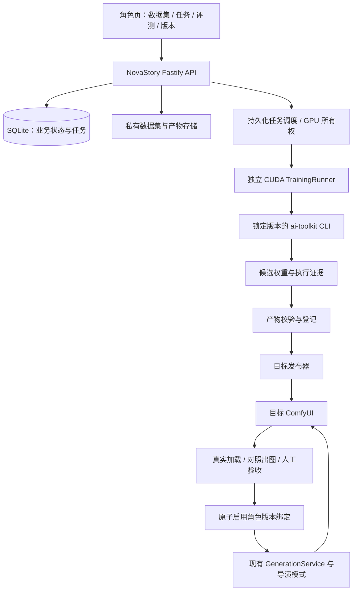
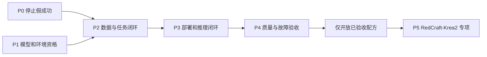

# NovaStory × ai-toolkit：角色 LoRA 训练与接入设计

> **文档状态：设计方案，尚未实施或通过 GPU 验收。**  
> 版本：v1.0 · 2026-09-28（Asia/Taipei）  
> 建议仓库位置：`docs/architecture/角色LoRA_ai-toolkit集成方案_20260928.md`  
> NovaStory 核查基线：`main@ef6246d0a481ad325ad226e79a51fd6f0f076db3`  
> ai-toolkit 研究基线：`ecee894ed2b1f3716d9d7326693061ec1a3105bb`  
> 本次交付：设计、接口契约、接入位置、实施顺序与验收矩阵；不修改业务代码、不启动训练、不提交仓库。上述 ai-toolkit 提交只是研究基线，不是已验证的生产版本。

## 0. 决策摘要

**推荐采用“NovaStory 管理业务与任务，独立 CUDA Runner 执行 ai-toolkit CLI，产物经过部署、真实加载与人工验收后再启用”的架构。**

不是把目前按钮里的“登记文件名”替换成一个 `spawn()` 就算完成，而是补齐以下闭环：

```text
选择角色的具体外观版本
  → 准备并审核训练图片、标注
  → 冻结数据集与模型配置
  → 持久化创建训练任务
  → 获取目标 GPU 的排他执行权
  → ai-toolkit 真正训练并保存权重
  → 校验权重及训练完成证据
  → 将不可变产物发布到目标 ComfyUI
  → 使用目标底模真实加载、出图和对照验收
  → 人工确认并原子启用
  → 角色立绘与导演模式共用同一套 LoRA 解析
```

第一版应收敛到：**一个角色外观版本、一份冻结数据集、一种已验收的训练配方、一个受控 GPU 执行端、一个 ComfyUI 部署目标。** 保留扩展点，但不立即建设通用训练平台、多租户集群或多人物身份混合训练。

四项不可妥协的决策：

| 决策 | 具体要求 |
|---|---|
| 不再假成功 | HTTP 202 只代表任务已持久化接受；训练、部署、验收、启用是不同状态。 |
| 不跨模型乱用 | 绑定实际推理底模及其已验证兼容配置，不能只保存 `.safetensors` 文件名。 |
| 不破坏现有生成链 | 扩展现有 GPU 所有权与生图编译链，不再另起一套绕过租约的训练/生图入口。 |
| 不覆盖正确资产 | 新训练失败、取消、部署失败或角色切换版本，不得覆盖之前仍然有效的 LoRA 绑定。 |

**模型优先级：先证明当前 Pony/SDXL 链路可训练、可加载；RedCraft/Krea2 独立资格验证。** 不为了套用某份 FLUX 教程而更换项目底模，也不把“ai-toolkit 支持 Krea2”解释成“现有 RedCraft INT4/INT8 文件已经可以直接训练”。

本文中的状态、数据表、新接口、阈值和默认参数，除明确标注为“当前实现”的内容外，均为拟议设计。来源索引见附录 A。

---

## 1. 当前实现核查与接入缺口

### 1.1 与用户描述一致的部分

| 当前位置 | 核查结果 | 接入要求 |
|---|---|---|
| `pages/CharacterManager.tsx`，`handleTrainLora` | 请求返回后立即提示 LoRA Ready，并将结果当作角色对象替换。 | 改为接收任务 DTO；展示排队、训练、待部署、待验收等状态。 |
| `backend/src/routes/characters.ts`，`POST /:id/train-lora` | 拼接文件名，更新 `visual_tags.assets.lora_path/lora_ready`，没有启动训练或写出权重。 | 保留路由名，但语义改为创建持久化任务，返回 202。 |
| `backend/src/services/image_generation_policy.ts`，`resolveLoraStack` | 角色 LoRA 以文件名进入堆栈；本地缺文件可跳过，远端可按未核验名称提交。 | 新角色 LoRA 必须先解析为已校验的产物与部署记录。 |
| `docs/architecture/一站式工具_20260925.md` | 提出过使用 ai-toolkit 的工具组合建议。 | 不能把工具建议当成已经接入的训练能力。 |

来源：[R1]–[R3]、[R10]。

### 1.2 必须一起修复的关联问题

**角色版本不能只绑定 `character_id`。** 当前 `character_version` 保存描述和视觉资产，激活版本时会把 `visual_tags` 整体写回角色。新建版本的 `clearAssets` 只清空头像、三视图、脸部图，其他资产字段仍被复制，因此旧 LoRA 字段可能跟随到新外观；现有占位训练路由也没有执行版本同步。[R1][R4]

**GPU 锁不能仅增加一个枚举就结束。** 现有 `GpuLeaseService` 使用 Node 进程内静态状态，已实现严格的租约身份检查及 Comfy prompt 停止确认，但只包含 image/video。独立 Python 训练进程、控制端重启或另一台执行机，不受该内存状态充分约束。[R5]

**训练不能直接复用 `generation_task` 并填一个虚假场景 ID。** 当前 `AssetTaskStore` 面向场景生图，有 SQLite 持久化与终态 CAS，也存在持久化失败时保留内存路径的处理。训练需要独立角色、数据集、底模、检查点与执行机语义；一旦返回“任务已接受”，就不能只存在于内存中。[R6]

**部署目录设计必须考虑现有 `basename()`。** 当前 LoRA 解析会剥离子目录。第一版推荐使用全局唯一的扁平部署文件名，而不是发布到子目录后再让解析器悄悄丢失目录信息。[R3]

**普通角色更新不能伪造训练状态。** 当前角色更新允许替换 `visual_tags`。新方案要在所有角色写入入口剥离或拒绝客户端传入的受管 LoRA 状态、产物引用和就绪标记，不能只修训练按钮。[R1]

### 1.3 可以复用，但不能照搬的基础

复用 `GenerationService → compileComfyWorkflow → ComfyUIService`、现有项目模型/风格选择、参考图策略、Comfy 认证与 prompt 所有权，以及既有状态机的 CAS 思路。现有编译器对 Pony/SD1.5 使用 `LoraLoader`，对 FLUX/RedCraft 使用 `LoraLoaderModelOnly`；新产物必须在这条真实编译链上验证，而不是只在 ai-toolkit 预览中出图。[R7][R8]

保持仓库规定的“基线 → 静态检查 → 测试 → 验收矩阵”顺序。本项目是 React/Vite + Fastify/TypeScript，不执行 Unity 专用检查。[R0]

---

## 2. 目标、边界与模型选择

### 2.1 本期目标

让用户在角色页完成数据集整理、提交训练、查看进度、比较候选模型、启用和回滚，并让角色立绘、三视图生成及导演模式使用同一个经过验证的身份 LoRA 绑定。

本期不包括：任意训练 YAML 编辑器、模型市场、自动上传公开模型平台、分布式训练、全量模型微调、把图像 LoRA 直接注入 H3 视频模型，以及未经验证的多角色 LoRA 同时全局叠加。

**训练身份 LoRA 和训练“某套固定外观”不是同一目标。** 第一版默认绑定角色外观版本，可以包含标志性服装。若以后需要跨服装的纯身份 LoRA，必须增加数据覆盖和独立评测，不能通过改一个界面名称宣称已经实现。

### 2.2 以实际生成模型为准

当前项目层模型契约是 `pony | sd15 | redcraft_krea2`，默认 `pony`。底层代码出现 FLUX 支持，并不等于项目层已经承诺 FLUX 训练/推理全链路。[R9]

拟议支持矩阵：

| 项目模型 | 训练策略 | 第一版支持状态 |
|---|---|---|
| Pony / SDXL 派生模型 | 以实际使用的 Pony 检查点作为优先训练目标，采用 SDXL 对应训练架构。 | 首个资格验证对象；通过真实训练与目标加载后启用。 |
| SD1.5 | 独立 SD1.5 配方、分辨率及兼容性清单。 | 可随后增加，不为完成第一条闭环同时展开。 |
| RedCraft / Krea2 | 原生 Krea2 配方，核实 Raw/Turbo 血缘、权重格式及 LoRA 导出/加载兼容性。 | 独立阶段；未通过验证时明确禁止启动该配方。 |
| FLUX、Qwen-Image 等 | 可以作为未来扩展；不改变当前项目默认契约。 | 本期不新增推理族。 |
| H3 等视频模型 | 继续消费生成并验收过的角色参考图。 | 不复用图像 LoRA 权重作为视频 LoRA。 |

ai-toolkit 研究基线中存在 SDXL、SD1.5 和 Krea2 的对应注册；SDXL/SD1.5 配置使用 DDPM 路径，Krea2 Raw/Turbo 另有模型配置，Turbo 涉及训练辅助适配器。不能把 FLUX 的 flow-matching 配置直接复制成 Pony 配方。[U3]

### 2.3 模型兼容性必须分成三层

```text
架构兼容：参数结构、目标模块、LoRA 格式能够匹配
    ≠
检查点兼容：在指定训练/推理检查点组合上经过验证
    ≠
产品质量合格：该角色在新姿态、构图、场景下仍然可辨认
```

至少保存：`architecture`、`base_checkpoint_digest`、模型来源 revision、文本编码器/VAE 标识、训练与推理配方版本、已验收的目标模型清单。

同属 SDXL 不代表所有 Pony、写实 SDXL、其他派生模型的表现相同。策略上允许后续扩展“经实测可用”的兼容清单，但不得根据文件名含 `XL` 或模型族相同自动放行。

### 2.4 RedCraft/Krea2 的专项门槛

ai-toolkit 的 Krea2 实现使用自己的 `SingleStreamDiT` 路径，支持加载特定本地 safetensors 或 Hub 权重；其复用 Qwen 文本编码/自编码组件，不意味着 Krea2 就是 Qwen-Image 的去噪架构。[U4]

实施前逐项验证：当前 RedCraft 文件的模型血缘；是否为预量化推理格式；能否被锁定版本训练加载器正确恢复；训练 LoRA 的参数键、形状及缩放与 Comfy 节点是否一致；辅助训练适配器是否需要在导出或推理阶段特殊处理。

若现有 INT4/INT8 推理文件不能作为训练输入，只能选择**已确认对应关系的可训练权重**，并重新验收其产物在当前推理模型上的效果。不得静默下载另一底模，仍把结果标成“当前角色模型已训练”。

### 2.5 运行环境

本地资格验证以用户此前提供的 **RTX 3060 12GB + 32GB 内存**作为目标，不作为已测容量保证。先测模型加载、前向/反向、保存、退出及目标推理，再决定配方开放范围；峰值系统内存、磁盘与模型下载同样纳入预检。

支持两种部署：同机 Windows/Linux 控制端与 CUDA Runner；以及 macOS 控制端连接远端 CUDA Runner。仓库现有 macOS 启动脚本已经采用远端 ComfyUI 默认模式，但这不代表远端已经具备训练服务。[R11]

对于 Krea2，首先在可控制的、更大显存环境完成资格验证，再评估本地低显存方案。本文不承诺最低显存、训练耗时或某个量化参数一定能跑。

---

## 3. 总体架构与责任划分



| 模块 | 拥有的责任 | 明确不负责 |
|---|---|---|
| NovaStory API | 权限/范围检查、数据集冻结、任务创建、状态查询、启用与回滚。 | 在 HTTP 请求生命周期内等待训练完成。 |
| 训练协调器 | 持久化排队、幂等派发、恢复对账、取消意图与资源调度。 | 替 ai-toolkit 重写优化器和训练循环。 |
| TrainingRunner | 管理自己的训练进程、固定环境、状态事件、检查点与产物证据。 | 接受客户端任意 shell、文件路径或第三方脚本。 |
| ai-toolkit | 依据受控配置执行训练。 | 充当 NovaStory 的角色数据库或业务状态机。 |
| 产物/部署服务 | 校验、不可变存储、目标传输、部署核验及回滚所需信息。 | 把文件存在当成身份质量合格。 |
| 现有生图链 | 按真实底模和目标端解析绑定，编译 LoRA、提示词及参考图。 | 信任前端提交的任意 LoRA 就绪标志。 |

### 3.1 为什么使用 CLI 适配层

ai-toolkit 提供 CLI，基本执行方式为 `python run.py <config>`。其 UI 可用于操作员调试，但第一版不依赖内部网页接口作为长期稳定的 NovaStory 服务契约。[U1][U2]

```bash
# 在受控 GPU 主机的独立环境执行；配置文件由服务器生成。
# 路径为部署示意，不是已在当前仓库安装好的命令。
/path/to/venv/bin/python /opt/ai-toolkit/run.py /work/jobs/<task-id>/config.yaml
```

NovaStory 只维护一层窄的 Runner 适配器。上游变化时升级适配器和配方，不把 ai-toolkit 源码整体复制进项目，也不通过浏览器自动点击其训练页面。

### 3.2 第一版的部署约束

采用单个 NovaStory 控制实例和 SQLite 持久化任务，不新增 Redis/BullMQ/Celery/Kubernetes 前置依赖。GPU Runner 使用自己的本地运行日志和作业目录，不通过网络共享直接操作 NovaStory 的 SQLite 文件。

远端 Runner 通信采用独立认证的私网 HTTPS 或受控隧道；角色图片传出本机前需要明确目的地与授权。ComfyUI 的登录凭据不自动等于训练主机凭据。

若使用与 ComfyUI 不同的专用训练 GPU，可按两个资源分别调度；若共用同一张卡，必须落实第 8 节的跨进程所有权。没有可靠同卡互斥时，禁止开放同卡训练，而不是寄希望于显存恰好够用。

---

## 4. 数据集：从角色资产到可训练样本

### 4.1 先建立数据集，不直接训练三个资产 URL

角色头像、脸部裁剪和三视图只是候选来源，不能默认构成合格训练集。尤其三视图拼图应拆成单视角图，去掉标注和拼图边框；同一母图的头像与裁剪不能被当成独立来源同时放进训练集与验证集。

**建议的首轮素材目标是 15–30 张经审核的有效图片，而不是官方最低张数要求。** 首轮可选约 20 张，覆盖正面、左右三分之二侧面、侧面、半身和全身，并包含不同构图与简单场景。数量不是硬性充分条件：20 张近重复图不如少量准确、有差异的图。

若只有一张定妆照，可以先生成候选扩展图，但必须逐张审核身份、发型、配饰和身体特征，不做“自动扩图 → 全部回灌 → 自动宣布一致性提高”的无监督闭环。

### 4.2 素材处理与审核规则

| 检查项 | 处理原则 |
|---|---|
| 身份与外观 | 排除脸型、发型、年龄感明显漂移的样本；固定外观与可变服装目标分开。 |
| 图像安全 | 校验实际解码格式、像素数、文件体积、异常图片；不能只看扩展名。 |
| 近重复 | 精确哈希去重，近重复检测辅助人工筛选，不把裁剪数当独立样本数。 |
| 三视图/拼图 | 拆分成有效单图；记录共同 `source_group_id`，保留来源关系。 |
| 水印、边框、文字 | 清理或剔除；不能把界面截图直接当角色样本。 |
| 增强 | 默认不水平翻转带单侧疤痕、饰品或特殊衣纹的角色。 |
| 分辨率 | 保留有效细节和纵横比，由经验证的桶/裁剪策略处理，不把所有图强行拉成正方形。 |
| 数据使用 | 记录来源、可使用范围及远端传输授权；默认不公开发布。 |

ai-toolkit 文档描述了图像与同名文本标注的目录组织，并提示部分 WebP 使用问题。建议 NovaStory 把自己的 WebP 上传资产规范化为 PNG/JPEG 后再冻结训练副本。[U1]

### 4.3 标注与触发词

每个外观版本分配稳定且不依赖角色显示名的触发字符串，例如 `nschr42v3x7`。训练时和推理时使用同一值；不要因为角色改名而改变触发词。

标注应描述可见内容，如姿态、镜头、衣服、背景和表情，避免把角色传记、小说情节或并不存在的配饰填进去。ai-toolkit 支持在标注里使用 `[trigger]` 占位符并通过配置替换；NovaStory 需要记录替换后的有效标注及其哈希。[U1]

```text
示意标注：
[trigger], an adult woman, three-quarter view, waist-up,
long black hair, white robe, standing in a courtyard, neutral expression
```

标注生成可以复用已有模型服务辅助，但在冻结前允许人工修改。不同模型的标注风格由训练配方管理，不在本期强行统一成一种长提示词模板。

### 4.4 不可变快照

数据集状态采用 `draft → frozen`；冻结时完成校验并产生 `manifest_sha256`。后续增删图片、改标注、改裁剪或更换外观参考，必须生成新数据集版本。

manifest 至少记录：角色及外观版本 ID、外观快照哈希、样本内容哈希、标注哈希、来源组、预处理版本、训练/验证划分、审核信息、来源授权、源生成模型（如有）。

训练图片与标注复制到私有训练根目录，不直接依赖随时可修改或删除的公开静态文件 URL。图像加载、caption 缓存和 latent 缓存均以模型/编码器/VAE/预处理及数据集指纹隔离，不能跨不兼容配方复用。

验证集按**来源组**拆分。建议首轮预留约 20% 的独立来源组作为产品评测素材；比例是工程起点，不是质量保证。样本很少时宁可补采，不把同一张图的轻微裁剪冒充独立验证。

---

## 5. 状态模型：任务、产物、部署、启用分开

### 5.1 训练任务状态

```text
queued → preparing → waiting_gpu → training → verifying_artifact → succeeded
   └─────────────── 任一可取消的非终态 ───────────────→ cancel_requested → cancelled
   └─────────────── 已确认执行失败 ──────────────────→ failed
   └─────────────── 执行中断且不能直接续接 ───────────→ interrupted
```

`reconciling` 作为恢复对账阶段标识，而不是“已失败”的同义词。Runner 失联时保存当前已知状态并标记连接未知，不根据失联直接释放 GPU 或重新启动同一个训练。

终态不可被晚到进度事件覆盖。状态变化使用数据库条件更新，包含 `task_id + run_id + expected_state/revision`；进度事件只更新进度字段。取消请求成功写入后，晚到的普通“训练成功”不能反向撤销取消。

`succeeded` 的含义限于：**本次训练满足结束条件，并取得结构有效、来源可追溯的候选产物。** 它不代表已部署、不代表人工质量合格，更不代表已替换角色正在使用的模型。

### 5.2 产物与部署状态

| 对象 | 状态 | 语义 |
|---|---|---|
| 产物完整性 | `verifying / valid / rejected` | 文件、张量、模型结构及训练证据是否可信。 |
| 质量审核 | `unreviewed / approved / rejected` | 指定产物、外观快照与推理配置的对照图是否达到产品要求。 |
| 部署 | `pending / transferring / verifying / ready / failed` | 指定目标端是否持有准确文件，并完成技术加载验证。 |
| 角色绑定 | `inactive / active` | 是否被用户选为该外观版本在某个目标推理配置下的生效产物。 |

部署技术验收失败只影响部署记录，不把有效训练产物改成“训练失败”。可以重试传输或修复目标环境，无须重新训练。

### 5.3 唯一的“可用”判定

```text
effective_ready =
    artifact.integrity == valid
    AND quality_approval_matches(artifact, appearance, inference_profile) == true
    AND deployment.state == ready
    AND deployment.target_identity == current_target_identity
    AND compatibility(current_inference_profile, artifact) == verified
    AND binding.character_version_id == requested_character_version_id
    AND binding.appearance_snapshot_hash == current_appearance_snapshot_hash
    AND binding.state == active
```

这里的“当前外观快照”只包含影响身份/外观的数据，不把角色显示名、备注等无关字段变化都当作失效。快照覆盖范围必须版本化并有测试。

目标断线或证据过期时显示“待重新核验”，不能用历史 `ready=true` 替代当前判定；也不必删除历史产物。首次部署执行完整摘要核验，之后可使用短期核验凭据和目标文件清单版本缓存，目标重启、文件属性改变或模型切换时失效，避免每张图重复读取大文件。

质量通过记录必须绑定产物摘要、外观快照和具体推理配置指纹；换底模、换关键加载节点或改变受评测配置后需要重新验收。产物上的汇总“已审核”标签不能替代这份带范围的批准记录。

前端兼容字段 `assets.lora_ready` 只能由上述服务端结果派生；`lora_path` 只能作为兼容输出，不能继续作为真相来源。

### 5.4 失败与取消示例

| 情况 | 正确结果 |
|---|---|
| 训练进程 OOM | 本次任务失败并保留诊断；旧已启用 LoRA 不变。 |
| 用户取消，但进程正常返回 0 | 任务仍是取消；禁止自动登记为训练成功。 |
| 训练完成，ComfyUI 离线 | 任务成功、产物有效、部署待重试；不能显示已可用。 |
| 训练针对 v3，用户已经切到 v4 | 产物仍归 v3，不自动覆盖 v4。 |
| v3 未变版本号，但外观数据修改 | 启用时快照检查冲突；需要复核或新数据集，不自动沿用。 |
| 新产物通过技术加载但人物不相似 | 保留候选，质量不通过，不自动启用。 |
| 旧任务的回调晚于新任务到达 | 仅更新自己的 run/task，不覆盖新任务、绑定或租约。 |

---

## 6. 数据模型与一致性约束

第一版采用以下六类持久化记录；样本清单保存在数据集 manifest 中，不额外引入复杂的资产图数据库。

| 表/记录 | 关键字段 |
|---|---|
| `lora_dataset_version` | `id, project_id, character_id, character_version_id, appearance_snapshot_hash, state, manifest_uri, manifest_sha256, sample_count, source_group_count, created_at` |
| `lora_training_task` | `id, project_id, character_id, character_version_id, dataset_version_id, profile_id, profile_revision, config_sha256, worker_id, gpu_resource_id, run_id, state, state_revision, last_event_seq, idempotency_key, request_sha256, retry_of_task_id, resume_of_task_id, checkpoint_ref, error_code, error_detail, timestamps` |
| `lora_artifact` | `id, task_id, sha256, size_bytes, storage_uri, format, architecture, base_checkpoint_digest, train_model_revision, toolkit_commit, environment_digest, dataset_sha256, config_sha256, trigger_word, rank, target_modules, contains_text_encoder_weights, completed_step, integrity_state, evaluation_refs, origin` |
| `lora_deployment` | `id, artifact_id, target_id, target_identity, inference_profile_digest, deployed_filename, deployed_sha256, state, loader_evidence_ref, smoke_prompt_id, evaluation_ref, last_verified_at, error_code` |
| `character_lora_binding` | `id, character_id, character_version_id, appearance_snapshot_hash, inference_profile_id, target_id, artifact_id, deployment_id, strength_model, strength_clip, state, revision, activated_at` |
| `gpu_resource_lease` | `resource_id, host_id, gpu_uuid, epoch, lease_id, owner_task_id, run_id, kind, workload_ref, heartbeat_at, state, release_requested_at` |

### 6.1 用“一个任务对应一次真实尝试”简化重试

第一版不在同一任务行中反复覆盖训练历史。显式重试创建新任务，记录 `retry_of_task_id`；显式续训创建新任务，记录 `resume_of_task_id + checkpoint_ref`。原任务保持终态、日志与产物不变。

同一次派发发生网络重试时则不创建新任务：Runner 以 `task_id + run_id + config_sha256` 幂等启动，返回同一个已有进程或终态。必须区分“业务上再训练一次”和“同一启动请求因丢包被再次发送”。

### 6.2 事务与唯一性

创建任务时，在一个短事务中校验冻结数据集、保存配置指纹、分配幂等请求记录并入队；事务提交后才能返回 202。数据库不可写时返回明确失败，不启动训练进程。

`Idempotency-Key` 在项目/角色/操作范围内唯一：相同 key 与相同请求内容返回同一任务，包括任务已经结束的情况；相同 key 搭配不同内容返回 409。新一轮训练必须使用新的 key。

运行中的训练或评测未确认停止时，拒绝物理删除其角色/项目；先完成取消与资源对账，避免数据库级联删除后 GPU 作业失去所有者。

冻结数据集不得原地修改。活动绑定在“角色版本 + 推理配置 + 目标”范围内唯一。启用和停用前一个绑定必须在同一事务完成，并检查预期版本与快照，避免后到请求覆盖先前选择。

Runner 的状态事件携带单调序号。只有当前 run 的新事件允许更新当前状态；已到终态的任务不能被进度写回 `training`。

### 6.3 不做跨系统伪事务

数据库、训练文件目录与远端 ComfyUI 无法一次性提交为同一个本地事务。采用可重试、可对账的阶段操作：

```text
写入不可变产物 → 校验 → 登记产物记录
上传临时文件 → 目标校验 → 原子发布 → 登记部署证据
对照验收通过 → 事务切换角色绑定
```

任何一步崩溃，都能根据 task/run、文件摘要和目标回执判断是否已执行。孤立文件进入延迟清理队列；不得通过“重新训练一次”修复单纯的登记或传输失败。

---

## 7. API 契约与前端交互

以下全部是 **NovaStory 拟新增/改造接口**，不是 ai-toolkit 已提供的标准远程 API。路径为应用相对路径，沿用项目实际 API 挂载前缀。

### 7.1 接口范围

| 接口 | 请求与返回要点 |
|---|---|
| `GET /lora-training/profiles` | 返回配方、匹配的底模、目标能力、资格验证状态和不支持原因；未验证配方不能伪装为可用。 |
| `POST /characters/:id/lora-datasets` | 创建草稿，关联具体外观版本。 |
| `POST /lora-datasets/:id/images` | 上传/选择受控资产；验证归属和内容，不接受任意主机路径。 |
| `PATCH /lora-datasets/:id` | 仅草稿可修改标注、裁剪和样本选择。 |
| `POST /lora-datasets/:id/freeze` | 校验并冻结 manifest；返回哈希和样本摘要。 |
| `POST /characters/:id/lora-training/preflight` | 解析实际底模、配方、运行端、部署端、授权和数据集，返回可执行性与阻塞原因。 |
| `POST /characters/:id/train-lora` | 改造已有接口；持久化入队后返回 202 和任务 DTO。 |
| `GET /lora-training/tasks/:id` | 状态、阶段进度、来源快照、错误、产物及恢复能力。 |
| `GET /lora-training/tasks/:id/events?after=...` | 可续读的事件/日志摘要；第一版可先用轮询，不强制 SSE。 |
| `POST /lora-training/tasks/:id/cancel` | 记录取消意图；正在运行时返回 202，不立即谎报进程已停止。 |
| `POST /lora-training/tasks/:id/retry` | 创建新任务，明确从头训练。 |
| `POST /lora-training/tasks/:id/resume` | 仅在检查点和运行状态可恢复时创建续训任务，否则返回具体阻塞原因。 |
| `POST /lora-artifacts/:id/deploy` | 对指定 ComfyUI 目标发布；重复提交幂等，不重新训练。 |
| `POST /lora-deployments/:id/evaluate` | 使用目标推理配方创建真实技术验证与对照出图任务，返回评测任务引用。 |
| `POST /lora-artifacts/:id/review` | 保存人工评审结论，必须关联具体评测记录与目标配置。 |
| `POST /characters/:id/lora-bindings/activate` | 指定产物、部署和期望角色版本/快照，原子启用。 |

第一版可自动串联“训练 → 部署 → 技术验证”，但最终启用仍应由用户确认；批量自动启用作为后续显式选项，不默认开启。

### 7.2 训练请求示例

```http
POST /characters/42/train-lora
Idempotency-Key: <client-generated-request-id>
Content-Type: application/json
```

```json
{
  "character_version_id": 103,
  "expected_appearance_snapshot_hash": "<sha256>",
  "dataset_version_id": "ds_42_v3_001",
  "training_profile_id": "pony_identity_3060_candidate_v1",
  "inference_profile_id": "project_7_pony_verified_v1",
  "worker_id": "cuda_worker_1",
  "target_id": "comfy_primary",
  "overrides": {
    "steps": 1200,
    "rank": 16
  }
}
```

```json
{
  "task_id": "lora_task_001",
  "status": "queued",
  "character_id": 42,
  "character_version_id": 103,
  "status_url": "/lora-training/tasks/lora_task_001"
}
```

上例中的 ID、哈希与配方名称均为契约示意，不表示存在这些资源；`candidate` 配方只有通过资格验证后才能真正接受生产任务。服务器必须重新验证前置条件，不能信任客户端之前拿到的 preflight 结果。

预检阻塞采用明确错误，例如 `DATASET_NOT_FROZEN`、`APPEARANCE_CHANGED`、`TRAINING_PROFILE_NOT_QUALIFIED`、`MODEL_INCOMPATIBLE`、`GPU_RESOURCE_UNMANAGED`、`DEPLOYMENT_TARGET_UNSUPPORTED`。不要一律返回“初始化失败”。

### 7.3 Runner 通信契约

建议自建窄接口：`GET /v1/capabilities`、`POST /v1/jobs`、`GET /v1/jobs/:run_id`、`POST /v1/jobs/:run_id/cancel` 和受限的产物/证据读取。它们属于 NovaStory Runner，不对浏览器直接开放。

提交内容只包含已审批的 profile、只读输入引用、指纹和租约凭据。Runner 必须拒绝不认识的 profile、过期 fencing epoch、未授权输入目录以及不一致的配置摘要。模型下载只能使用服务器批准的模型源和版本，不能借模型参数传入任意可执行仓库代码。

### 7.4 用户界面

把当前“训练 LoRA”改成“准备训练 / 训练管理”入口，分为数据集、训练任务、候选对照和已启用版本四块。不把几十个底层优化器参数直接放给普通用户。

状态文案建议：`素材待审核`、`已排队`、`等待 GPU`、`训练中 420/1200 步`、`训练完成，待部署`、`已部署，待验收`、`验收通过，未启用`、`已启用`。重复点击依靠服务端幂等解决，而不仅是禁用按钮。

进度显示真实阶段与步数；加载模型、缓存、传输没有可靠百分比时显示阶段和活动信息，不用计时器假装从 0% 到 99%。训练 100% 不代表部署和验收 100%。页面刷新后重新查询任务，不把组件状态当作唯一记录。

---

## 8. GPU、进程生命周期与故障恢复

### 8.1 以物理资源识别共享关系

为每个执行资源登记 `host_id + GPU UUID`。不能用 ComfyUI URL 或 `cuda:0` 直接代表唯一物理 GPU：不同服务地址可能共用一张卡，不同主机也都可能存在 `cuda:0`。

第一版同卡采用**严格串行**：训练、生图、H3 视频不能同时执行。默认按受控队列执行，不自动抢占正在运行的训练；界面明确告知训练期间同卡生图/视频需要等待。训练调度进入既有所有权体系，扩展 `kind=training`，并把租约状态持久化；不在 Python 端再建一把与原系统互不相知的锁。

现有实现已经要求 Comfy prompt 的真实停止证据才释放受保护租约。这条原则应扩展到训练：训练进程仍存活，或无法确认是否停止时，不得因为心跳超时就向下一任务授予 GPU。[R5]

### 8.2 训练开始前的受控交接

```text
任务准备完成（数据/模型下载尽量不占排他 GPU）
 → 请求 GPU 租约
 → 阻止新的托管推理进入该资源
 → 核实既有 Comfy/视频任务已经停止
 → 卸载受管、空闲的 Comfy 模型与本地 LLM
 → 检查可用 GPU/主机内存
 → Runner 核验租约 epoch
 → 启动专属于本 run 的训练进程
```

如果共享 ComfyUI 仍允许外部客户端绕过协调器随时提交，同卡安全性无法由一次 `/queue` 检查保证。第一版必须选择专用端点、限制外部提交，或要求明确维护窗口；不把“查询时空闲”当成未来持续独占的证明。

训练准备失败应停止本次执行并返回可解释的错误，不能照搬当前部分显存准备路径中的“失败也继续”策略。不得为训练直接全局中断不属于本任务的 Comfy prompt，或杀死所有 Python/Ollama 进程。

### 8.3 进程与所有权

Runner 用参数数组启动固定 Python 可执行文件，禁用 shell 字符串拼接。记录 `run_id`、进程组/容器 ID、进程开始时间、配置摘要、工作目录和租约 epoch。PID 单独不足以证明归属，必须防止进程号复用后误杀。

在控制端保存派发记录，在 Runner 本地先保存运行记录再启动。若启动后确认响应丢失，再次提交同一 run 应返回现有作业，不启动第二份训练。

fencing epoch 用于拒绝旧控制请求，但它本身不能让旧 CUDA 进程自动消失。资源重新授予前，仍须确认旧进程/容器和相关子进程退出。控制端重启后先与 Runner 对账，再开放该卡的新任务。

### 8.4 取消与保存不能混为一谈

取消顺序：写入 `cancel_requested` → 停止后续派发或通知所属 Runner → 请求受控退出 → 确认本 run 的进程树结束 → 标记 `cancelled` → 释放准确的租约。

ai-toolkit 当前入口对 `KeyboardInterrupt` 存在以退出码 0 结束的路径；其 README 也提醒保存检查点期间强行中断可能损坏文件。因此“进程退出码为 0”不能单独触发成功，取消时也不能承诺必定获得可续训检查点。[U1][U2]

若适配器能够可靠识别检查点保存边界，可在边界后退出；无法识别时采用有界的温和终止流程，再按本 run 的进程组强制结束，并把未完成文件隔离。不得无限等待，也不得把 `.partial` 或不完整 safetensors 发布出去。

### 8.5 训练后验收的 GPU 交接

候选权重生成后，先完成训练进程的收尾、确认 CUDA 进程退出并释放训练租约。随后部署服务复用现有生图编译与传输执行链，按独立评测所有者申请新的 image 租约，执行目标加载和对照出图。

**不要让训练任务持有独占 GPU，内部又等待一个同样需要该 GPU 的 Comfy 验收任务。** 这是必须覆盖的死锁用例。

### 8.6 重启、续训与恢复

| 故障 | 处理方式 |
|---|---|
| API 重启，Runner 仍运行 | 对账并续接状态订阅；不重启训练、不释放旧资源。 |
| API 与 Runner 断网 | 显示连接未知；维持 GPU 隔离；按受控超时策略让 Runner 自主管理退出。 |
| Runner 重启 | 检查遗留进程/容器及运行目录；完成对账前不接受该卡新任务。 |
| 模型下载失败 | 停留/失败于准备阶段，可重试下载；不占用整段训练 GPU 租约。 |
| 训练退出但没有有效最终产物 | 标记失败或中断，不因日志出现“saved”而成功。 |
| 产物存在，登记时服务崩溃 | 依据 run、manifest 和摘要补登记，不能再次训练。 |
| 部署成功，确认响应丢失 | 按目标文件摘要对账，幂等完成部署状态。 |

源 run 未确认停止时，禁止创建会占用同一资源的续训尝试；恢复 API 先做进程与租约对账。

区分三种恢复：继续跟踪仍活着的 run；从完整训练状态恢复；仅从 LoRA 权重重新开始优化。最后一种是 warm start，不得冒充精确断点续训。

ai-toolkit 的 `--recover` 用于配置列表中的失败恢复执行行为，不应当被封装成“从检查点续训”开关。续训能力应根据锁定版本实际保存的优化器、调度器、随机状态及步数支持来声明。[U2]

---

## 9. ai-toolkit 适配与训练配方

### 9.1 锁定环境，而不是点击时安装依赖

每个已验收配方绑定：ai-toolkit commit、Python 版本、Torch/CUDA 组合、依赖锁或容器镜像摘要、模型及编码器/VAE revision、配置模板版本、导出适配版本。

独立虚拟环境或容器与 ComfyUI 隔离，避免训练依赖升级破坏现有生图节点。模型和依赖在运维准备阶段安装，用户点击训练不能触发不受控的 `git pull`、任意 `pip install` 或下载未批准模型。

Runner 的能力接口应报告“已完成资格验证的 profile”，而不仅是“检测到了 CUDA”。相同型号显卡也需要核对实际驱动、可用内存、精度与优化器支持。

### 9.2 第一份 Pony 配方的候选值

下表是**资格测试起点，不是实测最佳参数，也不是完整可直接运行的上游 YAML**。

| 参数 | 首轮候选 | 决策依据与约束 |
|---|---|---|
| 训练架构 | SDXL，对应实际 Pony 检查点 | 不静默替换为通用 SDXL base。 |
| 训练对象 | 去噪网络 LoRA；不训练文本编码器 | 先降低变量与资源负担，再评估是否需要扩展。 |
| Rank / Alpha | 16 / 16 | 先得到基线；仅在具体质量问题驱动下比较其他值。 |
| Batch / 梯度累积 | 1 / 1 | 首轮减少语义混淆；需增加累积时，校验步数与有效批量口径。 |
| 分辨率 | 768 桶级别候选 | 首先验证峰值；通过后再单独测试 1024，不承诺 12GB 一定可行。 |
| 训练步数 | 1200 | 是探索预算；以检查点对照选择结果，不把步数跑完视为质量合格。 |
| 学习率 | `1e-4` | 仅作为首轮起点，观察数值稳定与欠拟合/过拟合。 |
| 精度 | 优先测试 bf16；失败时另建已验收的 fp16 配方 | 不在用户不知情时更改有效训练配置。 |
| 优化器 | 可用时测试 8-bit AdamW | 先验证对应平台的依赖可工作。 |
| 梯度检查点 | 开启候选 | 纳入实际显存/吞吐测试。 |
| Latent 缓存 | 私有工作目录的磁盘缓存 | 缓存指纹必须含底模相关预处理信息。 |
| 中间保存 | 例如每 250 步；最终产物独立保存 | 保留有限候选，不能删掉被续训/评测引用的检查点。 |
| 训练中预览 | 首轮关闭 | 训练退出后通过 ComfyUI 做独立验收，避免预览产生额外 GPU 峰值。 |
| 公开上传 | 关闭 | 发布到公共 Hub 不属于默认训练流程。 |

上游 SDXL 和 Krea2 的调度、模型加载与辅助适配配置不同，应由独立模板编译。项目的推理采样器、CFG 或 10 步采样设置，不能未经转换直接当作训练调度参数。[U3][U4]

### 9.3 配方编译器

NovaStory 对外暴露自己的窄 profile 结构；服务器校验有限参数后，编译成锁定版本 ai-toolkit 接受的 YAML。不得把浏览器传来的 YAML 原样交给 Python。

```json
{
  "schema_version": 1,
  "profile_id": "pony_identity_candidate_v1",
  "engine": "ai-toolkit",
  "architecture": "sdxl",
  "base_model_ref": "<approved-model-registry-id>",
  "dataset_version_id": "<frozen-dataset-id>",
  "trigger_word": "nschr42v3x7",
  "training": {
    "rank": 16,
    "alpha": 16,
    "steps": 1200,
    "batch_size": 1,
    "gradient_accumulation_steps": 1,
    "resolution": 768,
    "train_text_encoder": false,
    "gradient_checkpointing": true
  },
  "preview_policy": "after_training",
  "publish_policy": "private_candidate"
}
```

这是 **NovaStory 拟议的内部契约**，不是 ai-toolkit 原生配置。模板编译必须有 golden tests，并用实际上游解析器及一次真实短训练验证。当前研究基线支持的具体字段以该提交源码为准，不能靠教程字段名猜测。

持久化“用户请求参数”和“真正执行的展开配置”两份记录。真正执行的配置、模型引用和数据集发生改变时生成新摘要与新任务，不能在失败后偷偷降分辨率、减少步数，然后沿用旧任务成功状态。

### 9.4 进度与完成证据

Runner 统一输出有版本的事件，例如：`model_loading`、`dataset_cached`、`training_step`、`checkpoint_saved`、`training_finished`、`process_exited`。优先使用锁定版本可接入的回调/适配钩子；日志解析只能作为受测试的兼容层，不作为唯一成功依据。

完成证据至少包含：本 run 的实际配置摘要、已确认的步数口径、正常结束标记、进程结束原因、候选权重清单和摘要、是否收到取消，以及环境/模型/数据集指纹。

不要用“输出目录里最大的文件”“修改时间最新的文件”或一条 `saved` 日志推断最终产物。Runner 必须知道本 run 生成了哪些文件，哪些已经完整关闭，哪些是检查点，哪些是最终候选。

---

## 10. 产物校验、部署与回滚

### 10.1 校验分层

| 层级 | 必须核验的证据 | 不能替代它的信号 |
|---|---|---|
| 文件完整性 | 文件已关闭、大小与摘要一致、safetensors 结构可读、无残缺张量。 | 后缀名正确。 |
| 数值与训练真实性 | 目标权重有限值、有效 LoRA 更新不是全零；训练结束证据与 run/配置一致。 | 退出码 0；只有随机初始化矩阵非零。 |
| 结构兼容性 | 目标参数键、形状、rank、模块与加载器兼容；预期模块实际匹配。 | 能被一个通用文件读取器打开。 |
| 目标加载 | 指定 ComfyUI、指定底模、实际图节点加载证据与成功输出。 | `/prompt` 返回接受成功；文件出现在列表。 |
| 角色质量 | 保持身份并遵循新姿态/场景要求，人工对照确认。 | 训练 loss 下降；某一张图好看。 |

检查 LoRA 有效更新时，需要确认实际可施加到目标模块的增量，而不只检查 A 矩阵存在；某些初始化结构中单个非零因子并不足以证明已经学习。候选权重数值检查在 CPU 上按张量进行，避免验证过程再次占满 GPU。

### 10.2 私有存储与命名

建议工作目录：

```text
<private-data-root>/lora/
  datasets/<dataset-version-id>/
    manifest.json
    images/
    captions/
  jobs/<task-id>/
    request.json
    effective-config.yaml
    run.json
    events.jsonl
    checkpoints/
    evidence.json
  artifacts/<artifact-id>/
    model.safetensors
    manifest.json
    evaluations/
```

第一版部署到 ComfyUI 时，使用扁平且不可变的名称，例如：

```text
ns_char_42_a_<artifact-uuid>.safetensors
```

文件名由服务器生成，完整摘要保存在 manifest 与数据库中，不能仅依赖截短摘要防碰撞。不要直接使用角色名拼路径，也不要覆盖同名旧模型。这样既能兼容当前 `basename()`，又能降低 Comfy 缓存或同名文件误用问题。[R3]

### 10.3 本地与远端发布

本地或共享文件系统：复制到目标同一文件系统内的临时文件，校验大小/摘要，完成刷盘和原子重命名，再登记部署记录。生产环境必须测试本机操作系统的重命名与文件占用行为。

远端：使用部署在目标主机上的受控发布器，或者已明确验证的共享目录。浏览器不直接获得模型目录写权限；发布器仅允许写入配置好的 LoRA 根目录，拒绝绝对路径、路径穿越、符号链接逃逸和任意外部下载地址。

ComfyUI 标准路由文档列出了图片上传、模型枚举、节点信息及任务接口；不能把图片上传端点视为通用 LoRA 上传服务，也不能假设标准 `/upload/lora` 存在。[C1]

```text
传输到临时路径
 → 目标端核验摘要
 → 原子发布不可变文件名
 → 查询模型/加载器清单
 → 真实编译和加载验证
 → 保存目标端身份、底模指纹、prompt_id 与证据
 → deployment.ready
```

模型列表或 `object_info` 中能看到文件，只说明节点能够枚举该名称，不足以证明参数真正应用到模型。发布器和 Comfy 实例的模型目录映射必须在预检中核对。

### 10.4 显式启用与回滚

技术验证通过后，保留基线图与候选对照图，用户选择权重及强度。启用操作检查：当前外观快照、产物审核、目标部署、实际底模兼容性、预期绑定 revision。

检查通过后，在一个事务内停用旧绑定并激活新绑定。旧模型文件和评测记录保留。回滚只切换到一个仍然有有效目标部署及兼容证据的旧绑定，不重新训练或覆盖文件。

新任务进行中时继续使用旧有效绑定；用户可以明确选择不使用角色 LoRA，但系统不能把指定模型加载失败悄悄改成“继续不带 LoRA 出图”。

---

## 11. 接入现有生图、导演与角色版本链路

### 11.1 增加统一的角色绑定解析

拟新增 `resolveCharacterLoraBinding()`，输入为角色版本、外观快照、实际推理配置、部署目标及使用策略，返回经过验证的结构化绑定，而不是单纯文件名。

```text
角色或导演请求
 → 解析项目设置与选定工作流
 → 识别实际底模/编码器/LoRA 加载节点
 → resolveCharacterLoraBinding
 → resolveGenerationPlan / resolveLoraStack
 → 编译 LoRA 链与触发词
 → 验证最终图中绑定未丢失或旁路
 → 现有 Comfy 提交与所有权管理
```

项目模型字符串是筛选条件，不是最后证明。自定义工作流必须能提供实际底模与加载能力的可验证描述；无法识别时返回“该工作流尚未验证角色 LoRA”，不能靠正则猜测后放行。

评测复用的是工作流编译、Comfy 传输、prompt 所有权与 GPU 调度，不是给场景任务填入一个假的 `scene_id`。第一版评测执行记录归属部署记录，通过 `evaluation_ref` 保存，使用明确的 `owner_kind=lora_evaluation` 和 `owner_id=deployment_id`。若现有提交方法强制写场景资产，先抽出不写场景资产的执行段，并由调用者提供状态存储接口；普通场景任务保持原有持久化行为。

### 11.2 文件名之外还要传递的信息

结构化解析结果至少包含：`artifact_id`、部署文件名、底模兼容证据、触发词、`strength_model`、是否包含文本编码器权重、对应 `strength_clip` 以及验证版本。

当前编译器区分 `LoraLoader` 和 `LoraLoaderModelOnly`。第一版不训练文本编码器时，不应宣称存在 CLIP 训练收益；是否使用 `LoraLoader` 配合零 CLIP 强度，或其他兼容接法，由具体配方与图编译测试确定，不能改变现有风格 LoRA 的默认语义。[R7]

角色触发词来自产物 manifest，而不是猜文件名。应在最终正向文本编码路径中出现，且避免重复、被模板覆盖或被裁剪掉。现有编译器包含保留模板提示词和普通提示词两条分支，两条都必须验证。[R3][R7]

叠加角色与风格 LoRA 时，检查最终 sampler 的模型来源确实经过全部需要的加载节点，不能只断言图里出现了一个 `LoraLoader`。参考图策略不改变，但需要验证“角色 LoRA + 风格 LoRA + 参考图”不会使身份与构图过度约束。

### 11.3 缺失/不兼容时的行为

建议显式使用策略：

| 策略 | 行为 |
|---|---|
| `none` | 用户未选择/明确关闭角色 LoRA；保留现有文本与参考图生成。 |
| `required` | 用户已选择角色 LoRA；文件缺失、底模不符、部署未知、版本冲突时返回可恢复错误。 |

不采用静默的“尝试加载，失败就跳过”作为新角色 LoRA 的默认策略。普通没有训练 LoRA 的角色仍可继续生成，不能为了严格模式把整个项目所有角色都阻断。

当前第一版按明确的单一角色主体绑定。多人镜头若需要多个身份，不能直接全局叠加数个 LoRA 后宣称角色已经准确分配；应先保持现有多人路径，并显式标注未支持的身份分配能力。区域约束、分角色生成或合成放到后续阶段。

### 11.4 角色版本的读写规则

新建外观版本且 `clear_assets=true` 时，不继承已激活的受管 LoRA 绑定。若希望复用旧身份模型，必须经过显式复用动作及新版本验证。

激活历史外观版本时，从绑定表解析它在当前目标配置下的有效模型，不能信任 `visual_tags` 复制过来的状态。训练结果只写自己的产物与源版本关联，不调用“把结果直接写到当前角色”的无条件更新。

同一版本的关键外观字段发生变化时，使其旧绑定处于“需要复核”状态。描述中的无关剧情文字变化不应无条件使身份模型失效，使用明确版本化的外观指纹规则区分。

---

## 12. 旧数据迁移与兼容发布

### 12.1 不破坏已有真实外部 LoRA

对当前角色和所有 `character_version` 扫描旧 `lora_path/lora_ready` 字段，分类记录：空值、只有占位名、目标文件存在但来源未知、已能核验的外部模型。

旧 `lora_ready=true` 不能直接迁移为受管产物已验收。先保存原字段到迁移审计记录，将其标记为 `legacy_unverified`，再通过独立“导入已有 LoRA”流程核验架构、目标文件、加载与人工质量。

导入产物使用 `origin=imported`，允许缺少本系统训练 task 引用，但不能伪造训练记录；自行训练产物使用 `origin=trained` 且必须关联任务。真实外部 LoRA 不因缺少 ai-toolkit provenance 被物理删除。

### 12.2 防止状态被写回

角色创建、更新、版本复制、资产上传和历史版本激活等入口都要过滤受管字段。旧客户端传入 `lora_ready` 时，可以返回字段弃用错误，或忽略并附带明确兼容警告；不能继续持久化为权威状态。

后端 API 兼容投影可暂时返回派生的 `lora_path/lora_ready`，但前端训练请求必须切换到任务返回格式，不能同时保留“202 返回任务”和“前端把任务当角色替换”这两种不一致契约。

### 12.3 渐进开放

先上线取消假成功与历史状态标注；资格验证、训练闭环、部署验收和故障测试完成后，才通过配方级开关开放真实训练。

建议开关：总训练开关、每个已验收 profile 的开关，以及独立的历史模型导入入口。不要设置一个全局 `ai_toolkit_enabled=true` 就把所有模型族同时开放。

迁移后未核验的旧条目不会自动当作必需模型使用，界面明确告知它尚未启用；用户原来明确选择的必需 LoRA 不得被静默降级。保留迁移日志及恢复旧资料的办法，不覆盖用户模型文件。

---

## 13. 验收：先证明闭环，再判断质量

### 13.1 四层证据

| 验证层 | 方法 | 能证明什么 |
|---|---|---|
| 静态与契约 | TypeScript 类型检查、Runner schema、配置编译 golden tests。 | 前后端和执行适配接口一致；不能证明已训练。 |
| 无 GPU 集成 | 临时 SQLite、受控模拟 Runner、伪造中断/乱序/重复响应。 | 状态机、幂等、恢复、权限和迁移符合契约。 |
| 真实 GPU 技术验收 | 实际底模、真实数据、前向/反向、真实保存、目标 Comfy 加载。 | 权重确实训练生成，且目标模型真实应用。 |
| 角色质量验收 | 固定对照图、未见场景/姿态、人工审核。 | 是否值得启用为该角色的生产资产。 |

用户提供的“前后端类型检查及相关 56 项测试通过”是先前核验记录。本次没有重新执行这些测试，也没有取得当前运行环境中的训练日志或 GPU 指标；不能把先前结果当作本功能已经完成的证据。

### 13.2 G0：模型和环境资格验证

在建设完整训练界面前，对一个明确的 Pony 底模和一个受控 GPU 环境完成：模型与依赖指纹记录、加载、少量训练步的前向/反向、保存合法 LoRA、退出、目标 Comfy 加载、LoRA 开/关的有效更新检查。

少量步训练只证明链路，不评判身份学习效果。记录实际峰值显存、峰值系统内存、磁盘占用和阶段耗时，再决定配方是否面向 3060 开放。真实测量前，能力接口保持 `not_qualified`。

### 13.3 G1：一名角色的完整业务链

用冻结素材通过 NovaStory 接口创建任务，不从数据库手工伪造成功；观察排队、训练、产物验证、部署、真实生图、审核及显式启用。启用后分别从角色页与导演模式生成，确认两边使用同一个绑定和触发词。

验收包至少包含：NovaStory/ai-toolkit 提交、环境摘要、数据集 manifest、有效训练配置、模型指纹、run 与租约证据、有效权重摘要、目标部署回执、编译后工作流、prompt_id、基线与候选图、人工结论。

### 13.4 G2：故障与并发矩阵

以下均为**必须新增/覆盖的用例，不是已经通过的测试结果**。

| 编号 | 场景 | 通过标准 |
|---|---|---|
| T01 | 点击训练 | 返回任务；不能立即写 `ready=true`。 |
| T02 | 相同幂等 key 重复提交 | 只启动一个 run；返回同一任务。 |
| T03 | 同 key 不同请求 | 返回冲突；不覆盖原任务。 |
| T04 | 数据库写入失败 | 不返回已接受，不启动训练。 |
| T05 | 数据集草稿、坏图、来源组重复、路径越界 | 冻结/预检阻止；不进入 GPU 执行。 |
| T06 | 底模/配方/目标不兼容 | 明确拒绝；不偷偷换模型。 |
| T07 | 排队中取消 | 从待执行队列移除，没有遗留进程。 |
| T08 | 训练中取消，退出码为 0 | 最终为取消，不能自动发布/启用。 |
| T09 | 保存过程中中止 | 残缺文件被隔离；已有有效检查点不被误删。 |
| T10 | 取消与训练成功并发 | CAS 决定终态；晚到事件不能复活任务。 |
| T11 | 旧 run 的回调到达 | 不影响新任务、绑定或 GPU 租约。 |
| T12 | API 重启，训练仍运行 | 能续接同一 run，没有第二个训练进程。 |
| T13 | Runner 失联/心跳过期 | 资源进入待对账，不给下一任务使用。 |
| T14 | PID 被复用或租约 epoch 过期 | 不能杀错进程或释放其他任务的 GPU。 |
| T15 | 训练、生图、视频同卡排队 | 全部进入同一受管资源序列，不并发抢卡。 |
| T16 | 取消训练 | 不调用全局 Comfy 中断，不伤及其他 prompt。 |
| T17 | 训练结束后做 Comfy 验收 | 不死锁；先结束训练 CUDA 进程，再获取 image 租约。 |
| T18 | OOM、主机内存不足、磁盘满 | 可诊断失败；旧已启用模型保持不变。 |
| T19 | 文件存在但损坏、未更新或参数零匹配 | 产物/部署拒绝通过，不能仅凭文件名成功。 |
| T20 | 远端文件未到、摘要不符、响应丢失 | 分别失败/对账；不重新训练。 |
| T21 | 切换角色版本或修改关键外观 | 旧任务不覆盖当前外观；启用返回冲突或需复核。 |
| T22 | `clear_assets` 新建版本、恢复历史版本 | 不继承虚假的 LoRA 就绪状态；通过绑定表解析。 |
| T23 | 普通 PUT/导入角色提交 `lora_ready=true` | 服务端不能被伪造状态。 |
| T24 | 项目切换 Pony→SD1.5/Krea2 | 必需 LoRA 不匹配时停止，不跨族注入。 |
| T25 | 角色 LoRA 与风格/参考图共用 | 节点链未旁路，触发词未丢失，两种提示词编译分支均覆盖。 |
| T26 | 没有选择角色 LoRA | 既有文本/参考图生成不受阻断。 |
| T27 | 历史真实模型与占位文件名混合迁移 | 资料可追溯，真实文件不被删除，未知状态不当作就绪。 |
| T28 | 回滚和延迟清理 | 回滚目标仍存在且经过核验；清理不删除活动/运行中引用。 |

至少安排一条同卡真实验收序列：**生图 → 训练 → 训练产物验收出图 → H3 视频 → 生图**，并穿插取消和控制端重启。若第一版选择专用训练 GPU，也必须证明资源映射正确，不无故阻断其他 GPU。

### 13.5 G3：质量评测建议

先用少量技术对照确认 LoRA 的目标参数确实生效，再对最终候选做正式角色质量比较。不要对每一个中间检查点都执行大量完整场景图。

建议第一轮固定 12 个未直接出现在训练样本中的提示场景，覆盖角度、半身/全身、动作和环境；同一底模、种子、采样参数及参考策略下，分别生成 LoRA 关闭和开启的对照，共 24 张。必要时对少数关键场景增加种子，而不是开局大规模网格搜索。

评审维度：身份可辨认、标志特征、姿态/场景服从、严重结构错误、训练图复现倾向、与项目风格兼容。过度绑定背景或服装导致无法完成新场景，也属于失败。

可采用项目内初始门槛：12 个场景中至少 10 个身份明确可辨认，关键场景无严重身份漂移，且姿态/场景服从不低于基线；这些是**待团队校准的产品门槛，不是模型客观保证**。关键问题由人工决定，不能仅以最低 loss 或人脸相似分最高的候选自动胜出。风格化、非真人角色更不应套用未经验证的人脸分数阈值。

正式评测还应抽查生产组合：角色 LoRA + 当前风格 LoRA + 既有参考图策略。若组合效果下降，应调整经过版本记录的强度或策略，而不是把明显过拟合模型直接投入导演模式。

### 13.6 仓库检查命令

现有 npm scripts 已核对，后续实施应运行以下检查；这里列出命令不代表本次已经运行。[R12]

```bash
npm run typecheck
npm run typecheck --workspace backend
npm test
npm run build
```

新增 Python Runner 的 schema、状态机与适配器测试应独立运行并纳入 CI；真实 GPU 验收单列结果，不用 CI 中的模拟 Runner 通过来代替。

---

## 14. 实施拆分、代码落点与交付顺序

### 14.1 改造现有文件

| 现有位置 | 最小必要改动 |
|---|---|
| `backend/src/routes/characters.ts` | 训练接口改为任务；保护受管字段；版本/归属/快照检查。 |
| `pages/CharacterManager.tsx` | 任务返回契约、训练管理、数据集审核、真实状态与候选启用。 |
| 现有 API client 的 `trainCharacterLora()` | 返回类型从角色对象改为训练任务；补充查询/取消等方法。实施时按符号定位，不假定文件路径。 |
| `backend/src/db/database.ts` | 训练相关表、索引、约束与幂等迁移。 |
| `backend/src/services/character_versions.ts` | 清理旧状态继承；按版本绑定与快照解析；防旧训练写入新外观。 |
| `backend/src/services/gpu_lease_service.ts` | 训练资源类型、持久化所有权、run 守护和恢复对账；保持现有 prompt 所有权约束。 |
| `backend/src/services/image_generation_policy.ts` | 角色产物的结构化输入、显式触发词、严格兼容性/部署检查。 |
| `backend/src/services/generation_service.ts` | 真实底模解析后的绑定校验、最终 LoRA 链/提示词断言、评测任务复用。 |
| `backend/src/services/ai/comfyui_service.ts` | 复用认证与所有权；增加所需清单/加载验证能力，不伪造权重上传接口。 |
| `backend/src/core/settings_manager.ts` | Runner/发布器/资源映射配置；凭据独立管理。 |

这些位置是职责边界，不要求把全部逻辑塞回原来的大文件。

### 14.2 建议新增模块

```text
backend/src/routes/lora_training.ts
backend/src/schemas/lora_training.ts
backend/src/services/lora/
  dataset_service.ts       # 草稿、审核与冻结
  training_service.ts      # 用例编排、任务状态与恢复
  training_store.ts        # SQLite 事务、幂等、CAS
  runner_client.ts         # 自有 Runner 契约
  profile_registry.ts      # 资格验证与配置编译
  artifact_service.ts      # 候选校验和登记
  deployment_service.ts    # 发布、目标技术验证
  binding_service.ts       # 版本绑定、启用、回滚
workers/lora_runner/
  ...                      # 独立 Python 环境、进程管理和上游适配
```

以上全部为拟新增路径。第一版可以在相邻文件内合并小模块，不能为了形式上的层数引入多套状态机或重复数据库写入逻辑。

### 14.3 分阶段交付

| 阶段 | 交付内容 | 验收出口 |
|---|---|---|
| P0：停止假成功 | 旧字段标注/迁移、只读状态保护、移除立即就绪提示。 | 不存在任何无权重训练成功路径；普通参考图生图仍正常。 |
| P1：资格验证 | 一个 Pony 底模、一台受控 GPU、固定 ai-toolkit 环境、短训练与真实加载证据。 | G0 通过，知道这个配方确实可跑；没有通过则不开放训练。 |
| P2：任务与数据闭环 | 冻结数据集、持久化任务、Runner 幂等、GPU 所有权、取消及恢复。 | 从 API 提交到真实有效产物，全程可追溯。 |
| P3：部署与推理闭环 | 产物发布、目标加载、触发词、角色版本绑定、显式启用及回滚。 | G1 通过；角色页和导演模式一致使用真实 LoRA。 |
| P4：用户体验与加固 | 数据审核 UI、进度/日志、候选对照、历史导入；完整故障矩阵。 | G2、G3 通过；才开启该配方的日常使用。 |
| P5：Krea2 专项 | 当前 RedCraft 血缘/格式/加载验证，单独配方与硬件测试。 | 独立重复 G0–G3；不沿用 Pony 的合格结论。 |



P1 技术试验与 P0 可并行，数据审核界面也可依据已经确定的契约提前开发；但不能为了界面先完成，就跳过真实模型资格验证。

### 14.4 每张实施卡的完成条件

每次提交都应给出：基线 SHA、改动范围、未改变的契约、静态检查结果、具体新增测试、真实或模拟执行的区分、仍未通过的验收项。失败要保留错误与证据，不把尚未验收的配方自动降为另一模型后报告成功。

不以“调用了 ai-toolkit”“出现了 safetensors 文件”“已有 100% 进度”作为最终交付。**最终交付是：用户通过正常界面获得一个有来源、可部署、实际生效、可取消恢复、可回滚的角色模型。**

---

## 15. 运维、安全与范围控制

训练图片、标注、权重与调试日志默认放在私有数据目录。公开静态目录只保存经批准的展示图，不暴露完整数据集和内部主机路径。身份材料上传到远端前明确告知目标；训练代码许可证、基础模型许可和图片使用授权分别记录，不用其中一个替代其他许可。

Runner 使用最小权限运行；模型目录只读，任务目录按 run 隔离，发布器只对指定 LoRA 目录有写权限。不能将 Docker socket、通用 shell 或任意文件浏览能力通过训练 API 暴露给用户。拒绝未经审批的自定义 Python 扩展和需要执行远程代码的模型配置。

HF 等访问令牌只通过受控凭据存储和进程环境传入，日志、manifest、前端状态响应必须脱敏。对普通用户限制单任务步数、输入大小、排队数及资源使用；计费远端设置预算上限和明确授权，不自动购买或升级算力。

取消后的有效检查点可保留到配置的期限；中间文件按可配置保留策略清理。清理前检查活动绑定、部署、运行中任务、续训引用和评测引用。删除源图片不意味着远端副本或已训练 LoRA 自动消失，提供分别可审计的删除动作。

故障分类至少区分：输入错误、模型不兼容、环境/依赖错误、GPU/内存不足、训练数值异常、执行失联、产物损坏、传输失败、目标加载失败、人工质量拒绝。前端显示可执行的下一步，例如“修复部署目标后重试发布”，而不是让用户对所有错误都重新训练。

本期不实现跨 GPU 自动迁移训练、自动超参搜索、全自动身份评分、模型市场、多租户调度和通用工作流编排器。确有需求时，从已验证的接口和证据模型扩展，而不是提前扩大核心循环。

---

## 16. 本次结论与尚需实测的事项

本次源码核查支持用户对占位训练流程的判断，也进一步确认角色版本、GPU 生命周期、文件名解析与客户端状态写入需要纳入同一次设计，而不是只连接训练命令。

当前尚未取得以下运行证据：具体 Pony 检查点在用户 GPU/环境中的训练峰值；当前 RedCraft INT4/INT8 权重的可训练性及 LoRA 格式匹配；目标远端 ComfyUI 的发布权限和目录映射；真实角色数据集的学习效果。这些不影响本文的架构和契约交付，但决定具体配方何时能被标记为合格。

**建议的落地路线是：先关掉假就绪，先验证一个模型，再实现完整闭环；同一张卡统一管控，模型文件按版本登记，真实出图与人工验收后再启用。**

---

## 附录 A：源码与官方资料索引

阅读日期：2026-09-28。NovaStory 源码引用固定到 `ef6246d0a481ad325ad226e79a51fd6f0f076db3`；ai-toolkit 源码引用固定到 `ecee894ed2b1f3716d9d7326693061ec1a3105bb`。以下地址用于复核事实，不表示相关建议已实现。

### NovaStory

**[R0] 仓库评审要求**  
`https://github.com/eric20170524/nova-story/blob/ef6246d0a481ad325ad226e79a51fd6f0f076db3/AGENTS.md`

**[R1] 角色路由：占位训练、普通角色更新、资产处理**  
`https://github.com/eric20170524/nova-story/blob/ef6246d0a481ad325ad226e79a51fd6f0f076db3/backend/src/routes/characters.ts`  
重点：`POST /:id/train-lora`，约第 456 行起；`PUT /:id` 与版本同步。

**[R2] 角色页：handleTrainLora 与立即 Ready 提示**  
`https://github.com/eric20170524/nova-story/blob/ef6246d0a481ad325ad226e79a51fd6f0f076db3/pages/CharacterManager.tsx`  
重点：约第 591–603 行，以及新外观版本资产保存流程。

**[R3] LoRA 堆栈解析：basename、本地缺失与远程未核验**  
`https://github.com/eric20170524/nova-story/blob/ef6246d0a481ad325ad226e79a51fd6f0f076db3/backend/src/services/image_generation_policy.ts`  
重点：`resolveLoraStack`，约第 677 行起。

**[R4] 角色版本、激活与 clearAssets**  
`https://github.com/eric20170524/nova-story/blob/ef6246d0a481ad325ad226e79a51fd6f0f076db3/backend/src/services/character_versions.ts`

**[R5] GPU 租约与 Comfy prompt 守护**  
`https://github.com/eric20170524/nova-story/blob/ef6246d0a481ad325ad226e79a51fd6f0f076db3/backend/src/services/gpu_lease_service.ts`

**[R6] 现有生图任务存储、终态 CAS 与进度更新**  
`https://github.com/eric20170524/nova-story/blob/ef6246d0a481ad325ad226e79a51fd6f0f076db3/backend/src/services/task_store.ts`

**[R7] 生图编译、LoRA 节点、模型识别与提示词分支**  
`https://github.com/eric20170524/nova-story/blob/ef6246d0a481ad325ad226e79a51fd6f0f076db3/backend/src/services/generation_service.ts`  
重点：LoRA 注入约第 270 行起，工作流编译与有效提示词约第 429–650 行。

**[R8] ComfyUI 本地/远端配置、认证与客户端**  
`https://github.com/eric20170524/nova-story/blob/ef6246d0a481ad325ad226e79a51fd6f0f076db3/backend/src/services/ai/comfyui_service.ts`

**[R9] 项目层模型契约与默认值**  
`https://github.com/eric20170524/nova-story/blob/ef6246d0a481ad325ad226e79a51fd6f0f076db3/backend/src/services/project_settings.ts`

**[R10] 原一站式工具文档中的 ai-toolkit 建议**  
`https://github.com/eric20170524/nova-story/blob/ef6246d0a481ad325ad226e79a51fd6f0f076db3/docs/architecture/一站式工具_20260925.md`

**[R11] 核查提交及 macOS 启动说明**  
`https://github.com/eric20170524/nova-story/commit/ef6246d0a481ad325ad226e79a51fd6f0f076db3`

**[R12] 已核对的 npm 检查脚本**  
`https://github.com/eric20170524/nova-story/blob/ef6246d0a481ad325ad226e79a51fd6f0f076db3/package.json`  
`https://github.com/eric20170524/nova-story/blob/ef6246d0a481ad325ad226e79a51fd6f0f076db3/backend/package.json`

### ai-toolkit 与 ComfyUI

**[U1] ai-toolkit README：CLI、数据集组织、触发词与检查点提醒**  
`https://github.com/ostris/ai-toolkit/blob/ecee894ed2b1f3716d9d7326693061ec1a3105bb/README.md`

**[U2] ai-toolkit run.py：执行入口、--recover、异常与退出行为**  
`https://github.com/ostris/ai-toolkit/blob/ecee894ed2b1f3716d9d7326693061ec1a3105bb/run.py`

**[U3] 模型注册与默认配置：SDXL、SD1.5、Krea2 Raw/Turbo**  
`https://github.com/ostris/ai-toolkit/blob/ecee894ed2b1f3716d9d7326693061ec1a3105bb/extensions_built_in/diffusion_models/ui.tsx`  
重点：SDXL/SD1.5 约第 779–813 行；Krea2 系列约第 1889 行起。注册存在不等于 NovaStory 集成或用户硬件验收完成。

**[U4] Krea2 加载器与目标架构**  
`https://github.com/ostris/ai-toolkit/blob/ecee894ed2b1f3716d9d7326693061ec1a3105bb/extensions_built_in/diffusion_models/krea2/krea2.py`

**[C1] ComfyUI 官方服务端路由文档**  
`https://docs.comfy.org/development/comfyui-server/comms_routes`  
用于核对模型枚举、节点信息、图片上传、prompt、队列与历史接口；实际目标部署的版本和扩展能力仍需预检。

---

## 附录 B：评审时的十个否决问题

| 问题 | 一旦回答“是”，本次接入不能验收 |
|---|---|
| 按钮是否仍在任务入队时宣布 Ready？ | 是。 |
| 数据库失败后是否仍能偷偷启动训练？ | 是。 |
| 只凭退出码或文件后缀是否就能成功？ | 是。 |
| 心跳超时但训练仍可能活着时，是否释放 GPU？ | 是。 |
| 取消是否可能影响无关 Comfy prompt 或 Python 进程？ | 是。 |
| 训练 v3 的结果是否可能自动写到 v4？ | 是。 |
| 必需角色 LoRA 缺失时是否悄悄不加载继续出图？ | 是。 |
| 是否只测 ai-toolkit 预览，没有测实际 Comfy 底模？ | 是。 |
| 是否把导入的外部模型伪装成本系统训练成功？ | 是。 |
| 是否以模拟 Runner/类型检查通过替代真实训练与角色质量验收？ | 是。 |
