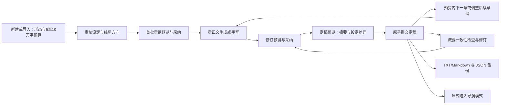

# 新书创建与 Agent OS 创作链路核查及收敛建设方案

核查日期：2026-09-28。核查对象：NovaStory 新项目创建、剧本编辑器及其项目级 Agent OS；参照对象：本地 DreamWaverAI 当前代码。本文为独立评审与建设文档，本次没有修改业务代码。

**最终适用范围：仅短剧/短篇小说；单部作品目标篇幅约 5 万—10 万字，正文总量不超过 10 万字；暂不涉及长篇小说。** 字数限制针对整部作品，不是单章或单次生成。以下方案、工量与验收均按这一最新边界编写。

## 1. 结论与决策建议

**NovaStory 已有较完整的创作工具内核，但尚未形成与 DreamWaverAI 对齐的完整创作链路。** 现有优势集中在已有章节的续写、改写、角色分析、世界观写入及导演模式衔接。主要缺口集中在起点的构思与章纲规划，以及后段的定稿、记忆更新、恢复和作品交付。

应将下一轮目标收敛为：**一句创意或一份导入稿 → 作品形态与总字数目标 → 可编辑的设定与章/集纲 → 首章/集写作 → 修订 → 定稿与设定回写 → 承接下一章/集 → 文本交付与可恢复备份**。逐章推进即可，不以自动完成整部作品为目标。

按本文 20 项能力口径，当前为 **4 项基本具备、12 项部分对齐、4 项缺失**。这不是实现率或质量评分：一项入口缺失或一次正文误覆盖就足以阻断完整链路，不能把底层接口数量折算成完成度。与创作无关的图像、漫画和视频能力不用于抵扣缺口。

建议保留 React/Vite、Fastify、SQLite、扁平章节、现有 LLM Provider、现有 Agent 面板和角色中心。新增能力限于两个规划动作、一套可预览及恢复的创作变更记录、作品形态与字数预算、少量状态字段与文本导出。优先修复正文保护和状态一致性，再补新书规划，最后收口 10 万字范围内的检查与交付。

“长文输入保护”在本文仅指单章、单集或一次请求超过模型上下文，不代表建设长篇小说功能。5 万—10 万字作品同样不能一次完整塞进当前本地模型，按章处理和概要预算仍然必要。

现有 **306 项测试全部通过**，前后端类型检查及根构建通过。但本次额外行为探针确认了长文改写截断、定稿状态未变化、体检失败误报零问题和备份回导丢失创作数据。这些说明现有测试覆盖不能证明全链路已闭环。

## 2. 核查基线与证据边界

| 项目 | 本次基线 |
| --- | --- |
| NovaStory | `/Users/lm/pyProj/nova-story`；HEAD `ef6246d`；核查开始时工作区干净 |
| 参照项目 | `/Users/lm/pyProj/Renren/app-registry/2025/Creation/DreamWaverAI`；所属仓库 HEAD `183bef0`；该目录无未提交变更 |
| 架构 | NovaStory：React/Vite + Fastify/TypeScript + SQLite；没有执行 Unity 检查 |
| 产品边界 | 短剧/短篇小说，目标 5 万—10 万字，整部正文硬上限 10 万字；章节数不是长篇扩展依据 |
| 环境 | Node `v22.21.1`、npm `10.9.4`；锁文件对应的实际构建为 Vite `6.4.3` |
| 方法 | 基线 → 静态调用链核查 → 现有测试与定向行为探针 → 验收矩阵 |
| 事实优先级 | 当前路由、服务、Schema、UI 调用及数据库行为优先；旧方案的“待实施/已关闭”标记只作为背景 |
| 本次未覆盖 | 未启动真实 LLM 评测文笔、延迟和长文质量；未做浏览器交互回放；未验证 DreamWaver 的外部 Nebula 服务或生产运行 |

证据分为：**代码确认**（当前调用链可追溯）、**执行确认**（现有测试或本次探针）、**待验收**（建设后的要求）。下文明确标注 UI 时序风险尚未浏览器复现；模型桩只证明程序处理与数据行为，不证明模型质量。

核心证据入口：

| 编号 | NovaStory 证据 | 核查内容 |
| --- | --- | --- |
| N01 | [Dashboard.tsx](/Users/lm/pyProj/nova-story/pages/Dashboard.tsx:52)、[projects.ts](/Users/lm/pyProj/nova-story/backend/src/routes/projects.ts:591) | 创建仅提交标题/简介，写入 project 后进入编辑器 |
| N02 | [StoryEditor.tsx](/Users/lm/pyProj/nova-story/pages/StoryEditor.tsx:297) | 手动保存、续写预览、菜单触发 Agent 前保存 |
| N03 | [ProjectAgentPanel.tsx](/Users/lm/pyProj/nova-story/components/agent/ProjectAgentPanel.tsx:200)、[ProjectAgentContext.tsx](/Users/lm/pyProj/nova-story/contexts/ProjectAgentContext.tsx:11) | 面板上下文、确认执行、结果同步 |
| N04 | [agent_service.ts](/Users/lm/pyProj/nova-story/backend/src/services/ai/agent_service.ts:156)、[agent_route.ts](/Users/lm/pyProj/nova-story/backend/src/services/ai/agent_route.ts:52)、[agent_os.ts](/Users/lm/pyProj/nova-story/backend/src/schemas/agent_os.ts:190) | 当前实际使用单意图小 Schema，再映射动作 |
| N05 | [agent_executor.ts](/Users/lm/pyProj/nova-story/backend/src/services/ai/agent_executor.ts:133) | 顺序执行、项目隔离、正文及世界观写入 |
| N06 | [writing_service.ts](/Users/lm/pyProj/nova-story/backend/src/services/ai/writing_service.ts:614)、[layered_context.ts](/Users/lm/pyProj/nova-story/backend/src/services/ai/layered_context.ts:79) | 续写、记忆、约束、元数据、体检及技能 |
| N07 | [ProjectSettings.tsx](/Users/lm/pyProj/nova-story/pages/ProjectSettings.tsx:143)、[project_documents.ts](/Users/lm/pyProj/nova-story/backend/src/services/project_documents.ts:334) | 故事设定、术语、Prompt 覆盖、显式启用的补充资料 |
| N08 | [chapters.ts](/Users/lm/pyProj/nova-story/backend/src/routes/chapters.ts:14)、[database.ts](/Users/lm/pyProj/nova-story/backend/src/db/database.ts:338) | status 为自由字符串；存在 condensed_content，无完整定稿事务 |
| N09 | [projects.ts 导出](/Users/lm/pyProj/nova-story/backend/src/routes/projects.ts:71)、[JSON 归一化](/Users/lm/pyProj/nova-story/backend/src/services/import/novastory_json_model.ts:264)、[JSON 回导](/Users/lm/pyProj/nova-story/backend/src/services/import/novastory_json_import.ts:66) | 备份载荷、字段丢失与恢复链路 |
| N10 | [useUndo.ts](/Users/lm/pyProj/nova-story/hooks/useUndo.ts:1)、[编辑器同步桥](/Users/lm/pyProj/nova-story/pages/StoryEditor.tsx:157) | Undo 仅覆盖本地正文；已落库 Agent 结果清空历史 |

| 编号 | DreamWaverAI 证据 | 真实参照能力 |
| --- | --- | --- |
| D01 | [SetupChat.tsx](/Users/lm/pyProj/Renren/app-registry/2025/Creation/DreamWaverAI/components/SetupChat.tsx:78)、[SetupOutline.tsx](/Users/lm/pyProj/Renren/app-registry/2025/Creation/DreamWaverAI/components/SetupOutline.tsx:35) | 对话构思、手工起步、设定预览、篇幅参数与首次结构生成 |
| D02 | [structureService.ts](/Users/lm/pyProj/Renren/app-registry/2025/Creation/DreamWaverAI/services/ai/structureService.ts:10) | 生成全书设定、卷章结构、按预估总章数扩展后续结构 |
| D03 | [WritingPhase.tsx](/Users/lm/pyProj/Renren/app-registry/2025/Creation/DreamWaverAI/components/WritingPhase.tsx:114) | 正文生成、drafted/completed、影响分析、下一章承接 |
| D04 | [agentService.ts](/Users/lm/pyProj/Renren/app-registry/2025/Creation/DreamWaverAI/services/ai/agentService.ts:27)、[agent/schema.ts](/Users/lm/pyProj/Renren/app-registry/2025/Creation/DreamWaverAI/agent/schema.ts:82) | 项目树、多动作计划、近轮对话、Zod 校验与修复重试 |
| D05 | [writingService.ts](/Users/lm/pyProj/Renren/app-registry/2025/Creation/DreamWaverAI/services/ai/writingService.ts:10)、[contextService.ts](/Users/lm/pyProj/Renren/app-registry/2025/Creation/DreamWaverAI/services/ai/contextService.ts:12) | 下一章负约束、上下文分层、浓缩与下一章钩子 |
| D06 | [App.tsx](/Users/lm/pyProj/Renren/app-registry/2025/Creation/DreamWaverAI/App.tsx:18)、[exportService.ts](/Users/lm/pyProj/Renren/app-registry/2025/Creation/DreamWaverAI/utils/exportService.ts:3) | Novel 对象 Undo、自动保存、TXT 作品导出 |
| D07 | [promptRegistry.ts](/Users/lm/pyProj/Renren/app-registry/2025/Creation/DreamWaverAI/services/ai/promptRegistry.ts:438)、[AdminPanel.tsx](/Users/lm/pyProj/Renren/app-registry/2025/Creation/DreamWaverAI/components/AdminPanel.tsx:35) | 当前 Prompt 只取默认值；管理面板导出 TS 源码 |

## 3. 参照项目的真实链路与限制

DreamWaver 的已连接主线为：书架新建 → 构思对话或手工初始化 → 可编辑设定 → 生成卷章目录 → 按章生成正文 → 修改/技能处理 → 定稿并更新人物与术语 → 下一章 → 续建后续章纲 → TXT 导出。该主线同时有结构、写作和状态入口，值得对齐的是这些步骤的连接关系。

但不能照抄其 README 描述：

1. **Prompt 管理不是运行时热更新。** 当前 `getPrompt()` 固定返回 `DEFAULT_PROMPTS`；AdminPanel 的修改保存在组件状态，主要交付方式是复制 TS 源码。NovaStory 已有项目级覆盖字段和设置界面，这一点应保留现状。
2. **四层上下文不等于四层均用于写作。** `contextService` 生成 oldSummaries/volumeHistory，但正文 `memoryPrompt` 实际只拼接 recentCondensed/recentFullText，另注入卷摘要与上一章结尾。不能将其称作已验证的“无限记忆”。
3. **“全书体检”也主要基于章纲。** 参照服务把卷章摘要、主线和角色放入 Prompt，没有逐章阅读全文。NovaStory 无需建设全文推理平台来追求表面对齐，但必须说明实际检查覆盖。
4. **定稿存在降级。** 影响分析失败时，参照仍把章节标成 completed；下一章钩子只在同卷且下一章摘要很短时补入。新方案应显式表达不完整状态，避免继承这种隐藏降级。
5. **缺少下一章摘要被当作结尾。** 参照的约束函数会要求收束全书；NovaStory 当前已改为“不强行完结”，这是更适合分批规划的行为。

## 4. 核心能力对齐矩阵

“基本具备”表示有可追溯入口与实现；“部分对齐”表示已有能力但数据、交互或质量边界未闭环；“缺失”表示未发现等价的端到端能力。它们都不等于真实模型质量已验收。

| # | 能力 | DreamWaver 当前实现 | NovaStory 当前实现与差异 | 判定 |
| --- | --- | --- | --- | --- |
| 01 | 新建空白作品 | 手工初始设定入口 | 标题/简介建项目并进入剧本页；本次实测初始章节数为 0 | 基本具备 |
| 02 | 从创意对话整理设定 | SetupChat → generateNovelStructure | 无新书构思流程；无项目聊天只是普通回答，不能生成可提交设定 | 缺失 |
| 03 | 故事设定编辑 | 主线、类型、风格、关系、人物、术语 | 项目设置 + 角色中心 + 术语 CRUD；含标签、POV、tone | 基本具备 |
| 04 | 首批章纲自动规划 | 设定 → 卷/章标题和摘要 | 仅手动建空白章/导入；无批量 AI 章纲与审核提交 | 缺失 |
| 05 | 有限篇幅的后续章纲与节奏 | extendNovelStructure + 预估总章数 | 无等价的增量规划、剩余篇幅预算与收束入口；本轮只在 10 万字内扩纲 | 缺失 |
| 06 | 章节结构管理 | 章/卷重命名、摘要、移动、删除 | 手工章 CRUD 已有；Agent 有执行器，但目标解析与参数映射有缺陷；卷属于主动收敛范围 | 部分对齐 |
| 07 | 正文初写与续写 | 生成正文后进入 drafted | 编辑器预览与 Agent 直接写库两条路径都有；采纳、元数据与状态处理不一致 | 部分对齐 |
| 08 | 电影化、冲突、反转 | 三类技能，参数选择 | 三类均已实现；长文输入被截断后整章覆盖；冲突/反转未注入 instructions | 部分对齐 |
| 09 | 目标字数/篇幅控制 | 持久化章目标字数、预估总章数 | API 接收 target_word_count，编辑器固定 800；没有整部 5–10 万字计划和 10 万字上限校验 | 部分对齐 |
| 10 | 连贯上下文与长期记忆 | 分层计算，部分层接入正文 | 近两章尾部、较近浓缩、旧章摘要、设定及补充资料已接入；总预算、状态与新鲜度不足 | 部分对齐 |
| 11 | 下一章负约束 | 取后续章摘要注入正文 | 续写路径已接入；技能改写未统一使用；没有章纲时约束作用有限 | 部分对齐 |
| 12 | Agent 多轮/多步/指代 | actions[] 与项目结构/近轮历史 | 执行器支持数组，但活跃规划器只选一个 intent；近轮文本用于路由，问答未带故事实质上下文 | 部分对齐 |
| 13 | 结构输出校验/重试 | Zod + 修复回路 | 严格路由 Schema、快捷意图、结构重试和兜底已实现 | 基本具备 |
| 14 | 动作确认与结果可控 | Action Card 后执行 | 当前确认的是动作，尚未看到生成正文/设定差异；确认后即可能改库 | 部分对齐 |
| 15 | 定稿→世界观→下一章 | completed、人物/术语更新、下一章跳转 | 人物性格与视觉标签合并、术语写入已实现；无统一定稿事务、状态转换和 nextPlot 持久化 | 部分对齐 |
| 16 | 一致性检查 | 章纲级 issues 报告 | 有报告卡；摘要总长截至 4000 字符；失败可能转为空 issues | 部分对齐 |
| 17 | Undo/Redo 与恢复 | 整个 Novel 对象历史 | 本地正文 Undo 有；Agent 落库同步清历史；无章节及设定变更恢复闭环 | 部分对齐 |
| 18 | Prompt 定制 | 默认值 + 管理面板导出源码 | 项目设置 `agent_prompts_override` 被服务读取，实际能力更强 | 基本具备 |
| 19 | 保存、导入及备份恢复 | 自动保存与本地构思草稿 | DB 持久化、导入预览/提交、JSON 导出已有；编辑缓冲保护和创作字段回导不完整 | 部分对齐 |
| 20 | 可阅读的作品交付 | TXT 导出 | 新书/剧本主流程只有项目 JSON 备份；未发现对应的整本文本 TXT/Markdown 交付 | 缺失 |

额外优势：NovaStory 的补充资料默认不参与 AI、需显式启用；人物分析含证据与置信度；分镜通过共用服务连接导演模式。这些应复用。漫画 PDF、图像和视频导出服务于下游制作，不等价于小说/剧本文本交付。

上述 20 项统计用于比较 DreamWaver 核心能力。用户补充的“两种作品形态 + 10 万字上限”单列为 F09 范围适配要求，不混入对参照项目的功能计数。

## 5. 完整创作链路判定

| 用户目标 | 当前能做到哪里 | 是否闭环 |
| --- | --- | --- |
| 从一句创意开始写一本新书 | 能建空项目，需手工补设定、建章及写章纲，或外部准备后导入 | 辅助创作起点未闭环 |
| 已有章纲，生成和修改一章 | 续写、改写和技能可用，但采纳、长文保护与恢复有问题 | 工具链可用，可靠性未闭环 |
| 定稿后按最新事实继续下一章 | 可写角色/术语；status、摘要新鲜度和 nextPlot 未联动 | 未闭环 |
| 修复逻辑问题并再次确认 | 能得到报告；缺失败/覆盖状态、定位修订后的复核闭环 | 部分闭环 |
| 导出作品并完整恢复继续写 | 有 JSON 备份；缺文本交付，回导丢失部分创作状态 | 未闭环 |
| 将选定章节交给导演模式 | 编辑器可保存并跳转；Agent 分镜复用 timeline service | 衔接已具备；本次未评估下游成片质量 |

因此可以说“支持已有文本的 AI 辅助创作”，不能说“已包含完整的新书创作生命周期”。

## 6. 关键问题、证据与修改方向

### F01：新书起点与章节规划缺失（P1，代码及探针确认）

N01 只写 project；章节由用户在编辑器单独创建。没有 D01/D02 的构思结果、章纲预览、批量生成和扩纲服务。现有 Markdown/TXT/JSON 导入解决的是外部内容入库，不等价于从创意创作。

修改方向：保留现有创建入口；在空项目编辑器中增加轻量“开始创作”区域，复用 Agent 对话与设置表单，形成设定卡和首批章纲卡。不建立第二套书架、第二个编辑器或新的聊天系统。

### F02：编辑器缓冲与 Agent 同步可能误覆盖（P0，静态调用链确认，未浏览器复现）

N02 的“智能创作”菜单会先保存；N03 的全局面板直接发送时只携带项目/章 ID，没有未保存正文或统一保存钩子。更明显的是：只读分析完成后，面板也会 `notifyDataChanged()`；编辑器监听该事件后执行 `loadChapters({ forceSync: true })`。只要服务器正文与本地缓冲不同，就有用旧服务器正文覆盖本地输入的路径。

此外，`syncAppliedEditorContent` 没有把结果中的 chapterId 传入应用桥；`ApplyHandler` 只有正文与 alreadyPersisted。长请求期间切章，结果存在写进当前编辑器缓冲的风险。该风险与后端的项目隔离校验是不同问题。

修改方向：统一入口的“保存/获取快照”桥；每次请求及结果绑定 projectId、chapterId、sourceRevision。只读结果不广播正文变化，写结果只刷新受影响实体；脏缓冲必须保留，旧版本结果进入候选区。切章、离页和保存失败提供恢复或阻止机制。

### F03：截断原文后进行整章替换，且部分用户指令丢失（P0，探针确认）

N06 `executeSkill` 只取原文前 3500 字符，N05 随后以生成结果覆盖全章。正文直接 rewrite 另有前 6000 字符截断。章节超长时，模型看不到尾部事件，整章替换可能删除这些事件。这里的阈值是 **字符数，不是 token 数**。

本次以 4000 字符以上正文和尾部哨兵验证 ADD_CONFLICT：Prompt 不含尾部事件；生成结果覆盖全文；“保留尾部关键事件”的 instructions 也没有进入 Prompt。原因是冲突与反转分支只注入固定类型、强度或目标，未拼接 instructions。技能路径还没有统一注入下一章约束与完整故事设定。

修改方向：首先禁止“截断输入 + 宣称完整替换”的组合。超过当前预算先引导选择段落，或者采用覆盖全部原文的分段处理；结果必须预览。统一技能与续写的设定、下一章边界和用户指令。空输出、遗漏分段或模型失败不能覆盖正文。完整长章自动分段重写可后置，安全拒绝/分段入口必须先交付。

### F04：定稿、元数据和后续记忆不一致（P0/P1，代码及探针确认）

N05/N06 的 APPLY_CHAPTER_IMPACT 会合并人物描述、性格、视觉标签和术语，但不把 chapter.status 改为 completed。界面“定稿”标签不能代表定稿流程已完成。本次探针实测：术语成功写入、执行返回 success，章节仍为 draft。

只有部分 DRAFT_CONTENT 应用路径重新生成浓缩；手工 PATCH、编辑器预览后保存和技能替换未统一刷新/失效摘要。探针实测：原章节 completed、原浓缩为“旧浓缩摘要”，技能覆盖正文后，这两个字段原样保留。`nextPlot` 存在于模型输出/响应，却没有稳定章节字段及下一章承接操作。角色/术语写入循环也没有包成一次原子定稿提交。

修改方向：所有正文写入统一变更版本并使浓缩及定稿事实失效。定稿先计算完整候选摘要和世界观差异，用户审核后一次事务写入：当前正文版本对应的浓缩、钩子、获选设定差异、completed 状态。失败应可重试；同一版本重复提交不重复新增角色/术语。下一章既有章纲不得被自动替换。

### F05：Agent Schema 能表达的能力未全部抵达自然语言入口（P1，确定性映射探针确认）

N04 的活跃路由只有 `intent/chapterScope/focus`，chapterScope 只有 current/none。即使保留完整 actions[] Schema，也不等于可以规划任意跨章多步操作。

确定性探针绕过 LLM、直接传入合法 route：`MOVE_CHAPTER + “移到末尾”` 映射为 index=0；`UPDATE_PROJECT_META + “把文风改为悬疑”` 映射为 main_plot 指令文本，style 未赋值。UPDATE_CHAPTER_SUMMARY 也直接把 focus 当作摘要，不是先生成摘要。此处证明的是映射缺陷，未声称真实模型每次都会输出该 route。

问答分支 `hydrateAnswerQuestions` 只把用户消息交给模型；路由阶段虽然加载了 bundle，却主要提取章节标题和 Prompt override。因此一般问答不能按“懂当前全书设定的助手”验收。

修改方向：保留单意图路由，增加少量按操作定义的 typed args、明确章 ID 解析、移动位置枚举；不确定时只返回待补参数，不默认为首章或错误字段。文风等设定优先复用表单编辑。问答接入裁剪后的设定、当前章摘要及近轮历史。任意多步自主代理本轮不做。

### F06：一致性检查覆盖不足，失败可误报为零问题（P0/P2，探针确认）

N06 的 checkConsistency 将每章摘要裁至 120 字符，再把合并结果裁至 4000 字符；优先 summary 而非基于实际正文的浓缩。50 章测试数据的最后一章未进入 Prompt。它不是正文全量检查，也未将 glossary 和补充资料作为完整核查来源。

`generateStructuredWithRetry` 最终可能返回 null；checkConsistency 返回 `data?.issues || []`，执行器仍报 success。探针把结构结果置为 null 后确认返回零问题。角色分析各段失败也有跳过并最终返回空列表的模式，不能把空结果统一当作“未发现”。

修改方向：先区分 complete/partial/failed 和 issues；失败不得显示“无问题”。后续按章纲/有效浓缩分批检查并汇总，报告已覆盖章节、截断、缺失摘要及来源版本。本轮目标是覆盖全书概要及已确认设定；正文深度检查限定为用户选定章节。

### F07：确认发生在生成前，生成后没有可靠恢复（P0/P1，代码确认）

当前 Action Card 是操作确认，`handleExecute` 用 apply=true 调用执行器，模型生成后可直接写库。再次以 apply=false 生成预览、再 apply=true 执行，会重新运行生成，不能保证落库内容等于预览内容。

N10 的 Undo 栈只保存前端正文；alreadyPersisted 同步会清空历史。结构删除、世界观变化和 AI 正文替换都没有统一的可恢复记录。批量执行器按设计遇到错误继续执行，不能拿它作为新书批量建章或定稿的整体事务。

修改方向：结果候选生成一次并获得 change_id，采纳只提交该候选。采用受版本校验保护的变更前后快照；正文可恢复，结构及设定变化可恢复到没有后续冲突的版本。批量章纲提交和定稿各自作为单个事务动作，不扩建通用工作流引擎。

### F08：项目备份没有保存完整创作状态（P1，真实路由与回导探针确认）

N09 的 JSON 导出包含 project、chapters、characters 和导演结构，但不包含 glossary、project_document。章节 SELECT * 导出包含 condensed_content，但 JSON 归一化与回导 INSERT 不保留该字段。

探针经过真实导出路由与真实回导服务：原来 1 条术语、1 份启用资料，恢复后均为 0；原浓缩字段恢复为 null。这不是模型问题。项目复制虽另有复制 glossary 的实现，也不能替代文件备份完整性。

修改方向：扩展现有 JSON 格式并兼容旧版本，明确保存章节创作字段、术语、补充资料及上下文开关；新增 TXT/Markdown 文本交付。媒体二进制打包与跨机器资产搬迁不列入本轮承诺。

### F09：两种作品形态与 10 万字上限没有对应控制（P1，新增范围要求下的代码确认）

当前正文模板明确要求“小说叙述，不是分镜脚本”，并禁止场景/动作指令标签；DRAFT_CONTENT 的全文重写判断还会把 screenplay 等词作为小说化替换信号。见 [正文模板](/Users/lm/pyProj/nova-story/backend/src/services/ai/prompt_registry.ts:128)、[重写意图判断](/Users/lm/pyProj/nova-story/backend/src/services/ai/agent_executor.ts:35)。这适合小说正文，不能因为页面叫“剧本编辑器”就认为短剧文本格式已对齐。

现有目标字数字段是单次生成参数，没有整部实际字数、计划预算与上限校验；导入服务同样未按 10 万字这一新业务规则限制项目。

修改方向：只增加 short_novel / short_drama 两种 content_form。小说使用叙述与对话；短剧采用集纲、场景、人物对白和必要动作说明，沿用同一 chapter 表与编辑器。短剧文本允许文学剧本的场景/动作，镜头号、景别、摄影机运动及视觉提示词仍交给现有导演模式。预算和字数统计在两种形态下共用，不建立独立短剧数据库或新编剧系统。

## 7. 收敛后的产品方案

### 7.1 入口与界面：沿用现有五个位置

| 现有位置 | 必要调整 | 范围约束 |
| --- | --- | --- |
| Dashboard 新建弹窗 | 保留标题/简介；选择“短篇小说/短剧”、5/8/10 万字目标；可选“空白开始/辅助规划”，仍先建 project | 不增加独立新书应用；模型不可用仍能空白创建 |
| StoryEditor 空状态 | 显示“完善构思 → 审核设定 → 规划首批章/集”；完成后收起，可从菜单重新进入 | 不要求先生成整部正文；已有导入项目默认跳过规划 |
| ProjectAgentPanel | 复用对话、动作卡、结果卡，补生成候选/采纳/丢弃/恢复及准确目标提示 | 不增加第二聊天侧栏；不展示调试参数作为主要创作流程 |
| ProjectSettings / CharacterManager | 复用类型、风格、标签、POV、tone、主线、关系、角色和术语；增加总目标、已写及剩余字数 | 不新建平行“世界观数据库”；人物欲望/恐惧等可先保存在角色描述中 |
| StoryEditor 工具栏 / 项目导出 | 增加“定稿并更新设定”“下一章”“规划后续章节”“导出文本” | 导演模式继续是显式下游入口，避免把分镜格式写回小说正文 |

首次先明确结局方向与起承转合，再细化 3–5 个章/集；后续只在剩余字数预算内细化或调整。章数由总目标和单章目标推导，用户可修改，但章数增加必须重新分配预算，不能无限追加。达到预定结尾需用户确认完稿，模型不能因当前批次结束就擅自完结。高级技法仍放在已有技能入口。

### 7.2 作品形态与篇幅预算

| 规则 | 本轮确定方案 |
| --- | --- |
| 作品形态 | 短篇小说、短剧两种；内部统一 chapter，界面按形态显示“章”或“集” |
| 总目标 | 新项目提供 50,000 / 80,000 / 100,000 字快捷选择，也可在 50,000–100,000 内自定义；写作中不足 5 万字属正常中间状态 |
| 硬上限 | 正式正文总字数 ≤100,000；标题、章纲、浓缩、资料、Agent 对话、导演资产均不占正文预算 |
| 统计口径 | 建议统一统计 content 经 NFC 规范化后的 Unicode 字母/数字码点：汉字、英文字母及数字各计 1，标点/空白不计；短剧对白和动作说明都计入。前后端和导入导出复用同一纯函数 |
| 新生成预算 | 允许追加量 = min(用户请求量，目标剩余量，100,000−实际正文总量)；Prompt 约束后仍须服务端重新统计候选 |
| 替换预算 | 使用“全项目实际量−被替换范围字数+候选字数”计算，不把整章改写错误当作纯追加 |
| 目标调整 | 超过当前软目标但未超 10 万字，可先修改目标再继续规划；不得静默扩大总目标 |
| 超限候选/手稿 | 禁止超限采纳和定稿；保留候选和本地可恢复草稿，明确多出多少字；不自动截断正文。缩减篇幅的修改允许执行 |
| 导入 | 预览返回正文总量；超过 10 万字的新导入不提交，提示用户缩减或分成独立作品；不自动拆书。既有超限项目可读取/备份，不破坏旧数据，也不声称已符合本轮范围 |

规划示例：小说可采用 25 章×2,000 字≈5 万字、40 章×2,000 字≈8 万字、50 章×2,000 字≈10 万字；短剧可参考 50 集×1,000 字≈5 万字、80 集×1,000 字≈8 万字。这里只是预算示例，**不据字数推断每集时长，也不强制集数**。一章/集可分多次生成，单次模型输出长度不能代替作品篇幅规划。

### 7.3 唯一目标链路



用户随时可以手工编辑或跳章。前章未定稿时提示“上下文包含草稿”，不照搬参照项目的硬性禁止。采用草稿还是已定稿事实必须可辨识；下一章钩子仅作为建议，不自动覆盖已写章纲。

### 7.4 仅增加两个规划动作

| 动作 | 输入 | 输出及采纳行为 |
| --- | --- | --- |
| `PLAN_STORY`（拟新增） | 创意、作品形态、总目标、当前设定、最近构思对话、用户启用资料 | 返回设定 patch、结局方向、少量候选角色/术语；显示差异后选择采纳；不自动覆盖已有主线 |
| `PLAN_CHAPTERS`（拟新增） | 已采纳设定与结局、已有章序、最后有效摘要、总/剩余预算、批次章数 | 返回预算内的扁平章/集标题、摘要、目标字数；默认追加，整批审核后事务提交；新书与后续细化共用 |

正文、三类技能、世界观影响、检查、结构管理继续用现有动作。`APPLY_CHAPTER_IMPACT` 在完成协议升级后承接完整定稿语义；保留“只分析影响”模式，避免所有角色分析都变成定稿。新增的只是规划动作，不是新的 Agent 框架。

## 8. 数据、接口与服务建设方案

以下均为**拟议变更**，不是当前已存在的接口承诺。

### 8.1 最小数据调整

| 位置 | 拟增加/规范内容 | 用途 |
| --- | --- | --- |
| project.settings | `content_form`、`target_total_words`、`creation_stage`、`default_target_word_count`；预计章数优先推导 | 目标 50,000–100,000；100,000 硬上限为共用业务常量而非可任意扩大配置；复用现有设定键并保留 image_generation |
| project | `revision` 单调递增 | 设定和章序变更的并发校验；导入旧项目初始化 |
| chapter | `revision`、`target_word_count`、`next_plot`、`metadata_source_revision` | 绑定正文版本、篇幅与派生记忆；保留现有 content/summary/condensed_content/status |
| chapter.status | 规范为 draft / completed | draft 兼容“待写”和“修改中”，由是否有正文区别；避免再加同义状态 |
| 单个新表 `creative_change` | id、project_id、chapter_id、kind、state、base revisions/hashes、request_key、payload_json、created_at、applied_at | 保存候选、变更前后内容、提交幂等与有限恢复；kind 严格限定创作动作 |

`summary` 定义为**规划章纲**，`condensed_content` 定义为**实际已写内容摘要**，两者不得互相静默覆盖。只有 metadata_source_revision 等于当前 revision 的浓缩才进入“有效记忆”；其他情况回退至明确标为“计划”的章纲或刷新摘要。

候选正文及历史快照不塞进 settings。候选大小、保留数量与过期清理必须有界，默认只保存近期创作变化；不实现通用事件溯源。结构删除的恢复范围需涵盖关联场景等依赖，不能仅恢复一个 chapter 行；来不及实现时，该操作明确暂不支持恢复并保留现有删除确认。

在 10 万字规模下，先通过共用计数字数函数汇总正文，不增加需要另行维护的跨表字数缓存。采纳事务内重新核算总量，覆盖两个章节同时生成导致的预算竞态。旧项目未设置 content_form 时默认沿用当前小说模式；切换形态只影响后续规划/生成，不自动改写已有正文。

### 8.2 统一候选与采纳协议

扩展现有 `/api/assistant/execute`，使它区分 `preview` 与 `apply`：

1. preview 接收明确 project/chapter、动作与源版本；调用现有 WritingService 或新规划服务；返回 change_id、目标、修改前后差异、覆盖范围和告警。**不写入正式正文、章纲、角色或术语。**
2. apply 只接收 change_id 与版本校验信息，从服务端读取已生成候选；核验所属项目、状态和基线后提交。**采纳时不再次调用 LLM。**
3. request_key 用于幂等：重复采纳返回首次结果；正文或目标已变化返回 409 并保留候选。项目元数据、章序或设定变化同样校验，不能只检查正文。
4. 服务端提交成功后返回 affectedEntities 及新的 revisions；UI 只更新匹配的实体。请求期间切章不会把旧章结果塞入新章。
5. 增加一个受版本校验保护的恢复操作；恢复生成新版本，不能覆盖用户后来手工改动，也不能把旧摘要冒充当前摘要。

兼容策略：先新增协议并迁移两个 UI 写作入口，再限制旧 `apply=true + actions` 的生成型写入。旧请求可转换为候选或明确报迁移错误，不能继续绕过预览写正文。无需同时长期维护两套不同的采纳语义。只读分析仍走现有 chat/服务；结构操作保持明确、确定性的参数和必要确认。

### 8.3 明确服务职责

| 服务/模块 | 处理方式 |
| --- | --- |
| `LLMService`、Provider、`prompt_registry` | 复用模型选择、重试；增加两个规划模板，正文/技能按 content_form 选择格式规则；不绑定新云模型或 SDK |
| `story_planning_service`（拟新增） | 只负责设定建议与扁平章纲；使用 Zod 校验数量、非空标题/摘要、索引与候选字段 |
| `WritingService` | 统一正文与技能上下文；保留用户指令和下一章边界；返回 coverage/errors 而非把失败变空列表 |
| `chapter_mutation_service`（拟新增或提取） | 集中处理手工保存、采纳正文、总量校验、摘要失效、状态重置和版本递增；避免在 routes/executor 多处复制 SQL |
| `creative_change_service`（拟新增） | 小范围候选存储、版本校验、幂等采纳及恢复；LLM 计算在事务外，最终 DB 变更在短事务内 |
| `AgentExecutor` | 调度这些服务并返回真实状态；不扩为自主循环编排器；同一动作需要原子的写入放入服务事务 |
| import/export | 复用现有解析、预览、提交与格式识别；抽取共用的结构持久化逻辑时保留“文件导入”和“AI 规划”的来源区别 |

角色变更要复用既有角色版本/视觉字段合并规则，保留头像、参考图与模型信息，避免定稿分析破坏已经制作的角色资产。补充资料继续显式启用，保持项目隔离和“资料内容不作为指令”的边界。

### 8.4 章节状态规则

| 事件 | 正文/状态 | 派生记忆和世界观 |
| --- | --- | --- |
| 新建章纲 | 无正文，draft | summary 为计划；无有效浓缩 |
| 手写保存或采纳 AI 修订 | revision 增加，draft | 旧浓缩失效；提示旧定稿影响需重新确认，不自动删除角色 |
| 生成定稿候选 | 正式状态不变 | 分析当前完整版本，展示角色/术语增改及摘要/钩子 |
| 定稿候选审核通过 | 同一基线版本下事务提交，completed | 写入有效浓缩、next_plot、获选设定差异；记录 before/after |
| 摘要或影响分析失败 | 保持 draft，正文不丢 | 候选 failed/partial；允许重试，不能冒充“定稿已全部完成” |
| 修改已定稿章节 | 回到 draft | 标记相关后续建议/报告过期；不自动重写后续章节 |
| 进入下一章 | 可继续写，显示上下文来源 | 优先使用有效浓缩和已采纳设定；钩子只补建议区 |

本轮不建设复杂世界线回溯。旧章再定稿或恢复若触及被后章修改过的角色/术语，按字段基线差异提示冲突，要求用户选择；不能把旧世界观快照整包覆盖到当前项目。

### 8.5 10 万字内的上下文、质量和失败边界

- 将预算从零散字符截断汇总为一个可检查的上下文构建结果；保留字符上限作为实现方式，但分别记录计划、事实、章节覆盖和截断情况。
- 即使总量只有 5 万—10 万字，多章概要也可能超出本地上下文。采用有限批次的概要检查及固定预算，无需长篇卷史、向量库或持续记忆平台。与当前章相关的角色和资料优先。
- 章节改写超过预算时保留原文并要求分段；后续若提供整章分段改写，每段必须有稳定范围、完整覆盖检查与统一采纳。不要靠模型“记住没收到的尾部”。
- 整部体检覆盖 10 万字范围内全部章/集纲及有效浓缩，报告检查级别为“概要”；深度正文检查按章/集触发，错误包含章节 ID、来源版本和证据说明。修订后可重查，旧报告标过期。
- 模型空响应、结构校验失败、部分分段失败、超时是不同结果；只有完整检查成功且 issues 为空才显示“本次范围内未发现问题”。
- 最小真实模型验收沿用当前配置，在短篇小说和短剧两种形态下分别跑正常章/集、超单次上下文和带明确后续事件的样例；记录模型名、上下文配置与耗时，不预设文笔或速度保证。

### 8.6 文本交付与备份格式

在现有项目导出入口增加 TXT 和 Markdown，按 chapter.index 稳定排序，明确导出全部章节还是仅已定稿章节；空章和草稿有一致的标识规则。作者名不应固定伪造为 AI 或项目名。

JSON 建议升为明确的新版本，支持读取 v1 并兼容缺字段：保留作品形态与目标预算、chapter 的规划/实际摘要、状态和新增创作字段、glossary、project_document 原文及 context_enabled、故事设定和现有导演结构。导入重建实体 ID 后同步修正关系；本地并发 revision 可重新初始化，但有效浓缩的版本关联必须正确重建，实际总字数须重新计算。

候选聊天记录和历史快照不必作为首版备份必选项；当前正式创作事实必须完整。对未包含的历史、媒体文件给出导出说明，不能称其为整个工作区的全量归档。

## 9. 分阶段建设与退出标准

工量是用于排序的工程估计，假设一名熟悉仓库的全栈开发者、可用的本地模型环境和已有测试设施；已计入两种文本形态及字数上限，不含大规模 UI 重设计及模型调优。估计总计约 **18–25 人日**，应在首轮实现后重新校准。

| 阶段 | 优先级/估计 | 修改重点 | 退出标准 |
| --- | --- | --- | --- |
| A. 保护已有正文 | P0，3–4 人日 | F02/F03/F06：目标绑定、脏缓冲、只读不强刷、超长/空输出保护、检查失败显式化、指令传递 | 只读操作和失败模型均不丢正文；切章无串写；超长输入不能直接整章覆盖 |
| B. 统一采纳与版本 | P0/P1，4–6 人日 | F04/F07：候选记录、版本校验、统一保存、幂等采纳、正文恢复 | 看到的候选就是写入的内容；旧版本 409；可恢复最近一次正文修改；所有写入口使元数据失效 |
| C. 新书到首章/集 | P1，5–6 人日 | F01/F05/F09：形态与字数、空状态规划、两个新动作、typed args、原子建章/追加 | 两种形态可从创意到首章/集；预算不超 10 万字；刷新可继续，重复提交不重复建章 |
| D. 定稿与交付 | P1，4–6 人日 | F04/F08：定稿候选和事务、下一章钩子、TXT/MD、完整 JSON 回导 | 两章连续创作可定稿、承接、导出、恢复继续写；中途失败没有部分定稿 |
| E. 上限规模收口 | P2，2–3 人日 | F06/F09：5/8/10 万字样例、概要覆盖、报告复查；小规模真实模型验收 | 10 万字样例覆盖全部章/集概要；故障不报零问题；两种形态的模型样例有记录 |

阶段 A/B 是新增 AI 规划的前置质量门槛。阶段 C/D 完成后验收“最小完整创作链路”；阶段 E 验收所承诺的 10 万字上限规模，不能作为扩大到长篇小说的授权。

本轮暂缓：10 万字以上长篇/无限连载、卷表与跨卷 UI、任意多 Agent 自主协作、复杂工作流编辑器、向量检索平台、自动写完整书、支付/云同步迁移、语音输入、DOCX/EPUB 排版、视频管线扩容和独立 Prompt 市场。流式输出可改善等待体验，但不是本轮链路闭环的前置项。

## 10. 验证记录

### 10.1 静态检查与现有测试

| 检查 | 实际结果 | 含义与限制 |
| --- | --- | --- |
| `npm run typecheck` | 退出码 0 | 前端/根配置通过 |
| `npm run typecheck --workspace backend` | 退出码 0 | 后端严格类型检查通过 |
| `npm run build` | 退出码 0 | Vite 与根 server 打包通过；JS 主包约 1029 kB，有现有 >500 kB 提示 |
| `npm test`，最终正常环境运行 | **306 tests / 306 pass / 0 fail / 0 skipped**，约 77.2 秒 | 覆盖现有仓库测试；不等于真实 LLM 或浏览器 E2E 通过 |

测试隔离使用 `DATABASE_URL=:memory:`、临时 config/data/static 目录，没有对现有项目数据库做实验。首次 npm test 被沙箱阻止创建 tsx IPC；改用 Node 直接运行后，2 个回环端口测试受限，7 个视频编译测试因临时目录未复制工作流失败。补齐仓库内工作流 JSON 并允许本机测试监听后，重新运行正常 npm test 全部通过；这些环境失败不计为业务缺陷。

最终运行方式（项目根目录；临时目录已创建，video-workflows JSON 已复制）：

```sh
DATABASE_URL=:memory: \
NOVASTORY_CONFIG_DIR=/tmp/nova-alignment-check/config \
NOVASTORY_DATA_DIR=/tmp/nova-alignment-check/data \
NOVASTORY_STATIC_DIR=/tmp/nova-alignment-check/static \
npm test
```

已有相关测试确实覆盖了：Agent 结构操作的项目边界、非原子批次继续执行、分镜共用服务事务、意图否定词、分层上下文、创作标签/POV/tone/补充资料传递和原生 JSON 图关系导入。但未发现足以覆盖本报告全部断点的现成端到端断言。

### 10.2 本次额外行为探针

使用内存 SQLite、Fastify inject、真实 Executor/服务，模型输出用确定性桩替代；所有断言通过。探针的“通过”表示**成功复现当前问题**，不表示产品验收通过。

| 探针 | 操作与观察 | 对应结论 |
| --- | --- | --- |
| T01 | POST 创建项目后查 chapter，数量为 0 | 新书创建只有容器，没有规划结果 |
| T02 | 超 4000 字符正文 + 尾部哨兵，执行 ADD_CONFLICT；Prompt 无尾部、无用户保留指令；DB 被模型桩结果全量替换，旧浓缩及 completed 保留 | F03/F04 |
| T03 | draft 章执行 APPLY_CHAPTER_IMPACT，成功写入 1 条术语，状态仍为 draft | F04 |
| T04 | 结构化体检结果返回 null；执行结果仍为 success、issues=[] | F06 |
| T05 | 构造 50 章，每章足量摘要；最后章哨兵未进入体检 Prompt | F06 |
| T06 | 合法 MOVE/UPDATE_PROJECT_META route 分别输入“移到末尾”“把文风改为悬疑” | 分别变为 index=0、main_plot=指令文本；F05 |
| T07 | 真实 export → normalize → restore，比较创作实体 | glossary 1→0，资料 1→0，condensed 非空→null；F08 |

复现材料位于本机临时文件：`/tmp/nova-alignment-probe.ts`、`/tmp/nova-alignment-probe.log`、`/tmp/nova-alignment-tests-final.log`。本文已记录输入、观察和代码依据，不依赖临时日志长期保留。UI 缓冲与切章问题仍需在实现前补浏览器复现，不能用这些服务探针替代。

## 11. 建设验收矩阵

下列为**待建设后的验收标准**，没有将未来项标为已通过。自动化优先覆盖跨层行为及故障恢复；真实模型只做少量有明确判据的样例。

| AC | 场景 | 通过标准 | 当前依据/状态 | 阶段 |
| --- | --- | --- | --- | --- |
| 01 | 模型离线新建书 | 空白项目照常可创建；辅助规划失败可重试，不重复建项目 | 基础创建已有；辅助规划缺失 | C |
| 02 | 一句创意→设定 | 生成可编辑结构设定；未采纳不改正式设置；采纳保留 image_generation | 缺失 | C |
| 03 | 首批章纲 | 标题/摘要/目标字数可审阅；事务提交、正确索引、稳定 ID；重复采纳不重复建章 | 缺失 | C |
| 04 | 预算内扩纲 | 只追加确认的章/集；既有正文不变；预算不足先调整计划；达到结局由用户确认 | 缺失 | C |
| 05 | 撤回/刷新规划 | 刷新恢复已有候选；丢弃候选不污染项目正式设定和章表 | 缺失 | B/C |
| 06 | 编辑器与面板入口 | 未保存正文作为显式快照或先成功保存；只读分析不覆盖本地输入 | 静态发现不一致，待浏览器复现 | A |
| 07 | 请求期间切章 | A 章请求返回时，只更新 A 对应候选/实体，B 编辑器内容不变 | 当前桥缺 chapterId | A/B |
| 08 | 候选采纳 | 生成前后版本可核查；预览文本等于入库文本；采纳不再次调用模型 | 当前直接写库 | B |
| 09 | 并发和重复操作 | 两个标签页冲突返回 409；重复 apply 返回首次结果；不重复追加正文 | 无统一协议 | B |
| 10 | 超长章改写 | 尾部哨兵不因输入截断而丢失；预算不足进入分段/拒绝路径；空响应不写库 | T02 复现缺陷 | A/B |
| 11 | 三类技能一致性 | 每类都收到用户指令、故事约束和下一章边界；输出进入候选区 | 部分已有，指令缺失见 T02 | A/B |
| 12 | 手动/AI 改正文 | 所有写入口增加 revision、回到 draft、旧浓缩失效；不会继续当作定稿事实 | T02 复现缺陷 | B |
| 13 | 定稿成功/失败 | 摘要、钩子、设定差异与 completed 原子提交；失败保留正文且不部分写设定 | T03 复现缺陷 | D |
| 14 | 定稿后继续下一章 | 使用上一章有效浓缩/结尾；钩子不覆盖用户章纲；改前章后提示上下文过期 | 当前 nextPlot 未闭环 | D |
| 15 | 世界观人工审核 | 按项采纳人物/术语变化；同名去重，保留人物视觉资产；重复定稿幂等 | 合并基础已有，差异采纳缺失 | B/D |
| 16 | 恢复 | 恢复最近正文变更后文本可核对；后续修改冲突时拒绝盲目回滚；结构/设定恢复范围明确 | 仅本地正文 Undo | B/D |
| 17 | 明确结构指令 | 移到末尾按实际章序计算；按目标章 ID 执行；文风修改不写 main_plot | T06 复现缺陷 | C |
| 18 | 故障与体检覆盖 | null/无效 JSON/部分失败显示失败或不完整；10 万字对应的全部章/集概要不静默截断 | T04/T05 复现缺陷；预算规模待验收 | A/E |
| 19 | 报告修订复核 | 报告定位到 chapterId/sourceRevision；正文改后报告过期；可重查修订章 | 缺完整闭环 | E |
| 20 | JSON 往返 | 章纲、正文、状态、浓缩、钩子、术语、资料及开关语义相等；兼容 v1；正确重映射实体 ID | T07 复现丢失 | D |
| 21 | TXT/Markdown 交付 | 按章序导出，范围/空章规则明确，中文与换行正确；不固定捏造作者 | 缺失 | D |
| 22 | 最小完整旅程 | 两种形态各跑：选择 5/8/10 万字目标→创意→3章/集规划→前2章/集写作/定稿→修订→复核→导出→JSON恢复继续写，无数据丢失 | 未覆盖的最终端到端验收 | D/E |
| 23 | 下游不回归 | 现有导入、角色视觉字段、分镜共用服务及项目设置保留；仓库基线测试继续通过 | 306 项基线全通过 | A–E |
| 24 | 篇幅边界 | 49,999 字可作为写作中草稿；50,000/80,000/99,999/100,000 正确统计；100,001 候选不能采纳/定稿且内容保留；并发提交不能突破上限 | 当前无对应规则；拟新增测试 | C/E |
| 25 | 两种格式 | 小说输出叙述/对话，短剧保留场景/动作/对白；技能遵循选定形态；切换形态不自动改正文；分镜数据仍在导演模式 | F09 代码确认缺口 | C/E |
| 26 | 上限规模与导入 | 5/8/10 万字夹具可计数、检查概要、保存、导出与回导；新导入超过 10 万字在预览提示且提交拒绝；旧超限项目不损坏 | 拟新增；不要求用真实模型生成 10 万字测试数据 | D/E |

发布判断以 AC22 的真实旅程、AC24–26 的范围适配和对应故障场景为准。规模测试可以用确定性文本夹具，真实模型只生成代表性章节/集；两类证据分别记录。完成接口或新增按钮只表示能力接入，不能替代旅程验收。
