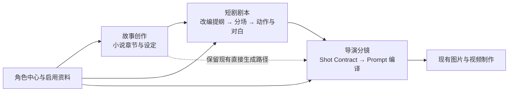

# 小说故事与短剧结构化剧本分层方案

日期：2026-09-28（2026-09-30 验收更新）。状态：**S0–S4 已全部落地并完成整链验收（SC01–SC13 闭环）**。依据：用户明确当前创作模块负责小说故事，短剧需要独立的结构化剧本模块；参考 Toonflow，按 NovaStory 现有架构收敛功能。

## 1. 产品决策

保留现有「故事创作」，在它与「导演分镜」之间增加「短剧剧本」模块。小说正文、改编剧本、镜头契约分别保存，用户可以在每一层编辑和审核。



首期新增四项用户能力：**改编提纲、分场剧本编辑、角色/场景/道具引用、交给导演生成分镜**。角色图片、镜头编译、生图、生视频继续走现有模块。

本方案修正此前「用 `content_form` 切换同一正文为小说或短剧」的方向：`chapter.content` 始终属于故事创作；短剧的场景、动作、对白存入独立剧本文档。故事 Prompt 中禁止分镜模板标签可以保留；短剧 Prompt 使用单独的结构化契约。集纲是改编规划，不作为剧本正文输出。

作品原先约 5–10 万字、上限 10 万字的规划仅约束小说故事正文，不能把改编剧本、分镜台词再次计入小说字数。短剧使用目标时长、分场数和结构完整性表达规模。

## 2. Toonflow 参考与取舍

本地参考：[一站式工具调研](./一站式工具_20260925.md)。其记录了小说到故事骨架、结构化剧本及制作工作台的产品思路。2026-09-28 补阅 [Toonflow 官方 README](https://github.com/HBAI-Ltd/Toonflow-app#readme)，确认其强调剧本、资产、图像/视频生成的关联，以及本地模型、Agent、无限画布等能力。**本次未安装运行 Toonflow，也未审计其内部剧本 Schema；下文的数据结构和接口是 NovaStory 的设计建议。**

| 参考能力 | NovaStory 首期采用方式 | 范围 |
| --- | --- | --- |
| 小说到故事骨架 | 从当前章生成可编辑的改编提纲，列出冲突、关键事件与结尾钩子 | 新增 |
| 结构化剧本 | 分场、人物、可表演动作、对白、画外音；可手写及局部改写 | 新增 |
| 角色、场景、道具关联 | 角色引用现有角色中心；场景和道具先作为本份剧本内的轻量条目 | 扩充 |
| 剧本到分镜 | 结构化剧本转换为现有 Shot Contract，沿用编译与质量门禁 | 扩充 |
| AI 助手 | 复用现有 Provider、结构化校验和项目 Agent 面板，提供有限明确动作 | 复用 |
| 图片、视频与模型接入 | 沿用现有导演模块、角色素材和 ComfyUI 管线 | 复用 |
| 无限画布、3D 导演台、插件/MCP 市场、A2A、多供应商中转 | 不属于本轮剧本模块的交付范围 | 后置 |

功能收敛：首期不建设跨章自动分集、全书一键改编、独立资产商城、配音剪辑平台、通用节点工作流或另一套分镜数据库。

## 3. 当前代码基线

以下为当前工作区的静态核验结果，包含尚未提交的 BE-A1 改动；不能当作新模块已完成的证据。

| 当前能力 | 代码证据 | 对本方案的影响 |
| --- | --- | --- |
| 小说章节与手工编辑 | [StoryEditor.tsx](../../pages/StoryEditor.tsx)、[chapters.ts](../../backend/src/routes/chapters.ts)、[story.ts](../../backend/src/schemas/story.ts) | 保留 `chapter.content/summary/condensed_content` 的故事职责 |
| 续写、三类写作技能、分层上下文 | [writing_service.ts](../../backend/src/services/ai/writing_service.ts)、[prompt_registry.ts](../../backend/src/services/ai/prompt_registry.ts) | 继续用于故事；提取可复用的设定读取，剧本使用自己的 Prompt 与 Schema |
| 项目导航与全局助手 | [ProjectLayout.tsx](../../pages/ProjectLayout.tsx)、[App.tsx](../../App.tsx)、[ProjectAgentPanel.tsx](../../components/agent/ProjectAgentPanel.tsx) | 增加一个剧本页面，复用项目上下文；避免再造聊天系统 |
| 导演直接读取章节正文 | [timeline.ts](../../backend/src/routes/timeline.ts) 的 `/generate`、[timeline_generation_service.ts](../../backend/src/services/timeline_generation_service.ts) | 当前没有独立剧本输入；服务同时做生成、编译和正式替换，需要拆出可预览步骤 |
| 镜头契约与编译 | [llm.ts Schema](../../backend/src/schemas/llm.ts)、[shot_contract.ts](../../backend/src/schemas/shot_contract.ts)、[pony_prompt_compiler.ts](../../backend/src/services/pony_prompt_compiler.ts) | 保留镜头事实源；`packShotSpec` 当前只保留已列字段，来源追踪必须显式扩展 |
| 数量截断 | [llm.ts](../../backend/src/services/llm.ts) 的 narrative 分支目前 `shots.slice(0, 20)` | 新剧本路径不能直接复用此截断行为，必须验证全部分场/对白覆盖 |
| 角色与素材 | [project_settings.ts](../../backend/src/services/project_settings.ts)、[media_asset_service.ts](../../backend/src/services/video/media_asset_service.ts) | 角色、视觉标签与参考图继续归现有模块所有 |
| 数据与备份 | [database.ts](../../backend/src/db/database.ts)、[projects.ts](../../backend/src/routes/projects.ts)、[novastory_json_model.ts](../../backend/src/services/import/novastory_json_model.ts) | 当前无剧本表、章节 revision 或已落地的通用创作候选表；导出/回导要随新实体补齐 |

最终写文档时再次核对工作区：除超预算拒绝、用户指令注入和空正文保护外，当前 `AgentExecutor` 与创作路由已改为先调用 `generateCondensedForContent`，再写入正文/浓缩；此前评审提出的后置浓缩异常路径已有代码调整，本轮未重新执行其测试。当前还新增了同一故事写作服务按 `short_drama` 分流格式的实现；按用户本次确认的分层方向，这部分应在 BE-C5/S0 收口到独立剧本服务。正文保护改动继续保留，不能把旧评审问题直接当作仍未修复的事实。

## 4. 首期范围与用户流程

### 4.1 一章对应一份改编剧本

首期沿用现有 chapter 作为制作单元：每章最多一份当前剧本文档，可包含多场戏；标题可显示为「第 N 集改编稿」。章节顺序就是剧本列表顺序，不复制一套排序状态。

这是为了复用现有 `scene.chapter_id`、导演选章、漫画导出和媒体归属。**首期不支持一个小说章拆成多个独立集，也不支持跨章合为一集。** 对于过长章节，用户可以先按现有编辑功能整理故事章节，再分别改编。将来确有跨章分集需求时再引入独立 episode 与来源映射，不预先迁移所有下游关联。

### 4.2 从故事到剧本

1. 用户在故事创作中保存当前章，打开「短剧剧本」。页面展示对应原文、改编状态与目标时长。
2. 设置改编要求：目标时长（默认建议 120 秒，可调整）、必须保留的事件、允许压缩的叙述。时长是创作目标，不保证最终视频时长。
3. 生成改编提纲候选：开场、冲突、转折、收束/钩子及来源段落。用户编辑并采纳；也可以手工填写提纲。
4. 按已采纳提纲生成分场剧本候选，审核后保存为剧本草稿。用户可增删/排序分场、编辑动作与台词、只改写选定一场。
5. 核对角色引用、关键事件覆盖和来源变更提示，确认当前剧本版本。
6. 预览分镜候选。若当前章没有正式 Timeline，可采纳并进入现有导演模块；已有 Timeline 的章节首期只允许预览和比较。

模型不可用时，原文阅读、手工提纲、手工剧本编辑与文本导出仍可使用。模型生成不承担保存已有手稿的职责。

### 4.3 页面与交互

导航显示「故事创作 / 短剧剧本 / 角色中心 / 导演分镜」。新增建议路由 `/project/:id/script`，按 `chapterId` 定位当前制作单元。

| 区域 | 内容 |
| --- | --- |
| 左侧 | 沿用章节列表，显示未改编、草稿、已确认、来源已变化 |
| 中部 | 提纲与分场卡片；场景、人物、动作、对白为可编辑字段；支持阅读版切换 |
| 右侧 | 原文只读对照、角色引用、关键事件清单与检查结果 |
| 操作区 | 保存、生成候选、局部改写、确认剧本、预览分镜、导出 |

编辑器不让用户直接修改 JSON。生成结果进入候选卡，显示目标章/场与差异，采纳时不再次调用模型。未保存编辑、切章和请求返回必须绑定 `project_id + chapter_id + script_id + revision`；旧请求的结果留在原目标候选区。

## 5. 核心文档契约

### 5.1 三层数据职责

| 层 | 持久化主体 | 保存的内容 |
| --- | --- | --- |
| 故事 | 现有 `chapter` | 小说正文、规划章纲、正文浓缩 |
| 剧本 | 新 `chapter_script` | 改编提纲、场次、人物引用、动作/对白/画外音、来源信息 |
| 分镜 | 现有 `scene` 与 `scene_version` | 景别、镜头动作、Shot Contract、Prompt、图片及媒体关联 |

剧本中的 `scriptScene` 表示一场戏；数据库已有的 `scene` 表示一个镜头。命名、类型与界面均区分这两者。剧本文本阅读版由结构数据确定性序列化，不能另存一份可独立编辑的 Markdown 正文形成双事实源。

### 5.2 结构化内容建议

```ts
type ScriptDocument = {
  schemaVersion: 1;
  title: string;
  targetDurationSec: number;
  outline: {
    logline: string;
    mustKeepEvents: Array<{ id: string; text: string; sourceParagraphIds: string[] }>;
    beats: Array<{ id: string; purpose: string; eventIds: string[] }>;
    endingHook: string;
  };
  locations: Array<{ id: string; name: string; description: string }>;
  props: Array<{ id: string; name: string; description: string }>;
  scenes: Array<{
    id: string;
    beatIds: string[];
    eventIds: string[];
    sourceParagraphIds: string[];
    locationId: string;
    interiorExterior: 'interior' | 'exterior';
    timeOfDay: string;
    characterIds: number[];
    propIds: string[];
    blocks: Array<
      | { id: string; type: 'action'; text: string }
      | { id: string; type: 'dialogue'; characterId: number; text: string; delivery?: string }
      | { id: string; type: 'voiceover'; characterId: number | null; text: string }
      | { id: string; type: 'sound'; text: string }
    >;
    estimatedDurationSec?: number;
  }>;
};
```

`outline` 与 `scenes` 分属提纲和正文；只有提纲时 `scenes=[]` 合法，但不能确认剧本或交给导演。正文至少有一场戏，每场至少一个非空 action/dialogue/voiceover；sound 不能单独充当一场戏。

首期建议每章 3–6 场，编辑器允许调整；LLM 请求的硬限制由统一预算配置和 Zod 设置（建议最多 12 场、总文本字符数有上限）。越界要拒绝或重新生成候选，不能截去尾部场次。

### 5.3 校验与改编规则

- 对白引用必须属于当前项目和当前场 cast；无名路人需要先在角色中心建立可引用身份。模型可提出待补角色建议，不能自动写入角色档案或编造数据库 ID。
- 场景、道具 ID 在本份剧本中唯一；复用条目保持名称一致。首期提供文字描述，不新增全局场景/道具生图中心。
- 分场与 block 使用稳定 ID，排序由数组顺序决定；局部改写校验目标 ID，其他场次逐字保持。服务端负责新增 ID 和引用归一化。
- 小说心理活动要改编为可表演动作、对白或明确的画外音。动作块不包含镜头号、景别及最终生图 Prompt。
- 必须保留事件要映射到具体场次；允许压缩或删减的内容需要在候选说明中列明。只检查 ID 覆盖不能证明情节表达充分，语义质量仍需用户审核。
- 相邻章节提纲可用作剧透边界；补充资料遵循已有显式启用规则。不得把未采纳的故事设定当作既成事实。
- 空响应、Schema 错误、缺场、重复 ID、非法角色、预算超限均返回失败；正式剧本与小说正文不变。

## 6. 持久化、候选与变更控制

建议首期增加两张本模块专用表，不引入通用工作流引擎。所有建表通过 `database.ts` 的版本迁移。

| 表 | 关键字段 | 职责 |
| --- | --- | --- |
| `chapter_script` | `id` 整数、`chapter_id` 唯一、`revision`、`status=draft/confirmed`、`document_json`、`source_snapshot_json`、`source_content_hash`、`source_context_hash`、时间戳 | 当前被采纳的剧本文档；项目归属沿 chapter 校验 |
| `script_change` | UUID `id`、`script_id`、`kind=outline/script/scene/storyboard/manual/confirm/restore`、`base_revision`、`candidate_revision`、`request_key`、`state=pending/applied/discarded`、`before_json`、`after_json`、`source_snapshot_json`、生成信息、`applied_revision/result_json`、时间戳 | 候选持久化、幂等采纳与有限恢复；载荷按 kind 分别做 Zod 校验 |

同一 `script_id + request_key` 唯一；重复请求返回原候选或原采纳结果。成功生成才保存完整 pending 候选，模型失败返回明确错误；不把半份结果保存为可采纳候选。候选内容可在审核界面修改，编辑及采纳同时验证 `base_revision` 和 `candidate_revision`，防止两标签页互相覆盖候选；applied 后的快照不可改写。

手工保存、候选采纳、确认、恢复共用本模块提交服务：事务内校验 revision → 写当前文档 → 增加 revision → 保存变更记录。恢复以新 revision 重放完整快照，只允许恢复当前版本的最近一次可恢复文档变更，存在后续编辑时返回冲突。

**来源新鲜度采用当前可落地的快照哈希。** 当前 chapter 没有 revision：生成时保存本章完整原文快照、段落 ID、精确内容哈希，以及实际使用的故事设定、角色文字、术语、启用资料版本摘要。模型只接收预算内的上下文，服务端保存可追溯来源。故事正文哈希不做静默截断或字符替换；上下文哈希只含实际使用的语义字段，角色图片更新不应使文本剧本无故过期。

读取、采纳、确认及分镜交接时重算哈希；不一致显示 `sourceChanged` 并阻止旧候选提交/直接制作。旧剧本保留，用户可重新改编，或逐项核对差异后明确确认沿用并建立新的来源快照。`sourceChanged` 是独立的新鲜度标记，不与 draft/confirmed 混成一个互斥状态。后续 Track 4 建立 chapter revision 后再增加 revision 关联，不能假定它已经存在。

LLM 调用在事务之外完成。短事务只做比较、校验和写入；所有会影响成功与否的派生结果在提交前准备齐全。候选采纳不再调用 LLM。跨项目引用、目标删除和旧版本分别拒绝，不回退到当前页面的其他章节。

## 7. AI 与后端边界

新增建议文件：`schemas/script.ts`、`services/script_service.ts`、`services/ai/script_generation_service.ts`、`routes/scripts.ts`。故事 Prompt 留在原写作服务；新增 `script_outline_gen`、`script_scene_gen`、`script_scene_rewrite` 三个模板，复用现有 Provider 和结构化重试机制。

采用「完整章级改编提纲 → 逐场生成 → 全文校验」的有限流水线。逐场生成所需输入为：已采纳提纲、该场涉及的完整来源段落、相关角色、上一场承接信息、用户指令和边界。所有场次成功且 coverage 检查通过后，才形成可采纳的整章候选。

超预算不使用 `head()/slice()` 丢弃来源。首期对过长单章或单场明确拒绝，提示用户先整理章结构/分场；不承诺全书自动分块。分场请求失败保留原正式剧本并标明失败场次，不能把成功的一半作为整份剧本采纳。

建议 API，均为**新增设计，当前不存在**：

| 接口 | 用途 |
| --- | --- |
| `GET /api/chapters/:chapterId/script` | 当前剧本、revision、来源状态及 pending 候选；未建立时返回明确空状态 |
| `POST /api/chapters/:chapterId/script` | 幂等建立空剧本，支持无模型手工起步 |
| `PUT /api/scripts/:scriptId` | 手工保存；携带 expected_revision，走共用提交服务 |
| `POST /api/scripts/:scriptId/candidates` | kind=outline/script/scene，生成候选；携带 request_key、expected_revision、明确目标 |
| `PATCH /api/scripts/:scriptId/candidates/:changeId` | 编辑 pending 候选，复验版本与载荷 |
| `POST /api/scripts/:scriptId/candidates/:changeId/apply` | 原子采纳，重复提交幂等 |
| `POST /api/scripts/:scriptId/candidates/:changeId/discard` | 丢弃候选 |
| `POST /api/scripts/:scriptId/confirm` | 校验完整性及来源后确认指定 revision |
| `POST /api/scripts/:scriptId/restore` | 恢复最近可恢复文档变更，仍需 expected_revision |
| `POST /api/scripts/:scriptId/storyboard-candidates` | 对已确认版本生成分镜候选，沿用 script_change 保存 |
| `POST /api/scripts/:scriptId/storyboard-candidates/:changeId/apply` | 仅向没有正式 Timeline 的章节提交候选；复验来源、script revision、章节与任务状态 |
| `GET /api/scripts/:scriptId/export?format=markdown` | 从当前结构序列化可阅读剧本；JSON 由项目备份包含 |

错误体沿用 `{ detail: string }`；坏输入 400、目标不存在 404、版本/来源/现有 Timeline 冲突 409、模型无效结果 502、超时 504。接口层返回可操作错误，日志不记录密钥或完整敏感正文。

Agent 只增加有限入口：「生成改编提纲」「生成剧本」「改写这一场」。路由绑定 `surface=story/script/director` 与明确的 `scriptId/scriptSceneId`；在剧本页面不能把“改写”映射到会覆盖 `chapter.content` 的旧技能。表单按钮和 Agent 进入同一服务，审核采纳由同一候选卡负责，不让 Agent 自行连跑改编→采纳→替换分镜。

## 8. 与导演模块的最小交接

### 8.1 先生成候选，再写正式镜头

从 `generateAndReplaceNarrativeTimeline` 提取「生成契约、编译与校验」「正式写入」两个阶段。新剧本路径调用共同的编译与写入逻辑，不另造 Prompt 编译器；已有从小说直接生成的调用方保留原接口兼容。

输入源必须显式为 `chapter` 或 `script`，页面显示来源。选择剧本时读取已确认且来源有效的剧本版本，不能在缺稿时静默改用小说正文。小说直出路径生成的镜头也应写明来源类型，避免与剧本产物混淆。

按分场生成镜头契约，保留 `script_id/script_revision/script_scene_id/block_ids` 来源。来源字段扩入 `shot_spec.source`，同时更新 `packShotSpec`、Scene Version、Coverage 继承、导入导出及复制链路；覆盖到旧镜头时允许 source 为空。

台词与画外音由 block 引用确定性装配到 `dialogue/narration`，模型负责镜头划分和画面契约。每条对白/画外音默认分配一次，保持原顺序；重复引用、遗漏或未声明的文本改写均使候选不合格。动作可以对应多镜，sound 装配到 `audio_prompt`。如确需拆分一条长台词，应在剧本层先编辑为多个 block。

全部必须保留事件、分场和有声 block 均有覆盖后，运行现有 compiler、sanitizer、uniqueness、negative、shot quota。首期镜头上限沿用 20 作为明确产品预算；超过上限返回“请压缩剧本或调整分场”，**不能调用 `slice(0,20)` 后宣称完整**。估计时长与镜头时长不自动等同，需要展示差异；真实音视频时长沿用现有下游规则。

### 8.2 保护已有制作结果

首期只允许向**空 Timeline** 提交；有正式镜头时仍可预览候选，但不开放本模块的一键覆盖/合并。这样无需在本轮建设整章 Timeline 版本图和媒体搬迁机制。

提交在短事务内重新检查章节归属、剧本确认版本、来源哈希、Timeline 为空及无冲突制作任务。一次写完所有镜头和 scene_version 基线，并标记候选 applied；失败整体回滚。并发双击只有一次落库；重试返回已生成的镜头 ID。检查与写入必须共用现有制作任务互斥边界，不能只在 UI 判断空列表。

剧本后续修改时，已有分镜、图片和视频保留并显示来源过期；不会自动重生成或改写镜头。首期验收的交接旅程使用新建、无正式 Timeline 的章节；存量有分镜章节的验收目标是预览可用、资产完整保留。

## 9. 兼容、导出与旧规划修正

| 项目 | 修正方式 |
| --- | --- |
| 旧项目 | 默认未建立剧本文档；打开项目不触发改编或数据转换 |
| 已有 `content_form=short_drama` | 保留原值与原正文以便兼容；新实现不再用它切换故事输出格式。UI 引导进入独立剧本模块，不自动把旧文本认作结构化剧本 |
| Track 4 的 BE-C1 / FE-C1 | 收敛到小说故事的目标字数与预算；从创建界面移除“同一正文选择短剧格式”的实施要求 |
| Track 4 的 BE-C5 | 改为故事 Prompt 职责统一；剧本格式由本方案的新模块承担 |
| Track 4 的 AC25、BE/FE-E2 | 小说故事旅程与剧本改编旅程分别验收；旧“双形态写入 chapter.content”用例失效 |
| 章节、项目删除与复制 | 按现有事务模式同步处理剧本和变更记录；确认信息展示关联剧本数量，禁止遗留孤儿引用 |
| 项目 JSON 备份 | 升级格式版本，纳入剧本、当前来源快照、pending 候选和最近可恢复记录；回导重映射 chapter/character/script ID 及 shot_spec.source；旧 v1 仍可读 |
| 回导来源哈希 | 基于导入后的完整内容及重映射后的语义引用重新计算；只在可证明来源快照相等时保留有效状态，否则标记来源待核对 |
| 阅读版导出 | Markdown 包含集标题、场号、地点、时间、角色、动作与对白；带草稿/来源过期状态。小说导出不夹带剧本 |

新格式若只导出剧本却不能恢复关联角色/场景来源，不能称为可恢复备份。必须先完成字段往返测试，再将模块标记可交付。

## 10. 实施顺序与退出门槛

任务勾选仅维护在 [0_TASKLIST.md](../0_TASKLIST.md) 的 Track 5，本文描述契约，不建立第二套进度清单。

| 阶段 | 最小交付 | 前置与退出门槛 |
| --- | --- | --- |
| S0 · 边界收口 | 故事 Prompt 与剧本 Prompt 分离；确定 UI 命名、来源与 Schema | 修订旧双形态要求；已有故事空结果/失败保护回归通过 |
| S1 · 手工剧本 | 两张表、迁移、版本保存、独立页面、手工提纲和分场、角色引用、Markdown 导出 | 无 LLM 可用；两标签页冲突不丢稿；小说逐字不变 |
| S2 · AI 改编 | 提纲/全文/单场候选、审核、确认、来源过期、有限 Agent 入口 | 候选刷新可恢复；无半份采纳；局部改写不动其他场 |
| S3 · 导演交接 | 剧本生成分镜候选、完整覆盖检查、空 Timeline 原子采纳 | 保留已有 compiler 与 scene_version；旧 Timeline/资产不受损 |
| S4 · 恢复与验收 | 项目复制/删除/JSON 往返、最近变更恢复、回归与浏览器旅程 | 下表所有首期 AC 有通过证据，真实模型样例单独记录 |

S1 可基于已保存小说章节实施，不依赖 Track 4 的整条新书链路完成；本模块必须自带版本和来源保护。项目设置、角色中心和导演共用基础服务可以复用，故事写库缺陷继续由 Track 4 修复。

## 11. 验收矩阵

所有条目均为**待实施后的验收要求**。采用仓库规定的「基线 → 静态检查 → 测试 → 验收矩阵」。

| AC | 场景 | 必须观察到的结果 |
| --- | --- | --- |
| SC01 | 同一章创建、生成、改写、确认及恢复剧本 | `chapter.content/summary/condensed_content` 逐字不变；剧本独立保存 |
| SC02 | 无模型，手写两场带对白的剧本 | 可保存、刷新、导出；集纲不混入正文；角色和本地引用校验正确 |
| SC03 | 提纲→剧本候选→编辑→采纳，重复提交 | 未采纳不改当前稿；采纳无 LLM 调用；同 request_key 不重复写入 |
| SC04 | 请求中切章、存在脏缓冲、两个标签页同时改稿 | 返回候选绑定原目标；旧 revision 返回 409；本地手稿和候选均可保留 |
| SC05 | 小说来源/相关设定改变 | 剧本可读并显示来源变化；旧候选不能提交；核对或重生成后恢复交接资格 |
| SC06 | 空/纯思考输出、非法 JSON、重复 ID、未知角色、单场超时、尾部超预算 | 明确失败；正式剧本和故事不变；不存在“部分成功即整份采纳” |
| SC07 | 只改写第二场 | 第一、三场的稳定 ID 和内容不变；第二场变化可审核；重排不误认目标 |
| SC08 | 有对白/画外音/声效、关键事件分布在末场的剧本生成分镜 | 完整场次与 block 覆盖；原声文本和顺序正确；超 20 镜不静默截断 |
| SC09 | 向空 Timeline 采纳，模拟中途 DB 错误、并发与重试 | 全部镜头+版本同时成功或全部回滚；不重复创建镜头 |
| SC10 | 当前章已有 Scene/Coverage/图片/视频，再生成剧本与分镜候选 | 所有现有 ID、版本和资产关系保留；提交返回明确冲突 |
| SC11 | 更新剧本后查看导演，复制项目、JSON 导出→回导 | 旧镜头标明来源过期；ID 重映射正确；剧本、候选与可恢复记录语义往返相等 |
| SC12 | Agent 在故事/剧本页面执行“改写”，并尝试跨项目目标 | 正确选择业务服务；不能通过旧正文技能覆盖小说；跨项目引用拒绝 |
| SC13 | 全程：保存故事→提纲→两场剧本→局部修改→确认→分镜预览/采纳→导演→导出/回导 | 浏览器与 SQLite 状态一致；保留现有小说直出、角色、导入导出与导演回归 |

自动化以内存 SQLite、Fastify inject、确定性模型桩为主，覆盖成功与失败事务。静态门禁：根与后端 typecheck；涉及前端时根 build；全库测试按仓库入口执行，环境权限失败须单独记录。另用当前配置做一份真实模型改编样例，检查可表演性、对白归属、事件保留和时长合理性；模型桩通过不能代替这项质量检查，也不代表视频实机验收。

## 12. 实施与验收达成记录

截至 2026-09-30，S0–S4 研发阶段已全部完成并闭环验收：
1. **S0（边界收口）**：小说故事正文与剧本严格隔离，小说技能拦截，`chapter.content` 逐字不可变。
2. **S1（手工剧本）**：`chapter_script` 与 `script_change` 迁移生效，独立编辑页支持提纲、分场、出场角色引用与 Markdown 导出。
3. **S2（AI 改编）**：改编提纲、整剧本逐场生成、局部单场改写流水线完成，Fail-Closed 保护与候选审核机制闭环。
4. **S3（导演交接）**：分镜候选生成，严格 20 镜上限门禁与 100% 分场及对白/画外音 block 覆盖，向空 Timeline 原子采纳镜头及版本基线。
5. **S4（备份恢复与整链验收）**：章节/项目删除级联清理，项目复制深拷贝与角色/分镜 ID 重映射，JSON 备份 V2 导出回导往返与 V1 兼容，导演分镜显式识别剧本版本演进与来源过期告警；验收矩阵 SC01–SC13 自动化测试与工程门禁全量通过。
