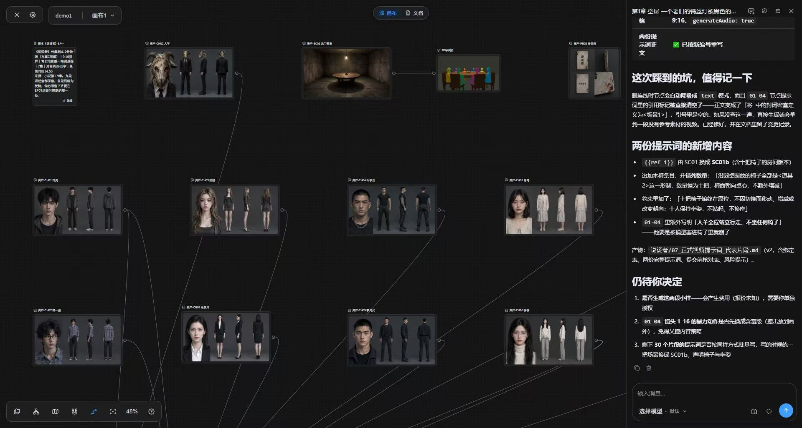
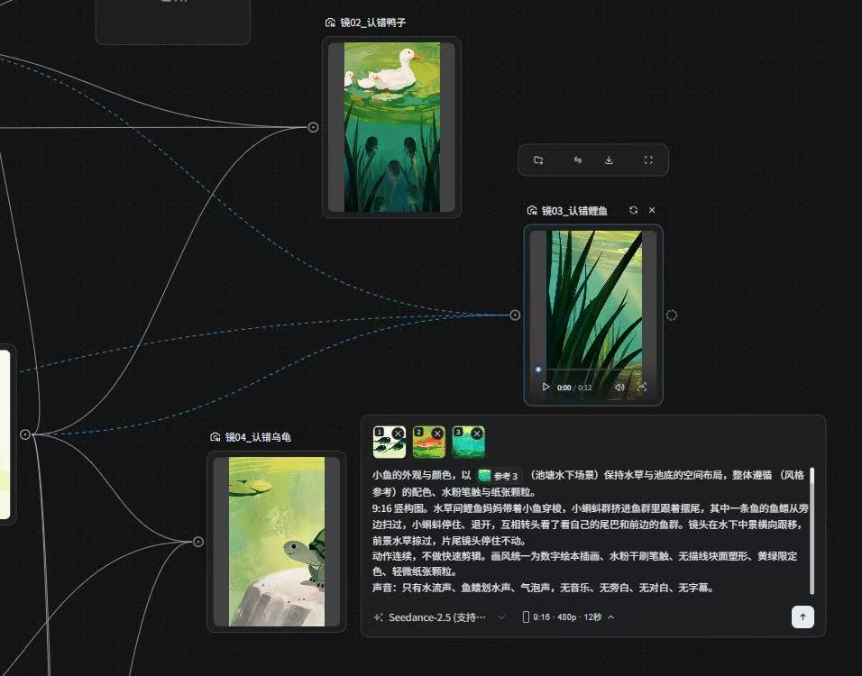

# AI 短剧细分领域工具推荐（2026-09-25）

> 数据说明
> - GitHub 星数 / fork / 最近 push / 许可证（SPDX）均为 **2026-09-25 约 18:20（北京时间）通过 GitHub API 实际查询**的结果；“最近更新”= `pushed_at` 换算为北京时间的日期。
> - 许可证写 `NOASSERTION` 表示 GitHub 无法识别为标准协议（多为自定义协议/模型协议），**商用前务必读原文**。
> - 商用产品价格来自第三方评测/官网片段，活动频繁，以官网为准；未能确认的写“未核实”。
> - 已有的三款一站式工具（火宝短剧 / LocalMiniDrama / MediaGo Drama）作参照：火宝 `chatfire-AI/huobao-drama` 15,517★/2,870 fork，2026-09-23，许可证 NOASSERTION（自定义）；`xuanyustudio/LocalMiniDrama` 1,848★/448，2026-09-14，MIT。MediaGo Drama 本次未复核。

---

## 1. 剧本 / 分镜（剧本创作、剧本→分镜、镜头表）

| 名称 | 类型 | 链接 | 星数/fork | 最近更新 | 许可证 | 一句话适合谁 |
|---|---|---|---|---|---|---|
| ViMax | 开源 | https://github.com/HKUDS/ViMax | 12,473 / 1,879 | 2026-09-20 | MIT | 想要“导演/编剧/制片”多 Agent 自动从创意→剧本→分镜→视频的人（港大 HKUDS） |
| Toonflow | 开源 | https://github.com/HBAI-Ltd/Toonflow-app | 16,017 / 2,865 | 2026-09-24 | MIT（API 当前值；早期 README/第三方曾写 Apache-2.0/AGPL，以仓库 LICENSE 为准） | 要“小说→故事骨架→结构化剧本→无限画布分镜”的桌面工作台 |
| SketchShot | 开源 | https://github.com/chinapxe/sketchshot | 34 / 2 | 2026-06-25 | AGPL-3.0 | 喜欢节点式无限画布做分镜/连续镜头的小团队（很小众，参考设计为主） |
| LTX Studio | 商用 | https://ltx.io/studio | — | — | — | 英文剧本→场景/镜头故事板，“Elements”保持角色一致；Free 800 次性积分，Lite $15/月，Standard $35/月起才有 AI Storyboard 与商用；国内需海外网络 |
| 海马轻帆 | 商用 | https://www.haimaqingfan.com/ | — | — | — | 中文编剧：小说转剧本、剧本格式/戏量统计、剧本评估；定价未核实；国内可用 |

**推荐**：开源首选 **ViMax**（活跃、MIT、架构清晰，剧本/分镜 Agent 可单独抽出来用）；要开箱即用的中文分镜工作台选 **Toonflow**。纯中文剧本打磨用 **海马轻帆**，英文/海外项目的分镜预演用 **LTX Studio**。showlab/MovieAgent（364★，2025-03 后无更新、无 LICENSE）不推荐。

---

## 2. 角色一致性（参考图/ID 注入、LoRA 训练、ComfyUI 工作流）

| 名称 | 类型 | 链接 | 星数/fork | 最近更新 | 许可证 | 一句话适合谁 |
|---|---|---|---|---|---|---|
| ostris/ai-toolkit | 开源 | https://github.com/ostris/ai-toolkit | 12,115 / 1,536 | 2026-09-25 | MIT | 给主角训练角色 LoRA（Flux/Qwen-Image/Wan 等），最稳的一致性手段 |
| Qwen-Image（含 Qwen-Image-Edit） | 开源 | https://github.com/QwenLM/Qwen-Image | 8,372 / 554 | 2026-02-10 | Apache-2.0 | 用参考图做“下一镜头”编辑、三视图、换装换景，ComfyUI 原生支持 |
| kohya-ss/sd-scripts | 开源 | https://github.com/kohya-ss/sd-scripts | 7,241 / 1,217 | 2026-09-24 | Apache-2.0 | 老牌 LoRA 训练脚本，精细控制训练参数的进阶用户 |
| WeChatCV/Stand-In | 开源 | https://github.com/WeChatCV/Stand-In | 791 / 50 | 2026-08-10 | Apache-2.0 | 视频生成里的身份保持（轻量插件，配合 Wan） |
| 其他参考（不再活跃但仍常用） | 开源 | InstantID / PuLID / StoryDiffusion / InfiniteYou / UNO | 11,996 / 3,554 / 6,463 / 2,684 / 1,362 | 2024-07 / 2025-08 / 2024-09 / 2025-08 / 2025-09 | 均 Apache-2.0 | 研究或老工作流兼容；2026 年已被 Qwen-Image-Edit / 视频模型“参考生视频”大面积替代 |
| 即梦 / 可灵 / Vidu 的“主体参考 / 多图参考 / 参考生视频” | 商用 | https://jimeng.jianying.com / https://klingai.com / https://www.vidu.cn | — | — | — | 不想自训 LoRA，直接用平台多图参考锁脸；积分/会员制，国内可用 |
| Seko（商汤） | 商用 | https://seko.sensetime.com | — | — | — | 自研 SekoIDX 一致性引擎，支持 100 集内连续剧集；个人 39 元/月起（第三方 2026-08 截图） |

**推荐**：自部署路线 = **Qwen-Image-Edit 出角色三视图/定妆照 → ai-toolkit 训练主角 LoRA → 视频模型参考生视频**；不想折腾直接用 **可灵/即梦/Vidu 多图参考**，这也是火宝短剧 / LocalMiniDrama 已接入的方式（LocalMiniDrama 的 `@图片N` 多图参考、尾帧衔接即基于此）。

---

## 3. 配音、音色、对口型

| 名称 | 类型 | 链接 | 星数/fork | 最近更新 | 许可证 | 一句话适合谁 |
|---|---|---|---|---|---|---|
| IndexTTS2（B 站） | 开源 | https://github.com/index-tts/index-tts | 24,180 / 2,879 | 2026-08-18 | NOASSERTION（自定义协议） | 中文短剧强情绪对白：音色/情感解耦、自然语言情感指令、时长控制（便于对口型） |
| CosyVoice 3 | 开源 | https://github.com/QwenAudio/CosyVoice | 23,764 / 2,702 | 2026-05-26 | Apache-2.0 | 批量生产、多语言/方言，速度快于 IndexTTS2；注意仓库已从 FunAudioLLM 迁到 QwenAudio |
| GPT-SoVITS | 开源 | https://github.com/RVC-Boss/GPT-SoVITS | 62,127 / 6,682 | 2026-08-18 | MIT | 为固定角色少样本微调专属音色，推理快 |
| VoxCPM | 开源 | https://github.com/OpenBMB/VoxCPM | 37,967 / 4,316 | 2026-09-02 | Apache-2.0 | 部署最简单、CPU/MPS 也能跑的零样本克隆 |
| LatentSync | 开源 | https://github.com/bytedance/LatentSync | 6,093 / 982 | 2025-06-20 | Apache-2.0 | 已有视频的高质量对口型（需约 18–20GB 显存，第三方数据） |
| InfiniteTalk | 开源 | https://github.com/MeiGen-AI/InfiniteTalk | 7,916 / 1,368 | 2026-05-22 | Apache-2.0 | 音频驱动整段视频（嘴型+表情+头身动作），适合对白长镜头 |
| MuseTalk | 开源 | https://github.com/TMElyralab/MuseTalk | 6,625 / 959 | 2025-09-26 | NOASSERTION | 低显存/实时预览型口型同步（画质不如 LatentSync） |
| 火山引擎豆包语音 / MiniMax 语音 | 商用 | https://www.volcengine.com/product/voice-tech / https://www.minimaxi.com | — | — | — | 国内云 API，音色库+克隆，按量计费（具体价格未核实），国内可用 |
| ElevenLabs | 商用 | https://elevenlabs.io | — | — | — | 英文/多语种配音与克隆标杆，订阅制；国内需海外网络与支付 |

**推荐**：对白 TTS 首选 **IndexTTS2**（情绪+时长控制最适合短剧），量大求快用 **CosyVoice 3**；对口型首选 **LatentSync**（后期改嘴型）或 **InfiniteTalk**（直接生成说话镜头）。注意：现在 Seedance/可灵/Vidu 等视频模型本身已支持“带台词原生音频/口型”，很多短剧可以不单独做对口型。

---

## 4. 漫剧 / 动态漫、小说推文

| 名称 | 类型 | 链接 | 星数/fork | 最近更新 | 许可证 | 一句话适合谁 |
|---|---|---|---|---|---|---|
| LumenX（阿里） | 开源 | https://github.com/alibaba/lumenx | 1,306 / 307 | 2026-08-11 | MIT | 小说→剧本分析→角色三视图→分镜视频→CosyVoice/Qwen3-TTS 配音→FFmpeg 合成的短漫剧流水线 |
| Toonflow | 开源 | https://github.com/HBAI-Ltd/Toonflow-app | 16,017 / 2,865 | 2026-09-24 | MIT | 小说导入到出片的桌面端（同第 1 节） |
| AI_novel | 开源 | https://github.com/tyxben/AI_novel | 280 / 30 | 2026-08-18 | MIT | 低成本“小说推文”：Edge-TTS + 配图 + Ken Burns + 字幕，另有 MCP 接口 |
| Koma Studio | 开源 | https://github.com/M-JYuan/Koma（fork 自 https://github.com/Sundykin/KomaBuild） | 98 / 27（上游 27 / 36） | 2026-09-21（上游 2026-08-20） | GPL-3.0 | Electron 桌面漫剧工作台，四/九宫格分镜、剪映草稿导出 |
| 巨日禄 | 商用 | https://video.jurilu.com/ | — | — | — | 推文工作室批量漫剧；第三方称基础版 68 元/月、专业版 198 元/月，国内可用 |
| 小云雀（剪映） | 商用 | https://xiaoyunque.jianying.com | — | — | — | 一键长剧本成片的短剧 Agent；基础会员 79 元/月起（第三方 2026-08 截图），国内可用 |
| LibTV（LiblibAI） | 商用 | https://www.liblib.tv | — | — | — | 无限画布+节点工作流，多模型聚合，可导出剪映工程；59 元/月起（第三方），国内可用 |

**推荐**：开源首选 **LumenX**（大厂出品、链路完整、MIT，但星数较少、8 月后未 push）和 **Toonflow**；只做小说推文图文视频用 **AI_novel** 足够。商用：批量推文选 **巨日禄**，一键成片选 **小云雀**，要精细控制选 **LibTV**。（另有第三方软文推荐的 Tago Movie、知漫剧、泡漫等，未独立核实效果。）

---

## 5. 视频生成编排 / ComfyUI 工作流

| 名称 | 类型 | 链接 | 星数/fork | 最近更新 | 许可证 | 一句话适合谁 |
|---|---|---|---|---|---|---|
| ComfyUI | 开源 | https://github.com/Comfy-Org/ComfyUI（原 comfyanonymous/ComfyUI） | 134,906 / 15,979 | 2026-09-25 | GPL-3.0 | 本地/自建节点式生成编排的事实标准，提供 API 可被短剧工具调用 |
| Wan 2.2 | 开源 | https://github.com/Wan-Video/Wan2.2 | 17,633 / 2,267 | 2026-09-21 | Apache-2.0 | 最主流的开源视频模型（T2V/I2V/S2V/Animate），商用友好 |
| ComfyUI-WanVideoWrapper（kijai） | 开源 | https://github.com/kijai/ComfyUI-WanVideoWrapper | 6,711 / 694 | 2026-05-24 | Apache-2.0 | 在 ComfyUI 跑 Wan 系列（含各种加速/控制 LoRA）的首选节点 |
| LTX-2 | 开源 | https://github.com/Lightricks/LTX-2 | 9,523 / 1,504 | 2026-08-26 | NOASSERTION（LTX 自定义协议） | 显存友好、速度快、带音频的视频模型 |
| comfyui-auto-drama | 开源 | https://github.com/qiukaihui/comfyui-auto-drama | 47 / 14 | 2026-08-26 | MIT | ComfyUI + MiniMax H3 的短剧流水线参考（角色四视图、R2V、自动质检、合片）；小项目，参考设计 |
| RunningHub | 商用 | https://www.runninghub.cn | — | — | — | 云端 ComfyUI + 无限画布 + 短漫剧工作台，没有显卡时首选；积分制，国内可用 |

**推荐**：**ComfyUI + Wan2.2（kijai Wrapper）** 是本地开源路线的核心；没显卡用 **RunningHub** 跑同样的工作流。其余如 HunyuanVideo-1.5（4,561★，2026-04-10，NOASSERTION）、SkyReels-V2（7,568★，2026-01-29，NOASSERTION）可作备选。

---

## 6. 剪辑合成、字幕、成片

| 名称 | 类型 | 链接 | 星数/fork | 最近更新 | 许可证 | 一句话适合谁 |
|---|---|---|---|---|---|---|
| pyJianYingDraft | 开源 | https://github.com/GuanYixuan/pyJianYingDraft | 4,435 / 670 | 2026-07-08 | Apache-2.0 | 程序化生成剪映草稿（轨道/字幕/转场/关键帧），AI 出片后在剪映精修 |
| VectCutAPI（原 CapCutAPI） | 开源 | https://github.com/sun-guannan/VectCutAPI | 2,252 / 476 | 2026-09-24 | Apache-2.0 | HTTP/MCP 接口生成剪映/CapCut 草稿，方便被 Agent 调用 |
| VideoCaptioner（卡卡字幕助手） | 开源 | https://github.com/WEIFENG2333/VideoCaptioner | 16,100 / 1,395 | 2026-09-12 | GPL-3.0 | ASR + LLM 断句校正 + 翻译 + 字幕烧录（出海译制必备） |
| NarratoAI | 开源 | https://github.com/linyqh/NarratoAI | 11,198 / 1,542 | 2026-09-17 | MIT | 短剧解说/混剪：剧情分析、解说文案、配音、字幕遮罩、剪映草稿导出 |
| MoneyPrinterTurbo | 开源 | https://github.com/harry0703/MoneyPrinterTurbo | 125,596 / 19,533 | 2026-09-24 | MIT | 主题→文案→素材→配音字幕→合成的通用短视频流水线，合成模块可借鉴 |
| Remotion | 开源（自定义许可） | https://github.com/remotion-dev/remotion | 60,359 / 4,661 | 2026-09-25 | NOASSERTION（公司商用需付费许可，详见其 LICENSE） | 用 React 代码模板化渲染成片（片头、字幕样式、批量出集） |
| 剪映 / CapCut | 商用 | https://www.capcut.cn / https://www.capcut.com | — | — | — | 最终精修、智能字幕、配乐；免费+会员，国内用剪映 |

**推荐**：成片精修走 **“AI 生成素材 → pyJianYingDraft / VectCutAPI 生成剪映草稿 → 剪映人工精修”**；字幕/翻译用 **VideoCaptioner**；做解说二创用 **NarratoAI**。纯自动合成可参考 MoneyPrinterTurbo 的 FFmpeg/MoviePy 实现。（注：新版剪映 7+ 不支持 pyJianYingDraft 的自动导出，只能生成草稿。）

---

## 7. 其他值得关注（工作台/架构参考）

| 名称 | 类型 | 链接 | 星数/fork | 最近更新 | 许可证 | 一句话适合谁 |
|---|---|---|---|---|---|---|
| ViMax | 开源 | https://github.com/HKUDS/ViMax | 12,473 / 1,879 | 2026-09-20 | MIT | 多 Agent 视频生成架构（有论文），适合参考角色分工与一致性管理 |
| Toonflow | 开源 | https://github.com/HBAI-Ltd/Toonflow-app | 16,017 / 2,865 | 2026-09-24 | MIT | “Agent + 无限画布 + 节点工作流 + MCP/插件”的产品形态参考 |
| ComfyUI-Manager | 开源 | https://github.com/Comfy-Org/ComfyUI-Manager | 16,258 / 2,497 | 2026-09-25 | GPL-3.0 | 管理 ComfyUI 自定义节点/模型，搭本地环境必装 |
| Seko / LibTV / 小云雀 | 商用 | 见上 | — | — | — | 国内三种产品思路：分步精控（Seko）、节点画布（LibTV）、一键 Agent（小云雀） |

---

## 总推荐（按实用性、质量、活跃度、与短剧生产的契合度）

| 细分领域 | 首选 | 次选 | 与三款一站式工具的搭配 |
|---|---|---|---|
| 剧本/分镜 | **ViMax**（12,473★，2026-09-20，MIT） | Toonflow（16,017★，2026-09-24，MIT）/ 海马轻帆（商用） | 用 ViMax/海马轻帆产出结构化剧本+分镜，再贴进火宝/LocalMiniDrama 的剧本步骤；MediaGo Drama 的 SKILL.md 可直接参考 ViMax 的角色分工写“编剧/分镜”阶段提示词 |
| 角色一致性 | **Qwen-Image-Edit + ai-toolkit 角色 LoRA**（8,372★/12,115★，Apache-2.0/MIT） | 可灵/即梦/Vidu 多图参考（商用） | 三款工具都支持上传角色参考图：先用 Qwen-Image-Edit 生成统一的三视图/定妆照作为参考图导入；LocalMiniDrama 的 `@图片N`+尾帧衔接效果最好 |
| 配音/对口型 | **IndexTTS2**（24,180★，2026-08-18，自定义协议） | CosyVoice 3（23,764★，Apache-2.0）；对口型 LatentSync / InfiniteTalk | 本地起 IndexTTS2/CosyVoice 服务，替换一站式工具内置 TTS（LumenX 已内置 CosyVoice，可参考接法）；或直接用视频模型原生对白音频省去对口型 |
| 漫剧/小说推文 | **Toonflow**（开源）/ **巨日禄**（商用） | LumenX（1,306★，MIT）/ 小云雀 | 与火宝/LocalMiniDrama 功能重叠较多，属“替代”而非“搭配”；可参考 LumenX 的小说解析与资产抽取逻辑 |
| 视频编排/ComfyUI | **ComfyUI + Wan2.2 + kijai WanVideoWrapper** | RunningHub（云端） | 想省 API 费时，把一站式工具里的“视频生成”步骤换成调用本地 ComfyUI API（Koma、comfyui-auto-drama 已有此类 Provider 可参考） |
| 剪辑/字幕/成片 | **pyJianYingDraft / VectCutAPI**（Apache-2.0） | VideoCaptioner（GPL-3.0）、NarratoAI（MIT） | 三款工具导出分镜视频+音频后，用 pyJianYingDraft/VectCutAPI 一键生成剪映草稿做最终精修；VideoCaptioner 负责字幕与出海翻译 |

**一句话结论**：最实用的组合是“**一站式工具（火宝 / LocalMiniDrama / MediaGo Drama）做主干 + Qwen-Image-Edit/LoRA 管角色 + IndexTTS2 管配音 + 剪映草稿（pyJianYingDraft）管精修**”，本地有显卡再把视频生成切到 ComfyUI + Wan2.2。

---

## 未能核实 / 备注
- MediaGo Drama、DramaBuddy：本次未复核。
- HITsz-TMG/FilmAgent：GitHub 搜索未找到该仓库（可能已改名或删除），未收录。
- Agions/frame-fab、krillinai/KrillinAI：API 查询未返回结果（可能改名或限流），未收录数据。
- SurpassHR/printfilm（Spring Boot 短剧平台）为 fork、0★；TwoOxygenH2O/niren-drama 1★：太小，未收录进表。
- Toonflow 许可证：API 当前显示 MIT，但搜索摘要/派生 fork 曾提到 Apache-2.0 与 AGPL-3.0，存在变更史，使用前请看仓库 LICENSE。
- 商用产品价格均来自第三方评测（多为 2026-08 截图），未在官网逐一核对；海马轻帆、豆包语音、MiniMax、RunningHub 具体价格未核实。
- NOASSERTION 许可的具体条款（IndexTTS、fish-speech、MuseTalk、LTX-2、HunyuanVideo、SkyReels、Remotion、火宝短剧）未逐条核读。

---

Toonflow 是一个开源的 AI 短剧和漫剧制作平台。它把剧本、角色场景素材和视频片段放在同一张无限画布上，从想法到出片都在这一个工具里完成。下面按官方 README 和截图整理，我没有实际装机试用过。

**主要功能**

1. **灵感和剧本**：项目首页有「灵感模式」，可以从一个想法或一部小说开始。旁边有 AI 助手帮你拆章节、写结构化剧本和分镜。截图里助手会读分镜文档、改提示词，还会记录每次改了什么。
2. **无限画布**：剧本、角色、场景、道具和视频片段都是画布上的节点。节点可以连线、分组，整个项目的前后关系一眼就能看到，不用像普通工具那样在一步步的表单里来回切换。
3. **资产管理**：角色、场景和道具各自单独管理，可以生成角色三视图和定妆照。后面做视频时直接引用这些素材，靠它们让角色在不同镜头里保持一致。
4. **3D 导演台**：这是它比较特别的功能。你可以在一个简单的 3D 场景里摆人物站位、调相机焦距和画幅（比如 16:9）、设置灯光、加关键帧，先把镜头预演出来。再让 AI 按这个构图生成视频方案，最后导出成视频节点。
5. **视频生成**：一次可以放多张参考素材，比如角色图、场景图和首尾帧，再调用视频模型生成片段。
6. **模型接入**：可以自己填第三方 API，也可以接本地的 ComfyUI 和本地大模型。官方还有一个叫 TF-Router 的模型中转平台，能帮拿不到 Seedance 2.0 权限的用户用上它。TF-Router 的源码也开源了。
7. **扩展能力**：支持 MCP，也就是接外部工具的一种通用接口。另外有插件市场，可以加节点和工具；Agent 的提示词、工具和 A2A（Agent 之间互相协作的接口）也都开放，可以自己改 Agent 的行为。官方说还会做 Skill Hub，让大家分享制作经验。

**部署方式**
- 桌面版有 Windows 和 macOS（Apple Silicon）安装包，下载就能用。
- 也可以用 Docker 或装在 Linux 服务器上，打开 `http://127.0.0.1:3000` 使用，自带 FFmpeg。
- 注意服务器版没有登录鉴权。放到公网时要用防火墙限制访问，或者在前面加一层带认证的反向代理。

**官方案例的成本**：一个约 2 分钟的成片，制作花了大约 2 小时，模型费用约 130 元，其中视频生成占约 120 元。用的是 Seedance 2.0、GPT Image 2 和 Claude Opus 4.6。

**许可证**：现在是 MIT，可以随便商用，没有附加条款。更早的版本用过 AGPL-3.0 和 Apache-2.0 加附加协议，只有用那些旧版本才需要留意。

和火宝短剧、LocalMiniDrama 比，Toonflow 更像一个可视化的创作工作台，适合想一个镜头一个镜头细调的人。火宝和 LocalMiniDrama 更偏向按固定流程一路生成下去。

