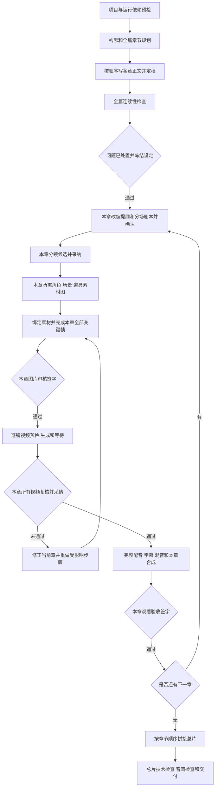

# NovaStory 完整视频制作链路与内部接口

本文供后续实际制作和调度开发使用，说明从项目构思、章节正文、剧本、素材、分镜到镜头视频、章节成片和总片的调用顺序，以及每一步的内部接口、入参、出参和完成条件。

**制作约束：生图与生视频按章节依次完成。第 N 章的素材图、分镜关键帧、镜头视频、人工复核和章节合成全部完成后，才能开始第 N+1 章的图像与视频生成。最后按章节顺序拼接完整视频。** 全篇文本和稳定设定可提前准备。已有正文可以保留；分场剧本、分镜，以及角色、场景、道具图如果要重做，必须走各自的正式候选或生成接口，旧图和旧视频保留为历史版本，不能因为磁盘上已有文件就跳过。共用资产按首次使用章节生成，外观未要求重做时才复用，不能借共用素材准备提前批量生成后续章节画面。

**提供方约束：生图和生视频默认按项目设置使用本机 ComfyUI。** 图像模型、工作流、风格和比例以项目 `image_generation` 为准，由已启用的 ComfyUI 执行。视频在项目 `video_generation.workflow_id` 为空时走 ComfyUI 上的 Official Ref2VA，有引导帧或尾帧时再选 Multi-Frame 或 FL2VA。Codex 图像队列和 `grok_imagine_browser` 是特定通路，只有操作者明确要求并传入对应命令参数时才使用；制作脚本不会因为系统里残留 `image_provider=codex`、环境变量或项目里写了 Grok 工作流就自动改走这两条通路。

**当前操作依据是 2026-10-07 的磁盘工作区：HEAD `7d1e42a` 加尚未提交的文档、制作脚本和测试修改。** `84caf84` 是 2026-10-06 修复工作的起点，不包含后来提交到 `7d1e42a` 的 720p 统一、正式配音与章节签字。第 1～11.1 节按当前磁盘代码描述；第 11.2～11.7 节为历史核查和修复记录，第 11.8 节记录本工作区的改动与验证。历史证据 JSON 的 `baseline_commit=84caf84` 不能作为当前工作区的验收 SHA。隔离测试不等于真实模型内容与音画质量验收。

2026-10-06 提交整理：制作入口依赖的 `scripts/local-queue.mjs`、`scripts/video-delivery-contract.mjs` 及交付契约测试原受 `/scripts/*` 忽略规则排除，本次将这三份必要文件纳入版本管理；本文和指定核查脚本、JSON 证据也一并纳入。生产数据、日志、测试媒体目录和测试清理备份继续留在本地。此整理不等于修复第 11.6 节列出的生产逻辑缺口。

**历史修复（2026-10-06，起点 `ae1eed0`）：正式剧本分镜路径此前漏传项目 NSFW 模式，后续提交已接入。** 分镜服务解析项目模式与系统默认值，将对应策略加入模型提示词，并在候选中记录有效模式与策略版本。该次模拟回归验证了传递与时间线采纳，未调用真实模型或替换实际项目产物。修复前证据见第 11.4 节，修复后的行为见第 5.3、11.5 节。

## 1 当前结论与运行边界

**已复现的制作工程缺口现已接通，并通过两章隔离全流程验证。** `all` 初始化缺省规划，统一提交 720p 请求，从确认剧本制作完整配音、字幕和章节视频，依次等待图片审核、视频采纳及章节观看签字。签字绑定来源与文件哈希，全部章节通过才合成总片。真实项目还须具备可用的文本、ComfyUI、TTS、FFmpeg/ffprobe 环境，并由操作者验收画面、声音和口型；脚本不能替代这项内容判断。

| 项目 | 当前代码事实 | 对后续制作的要求 |
| --- | --- | --- |
| 完整制作入口 | `npm run production:full -- --project <id>` 调用 `scripts/full-production.mjs` | 项目 ID 必填；仅在 PLAN_NOT_FOUND 时初始化规划，其他错误停止 |
| 图像和视频提供方 | 项目 `image_generation` 决定 ComfyUI 模型和工作流；`comfyui.enabled` 为真时生图走 ComfyUI。视频工作流为空时默认 Ref2VA | Codex 图像须同时满足 `--allow-codex-image`、系统 `image_provider=codex` 和 ComfyUI 关闭；Grok 视频须明确传入 `--video-workflow grok_imagine_browser` |
| 当前默认顺序 | 全篇正文 → 连续性检查及问题处置 → 本章剧本、分镜、素材、关键帧和图片签字 → 视频采纳 → 正式配音、字幕和本章合成 → 章节签字 → 总片和验收 | issues 非空时先修订正文或登记有指纹的人工处置；all 严格按章放行 |
| 分镜内容策略 | 正式 `storyboard-candidates` 与兼容时间线入口均按项目 `image_generation.nsfw_mode` 和系统默认值选择模型契约策略 | 新候选记录 `nsfw_enabled` 与策略版本；已有候选不自动重写，调整模式或升级策略后需新 key 与正式重建，见第 5.3 节 |
| 交付契约 | 生成源片为 1280×720、24 fps、120 帧、5 秒；解码计帧，未知帧数拒绝；剪辑长度按实际配音预算确定 | 旧 480p 片需重新生成；长台词延长剪辑并冻结末帧，合成片须有音轨 |
| 视频完成语义 | 技术 QA 通过得到 `draft` 候选；需复核的得到 `review_required` 候选 | 查询任务完成后，读取媒体列表、观看检查并采纳；必须取得 `narrative_final + ready` |
| 最终合成 | 在本地脚本 `assemble()` 中调用 FFmpeg；后端未提供章节或总片合成 HTTP 路由 | 合成调用属于本地编排步骤，不能调用臆造的 `/api/videos/assemble` |
| 配音与字幕 | render-block 从确认剧本读取完整原声块；正式媒体、顺序混音、SRT 和 MP4 字幕轨已衔接 | 试听限 80 字，正式配音完整读取源块；准确朗读、音效和口型仍须听看 |
| 章节和时长 | --chapter-limit 为前 1～200 章，默认 5；分镜默认 5 秒，剪辑取镜头时长与完整音频预算的较大值 | 总片时长按剪辑清单求和；所选范围覆盖全篇才是全篇交付，不能凭文件名判断 |

主要依据：[制作脚本](D:/StudioProjects/nova-story/scripts/full-production.mjs)、[脚本调度入口](D:/StudioProjects/nova-story/scripts/full-production.mjs)、[视频路由](D:/StudioProjects/nova-story/backend/src/routes/videos.ts)、[合成逻辑](D:/StudioProjects/nova-story/scripts/full-production.mjs)。本地文件链接使用工作区绝对路径；在 Windows 编辑器中也可按源文件路径定位。

## 2 制作顺序



上图与当前 all 调度一致。连续性 issues 非空时，text 阶段退出；`review-continuity` 要求审核人、当前报告指纹和非空处置说明，但不会自动逐条核对说明。图片和章节签字保存复核人、时间及来源指纹，在续跑和总片合成前重核。待审核时脚本退出，操作者核对后登记，再运行原命令。重做使用正式接口或 --rebuild-*，ready 视频先归档保留历史；不得直接改库或删除整个 state.json 绕过保护。

| 顺序 | 执行范围 | 工作 | 完成条件 |
| --- | --- | --- | --- |
| A | 项目一次，恢复时复查 | 选择或创建项目、检查文本服务、图像通路、所选视频工作流、FFmpeg、输出位置 | 项目存在，所选通路可用，阻塞项为空 |
| B1 | 全局 | 构思、故事蓝图、章节规划，采纳候选 | 名称、核心角色、世界观、章节计划明确 |
| B2 | 从第一章到末章 | 创建本章 → 正文预览 → 保存 → 影响分析并定稿 → 下一章 | 所有正文非空且 `status=completed`，定稿哈希与现正文一致 |
| B3 | 全局 | 连续性检查，补齐角色、场景、道具的文本定义；issues 非空时修订正文重跑，或用 `review-continuity` 登记审核人、报告指纹及处置说明 | 报告无问题，或已有匹配当前正文和报告的人工处置记录；说明内容须由操作者逐项核实，脚本只检验非空 |
| C1 | 当前章 | 改编提纲候选 → 采纳 → 分场剧本候选 → 采纳 → 确认。已有剧本但本次要求重做时，仍重新生成候选并采纳，不直接沿用旧分场 | 剧本 `confirmed` 且来源未过期；重做后的修订号已更新 |
| C2 | 当前章 | 分镜候选 → 核对覆盖 → 采纳。已有分镜来源过期，或本次要求重做时，用 `replace_existing` 替换；已采纳的成片必须先保留为历史版本 | 获得真实 `scene_id[]`，对白和旁白块被准确分配 |
| C3 | 当前章首次需要的资产，或本次要求重做的资产 | 定妆照 → 三视图；场景和道具素材图。重做会生成新版本，不覆盖删除旧图 | 所需资产有图，版本固定；未要求重做的合格共用资产才直接复用 |
| C4 | 当前章每镜 | 绑定场景和道具 → 生成关键帧 → 检查画面和引用快照 | **本章全部关键帧合格后才进入本章生视频** |
| C5 | 当前章每镜 | 读取媒体 → 选择视频策略 → 预检 → 提交 → 等待 → QA 和人工复核 → 采纳 | 每镜存在当前版本、当前关键帧对应的 `narrative_final + ready` |
| C6 | 当前章 | 规范化镜头片段 → 顺序拼接章节视频 → 观看本章 | 章节文件、镜头顺序、时长、声音均验收通过 |
| D | 全部章节完成后 | 章节视频按序拼接 → 总片验证 → 导出备份和报告 | 得到完整总片，不能以阶段片代替总片 |

先定稿全篇正文的原因：`/api/agent/impact` 会更新人物和世界观；剧本来源新鲜度同时检查正文和项目语义设定。先做第一章剧本、再继续写后几章，后续定稿可能让第一章剧本来源过期。角色图片变化本身不使剧本文本来源过期，但会影响关键帧和视频的视觉版本链。

依据：[剧本来源哈希](D:/StudioProjects/nova-story/backend/src/schemas/script.ts)、[定稿写入](D:/StudioProjects/nova-story/backend/src/services/ai/writing_service.ts)。

## 3 接口约定与对象标识

以下 HTTP 路径均为内部 Fastify 接口，示例基址为 `http://127.0.0.1:3000`，路径已包含 `/api`。请求默认为 JSON；上传接口明确使用 multipart。`?` 表示可选字段，示例中的 ID 和版本仅作形状说明，执行时必须使用上一步返回值。

| 标识 | 类型 | 来源与含义 |
| --- | --- | --- |
| `project_id` | integer | 项目 ID |
| `plan_entry_id` | string | 规划条目 ID；不能拿章节 ID 替代 |
| `chapter_id` | string | 已创建章节 ID，包含章节正文 |
| `script_id` | integer | 章节结构化剧本 ID |
| `script_scene_id` | string | 剧本文档内部的分场 ID |
| `scene_id` | integer | 导演时间线中的**一个镜头**，不是剧本分场，也不是场景素材 |
| `scene_version` | integer | 镜头版本，取 `active_version`；视频请求省略会默认为 1 |
| `character_id` | integer | 角色库 ID |
| `library_asset.id` | integer | 场景或道具素材库 ID；用于绑定镜头 |
| `media_asset.id` | integer | 视频系统媒体 ID；用于视频关键帧、角色参考、候选视频等 |
| `task_id` | string | 异步生图或生视频任务 ID，不是媒体 ID |
| `request_key` | string | 幂等请求标识；同一次提交保留相同 key 和相同 body |
| `revision` | integer | 规划、剧本或素材修订号，按对象分别使用 |

重要出参对象的主要字段如下。本文列出制作调用需要的字段，不将这些节选当作完整数据库导出格式。

```ts
type Chapter = {
  id: string; project_id: number; index: number; title: string;
  content: string | null; summary: string | null; status: string;
  target_word_count: number | null; plan_entry_id: string | null;
  condensed_content: string | null; finalized_content_hash: string | null;
};

type PlanView = {
  project_id: number; revision: number; document: StoryPlanDocument;
  entries: Array<{
    id: string; title: string; summary: string; targetWordCount: number;
    disposition: "active" | "retired";
    chapter_id: string | null; chapter_status: string | null;
    chapter_index: number | null;
  }>;
  budget: { written: number; reserved: number; target: number | null };
  next_entry_id: string | null; auto_create_next_chapter: boolean;
};

type Script = {
  id: number; chapterId: string; projectId: number; revision: number;
  status: "draft" | "confirmed"; document: ScriptDocument;
  freshness: { sourceChanged: boolean; contentChanged: boolean; contextChanged: boolean };
};

type ScriptCandidate = {
  id: string; script_id: number; kind: string; state: "pending" | "applied" | "discarded";
  base_revision: number; candidate_revision: number; request_key: string;
  after_json: string; before_json: string | null;
};

type LibraryAsset = {
  id: number; project_id: number; kind: "location" | "prop";
  name: string; description: string; visual_prompt: string;
  revision: number; status: string; task_id: string | null;
  image_url: string | null; source_chapter_ids: string; // JSON 字符串
};

type MediaAsset = {
  id: number; project_id: number; scene_id?: number | null;
  scene_version?: number | null; character_id?: number | null;
  parent_asset_id?: number | null;
  media_type: "image" | "video" | "json"; role: string;
  status: "draft" | "review_required" | "ready" | "rejected" | "archived";
  url: string; width?: number; height?: number; fps?: number;
  frame_count?: number; duration_ms?: number; sha256?: string;
  metadata_json?: string;
};
```

`StoryPlanDocument` 包含 `schemaVersion:1`、`blueprint`、`targetTotalWords`、`endingPolicy`、`autoCreateNextChapter`、`chapters[]`。短篇项目可保留 `targetTotalWords:null`；非空值的当前 schema 限制为 50000～100000，不能为五章短片随意填 8000。

`ScriptDocument` 包含 `schemaVersion`、`title`、`targetDurationSec`、`outline`、`locations[]`、`props[]`、`scenes[]`。每个分场有 `id/locationId/characterIds/propIds/blocks[]`；块类型为 `action/dialogue/voiceover/sound`。`dialogue` 必须有项目内的 `characterId`；`voiceover.characterId` 可为 null。剧本分场最多 12 场，分镜候选最多 20 镜，不能把它们混为同一限制。

## 4 全局准备与章节正文接口

### 4.1 项目和运行预检

| 顺序 | 接口 | 入参 | 出参和使用方式 |
| --- | --- | --- | --- |
| 1 | `GET /api/projects/` | Query：`skip?`, `limit?` | `Project[]`，选择目标项目 |
| 2 | `POST /api/projects/` | Body：`title:string`, `description?:string|null`, `settings?:string|null` | 新 `Project`，记录 `id`；`settings` 是 JSON **字符串** |
| 3 | `GET /api/projects/{id}` | Path：项目 ID | `Project`；读取现有设置和项目身份 |
| 4 | `PUT /api/projects/{id}` | Body：`title?`, `description?`, `settings?` | 更新后的 `Project`；修改图像策略时先解析并合并原 settings，再序列化 |
| 5 | `GET /api/settings/` | 无 | 公共系统设置，包含文本、图像、ComfyUI 等配置，不返回明文密钥 |
| 6 | `POST /api/settings/verify-llm` | Body：`{}` 使用已有配置；也支持 `llm` 配置覆盖 | `{status:"success",message,provider,model}`；失败 HTTP 502；会实际做小段文本推理 |
| 7 | `POST /api/settings/verify-comfy` | Body：`{}` 使用已有配置 | `{status:"success",message,mode,base_url,...,devices}`；用于 ComfyUI 路径 |
| 8 | `GET /api/videos/capabilities` | Query：`workflow_id`，建议显式传本次选用工作流 | `video_generation_enabled`, `missing_components[]`, `ffmpeg_available`, `ffprobe_available`，以及工作流和运行时信息 |
| 9 | `GET /api/projects/{id}/asset-library` | Path：项目 ID | `LibraryAsset[]`，检查共用素材 |
| 10 | `GET /api/characters/?project_id={id}` | Query：项目 ID | 角色数组，包含 `id/name/description/visual_tags/avatar_url/turnaround_url/active_version` 等 |

视频功能由 `NOVASTORY_ENABLE_VIDEO=true` 开启，且必须通过所选工作流的运行预检。核查全局能力只能说明运行依赖，不能替代每个镜头的 `/videos/preflight`。

项目图像设置建议保持固定横屏，避免生出竖屏关键帧后才被视频门禁拒绝：

```json
{
  "image_generation": {
    "model": "pony",
    "workflow_id": null,
    "style": "xianxia_immortal",
    "output_spec": {
      "aspect_ratio": "16:9",
      "resolution": "standard",
      "orientation_policy": "fixed"
    },
    "nsfw_mode": "inherit"
  }
}
```

这是 `Project.settings` **解析后的内部内容示例**；传给项目接口时需 JSON.stringify。当前项目模型枚举为 `pony/sd15/redcraft_krea2`，但完整制作关键帧至少要求 1280×720、固定 16:9。`pony` 和 `redcraft_krea2` 的 standard/high 满足默认尺寸；SD1.5 即使 high 也只有 1024×576，不能通过本制作链路的关键帧门禁。draft、竖屏、方图和自动方向同样不受本链路支持，预检及生图阶段会提前阻断。生图接口会使用项目配置，覆盖请求中的模型和工作流选择；不能直接提交 ComfyUI 图节点绕过项目设置。

### 4.2 构思和规划

| 顺序 | 接口 | 必需入参 | 主要出参 |
| --- | --- | --- | --- |
| 1 | `POST /api/assistant/chat` | `message`, `context:{project_id,surface:"story",conversation_mode:"ideation",language:"zh"}`；`history?` 默认 `[]` | `{thought,response,actions,results,needs_confirmation,action?}`；`response` 是构思建议，不等于已落库规划 |
| 2 | `GET /api/projects/{id}/story-plan` | 项目 ID | `PlanView`；无规划时可返回 404 |
| 3 | `POST /api/projects/{id}/story-plan/bootstrap` | 项目 ID，Body `{}` | `PlanView`；新项目或旧项目缺少规划时先初始化 |
| 4 | `POST /api/projects/{id}/story-plan/candidates` | `request_key`, `expected_revision`, `kind:"blueprint"`, `message` | 直接返回规划候选，HTTP 201；主要字段 `id/state/base_revision/candidate_revision/before/after/patches[]` |
| 5 | `POST /api/projects/{id}/story-plan/candidates/{changeId}/apply` | `expected_revision`, `expected_candidate_revision`, `selected_patch_ids:string[]` | `{plan_revision,candidate_id,affected_entities,view:PlanView}` |
| 6 | 同第 4 步 | `kind:"chapters"`, `mode:"initial"|"extend"|"revise"`, `message`，其余同上；`batch_size?:1..5`, `target_plan_ids?:string[]`, `history?` | 新的章节规划候选；`revise` 时明确目标条目 |
| 7 | 同第 5 步 | 使用章节候选的 ID、版本和所选 patch IDs | 更新后的规划视图；这是正式章节创建的依据 |

生成候选与采纳候选是两个动作。规划候选的 `after` 是已解析对象；剧本候选的 `after_json` 是字符串，不能使用同一种解析方式。蓝图候选可能同时包含项目名称、角色、术语等 patch，必须检查实际选择项，不能假设生成蓝图就已创建全部角色。

新项目可直接运行制作脚本：text() 先 GET 规划，仅对 HTTP 404 且 code=PLAN_NOT_FOUND 执行 bootstrap；其他 404、参数错误或连接失败仍停止。

规划候选生成请求示例：

```json
{
  "request_key": "production:42:plan:chapters:attempt:0",
  "expected_revision": 2,
  "kind": "chapters",
  "mode": "extend",
  "batch_size": 5,
  "message": "沿用已确认的蓝图，规划五章，各章有明确因果和转折，最后一章解决本次危机。"
}
```

如需人工编辑规划：`PATCH /api/projects/{id}/story-plan`，Body `{expected_revision,document}`，返回 `PlanView`。为让调度器明确控制章序，建议在既有文档基础上将 `autoCreateNextChapter` 设为 false；这是建议的编排设置，接口本身也支持自动创建下一章。

### 4.3 正文按章节顺序完成

以下步骤对每章顺序执行。新章创建前，上一章必须定稿；正文全部完成后再进入图像与视频制作。

| 顺序 | 接口 | 入参 | 出参和下一步 |
| --- | --- | --- | --- |
| 1 | `GET /api/chapters/?project_id={id}` | 项目 ID | `Chapter[]`，按 `index ASC` 返回；确定最后一章、已有正文和目标章序 |
| 2 | `POST /api/projects/{id}/story-plan/next-chapter` | `plan_entry_id:string`, `expected_revision:int`, `expected_last_chapter_id:string|null`, `request_key:string` | HTTP 201，`{chapter:Chapter,plan_revision,reused}`；用返回 `chapter.id` |
| 3 | `POST /api/agent/draft` | `instructions:string`, `project_id:int`, `chapter_id:string`, `target_word_count?:int`, `apply:false`；可选 `context_text`, `context_chapter_id`, `apply_metadata` | `{content,condensed,next_plot}`，部分字段可能无值；这是生成结果，预览路径不保存正文 |
| 4 | `PATCH /api/chapters/{id}` | `{content:生成正文}`；接口还支持 `title/summary/status/condensed_content` | `Chapter`；正文变更会清除定稿哈希，使已完成章回到草稿状态 |
| 5 | `POST /api/agent/impact` | `{project_id,chapter_id,apply:true}` | 影响分析对象：`newOrUpdatedCharacters`, `newOrUpdatedGlossary`, `chapterContinuity`, `personalityMerged`, `visualTagsMerged`, `applied`，以及可能的 `autoNext` |
| 6 | 再次 `GET /api/chapters/?project_id={id}` | 项目 ID | 验证该章 `status=completed` 且 `finalized_content_hash=SHA256(原样正文)` |
| 7 | `POST /api/agent/consistency` | `{project_id}` | `{issues}`；全篇完成后检查跨章连续性，人工处理问题 |

不要将 `apply:true` 的草稿接口当作替换保存：当前实现会将新草稿**追加**到已有正文。推荐 `apply:false` 预览后显式 PATCH。`draft/impact/consistency` 没有本链路统一的 `request_key` 幂等契约，网络结果未知时应先读章内容和状态再决定是否重试。

原有正文应保留并核验。字数达到目标的 80% 是现有脚本的完整性阈值，不代表内容质量达标。`impact` 返回 `applied:true` 后还应回读定稿哈希；若开启自动下一章，应读取 `autoNext` 和章节列表，避免调度器再次创建。

## 5 当前章剧本和分镜接口

### 5.1 改编提纲和分场剧本

| 顺序 | 接口 | 入参 | 出参 |
| --- | --- | --- | --- |
| 1 | `GET /api/chapters/{chapterId}/script` | 章节 ID | `{exists:boolean,script:Script|null}` |
| 2 | `POST /api/chapters/{chapterId}/script` | `{title?:string}`，可用 `{}` | `{script:Script}`；幂等创建或返回已有剧本 |
| 3 | `POST /api/scripts/{scriptId}/candidates` | `kind:"outline"`, `expected_revision`, `request_key`, `instructions?`, `target_duration_sec?` | HTTP 201，`{candidate:ScriptCandidate}`；解析 `after_json` 得到改编提纲 |
| 4 | `POST /api/scripts/{scriptId}/candidates/{changeId}/apply` | `expected_revision`, `expected_candidate_revision?`, `request_key?` | `{script:Script}`；以后续返回的 `revision` 继续 |
| 5 | 同候选生成接口 | `kind:"script"`，其余同第 3 步 | `{candidate}`；`after_json` 为完整分场剧本 |
| 6 | 同采纳接口 | 使用第 5 步的候选 ID 和版本 | `{script}` |
| 7 | `POST /api/scripts/{scriptId}/confirm` | `expected_revision`, `request_key?`, `force_source_refresh?:false` | `{script}`，应为 `confirmed`，`freshness.sourceChanged=false` |
| 8 | `GET /api/scripts/{scriptId}/export` | 默认 JSON Accept | `{format:"markdown",markdown}`；`Accept:text/markdown` 或 `text/plain` 时返回正文文本 |

建议明确发送 `expected_candidate_revision` 和 `request_key`，即使部分接口允许省略。不能用 `force_source_refresh:true` 机械消除过期标记；先判断源文变化是否已反映进剧本。

每章 60 秒、4 个戏剧节拍、4 个分场可以作为某次制作的目标，当前脚本没有写死这些数字，也没有在剧本请求中传入固定 `target_duration_sec`。需要该目标时，应在正式候选请求中明确传时长与改编要求，并检查结果。`--brief-file` 主要用于构思、规划和正文，不会原样传入剧本、分镜阶段的 `instructions`。应审核 `outline.mustKeepEvents` 是否在实际表演块中出现，不能仅靠事件引用 ID 声称覆盖。

返工接口：手动修改用 `PUT /api/scripts/{scriptId}`，Body `{document,expected_revision,request_key?}`；局部分场改写用候选接口 `kind:"scene"` 并传 `target_scene_id`；明确刷新来源用 `POST /api/scripts/{scriptId}/refresh-source`，Body `{expected_revision,request_key?}`。返回均为 `{script}`，候选生成例外为 `{candidate}`。修改后需重新确认并检查下游分镜。

### 5.2 从已确认剧本生成本章分镜

| 顺序 | 接口 | 入参 | 出参 |
| --- | --- | --- | --- |
| 1 | `POST /api/scripts/{scriptId}/storyboard-candidates` | `{expected_revision,request_key,instructions?}` | `{candidate:ScriptCandidate}`，HTTP 200 |
| 2 | 检查候选内容 | `JSON.parse(candidate.after_json)` | `schemaVersion/scriptId/scriptRevision/chapterId/totalDuration/estimatedScriptDuration/coverageReport/shots[]` |
| 3 | `POST /api/scripts/{scriptId}/storyboard-candidates/{changeId}/apply` | `{expected_revision,expected_candidate_revision?,request_key?,replace_existing?:false,expected_scene_ids?:number[]}` | `{success,count,scene_ids,already_applied?,replaced_scene_ids?}` |
| 4 | `GET /api/timeline/{chapter_id}` | 章节 ID | `{chapter_id,storyboard_mode:"narrative",timeline:Shot[],script:{id,revision,status}|null}` |

建议的分镜请求示例：

```json
{
  "expected_revision": 4,
  "request_key": "production:42:chapter:ch-1:storyboard:r4",
  "instructions": "生成12镜，每镜5秒。每镜一个地点、一个连续动作；覆盖所有分场和全部对白旁白块，每个原声块只分配一次并保持时序。地点和道具使用资产库稳定名称。"
}
```

`shots[]` 的关键字段为 `index/script_scene_id/block_ids/visual_prompt/audio_prompt/dialogue/narration/duration/shot_type/camera_movement/camera_angle/negative_prompt/shot_spec/source`。`shot_spec` 通常是 JSON 字符串，包含 `location/primary_action/primary_subject/visible_subjects/key_props/shot_intent/uniqueness_key/must_not/source`。`source` 应保留 `type:"script"`、`script_id`、`script_revision`、`script_scene_id`、`block_ids`。

镜头真实 ID 以采纳后的 `scene_ids` 或回读时间线为准，不能用候选 `index` 当 `scene_id`。时间线中再读取 `active_version/asset_status/asset_url/task_id` 等生产状态。

若已有分镜，替换须显式传 `replace_existing:true` 和当前完整 `expected_scene_ids`。服务会保留旧时间线快照，并对已有采纳视频或运行任务等情况进行限制。正文直接生成的兼容入口 `POST /api/timeline/generate` 虽存在，但本流程选择剧本候选路径，以保留剧本来源与原声块覆盖证据；不要在已有制作进度上切换路径重建。

12 镜是请求示例，不强制固定镜数；脚本指令和服务缺省时长均为 5 秒。正式服务与交付 F15 均核对全部分场、原声块次数、顺序及原文。长台词在剪辑阶段完整保留并延长镜头，不能用降低镜数或截断声音掩盖遗漏。

依据：[分镜路由](D:/StudioProjects/nova-story/backend/src/routes/scripts.ts)、[分镜契约](D:/StudioProjects/nova-story/backend/src/schemas/script.ts)、[镜头契约](D:/StudioProjects/nova-story/backend/src/schemas/shot_contract.ts)。

### 5.3 NSFW 模式在分镜与生图之间的实际边界

2026-10-06 核查结论：**“项目 NSFW 模式没有交给正式分镜提示词”此前确实存在，当前已修复模式传递。** 基线 `ae1eed0` 的分镜路径只传剧本文本，漏传项目模式及其对应契约要求。此次修改 `StoryboardGenerationService` 和模板，复用共享策略并适配正式分镜 schema；编译器和清洗器的生产逻辑无需改变。不能据此认定 `novastory-qwen3.5:9b` 的实际输出能力或画面效果已验收：本次只用模拟提供方验证传递链路，未调用真实模型。

| 环节 | 核查到的代码行为 | 对制作的影响 |
| --- | --- | --- |
| 模型响应契约 | `script_storyboard_gen` 禁止输出整段英文视觉 Prompt；`RawStoryboardShotSchema` 没有 `visual_prompt` 字段，额外传入的该字段会被 schema 丢弃 | 模型只负责 `location/primary_action/primary_subject/visible_subjects/key_props/shot_intent/subject_scale` 等字段；候选里的 `visual_prompt` 是服务端产物 |
| 正式剧本分镜候选 | `generateStoryboardCandidate()` 查询项目设置，以 `resolveEffectiveNsfw` 解析模式，再调用 `buildTimelineVisualPromptPolicy(...,{responseFormat:"script_storyboard"})` 注入模板 | 项目 `on/off/inherit` 与系统默认值共同决定契约策略；超预算重写继续使用同一模式，导演 `instructions` 保持独立 |
| 正文直接生成时间线 | `generateAndReplaceNarrativeTimeline()` 查询项目设置并解析有效模式，再传给 `LLMService.generateTimeline(...,{nsfwEnabled})` | 兼容入口已有模式接入，不能拿它证明正式剧本候选入口也已接入；本链路仍应保留剧本候选流程 |
| 契约编译 | `compilePonyPrompt()` 将 `primary_action` 作为加权焦点拼入正向提示词，再按可见主体匹配角色锁；没有 NSFW 开关分支 | 已写入动作字段的可见服装与动作可进入 `visual_prompt`。没有证据表明必须增加 NSFW 参数才能保留它们；它也不会从空白契约推断缺失的剧情动作 |
| 提示词清洗 | `sanitizeVisualPrompt()` 清理非视觉词、声音词和修辞；没有模式解析或补写动作的逻辑 | 清洗器不会补足分镜模型没有写出的动作。本次可见动作样例能通过清洗，不等于任意混合了声音或抽象词的句子都会原样保留 |
| 生图阶段 | `GenerationService` 另行读取项目模式与系统默认值，调用 `resolveGenerationPlan()` 决定 LoRA 与提示增强 | 生图阶段的有效模式不能倒推模型生成契约时的模式；LoRA 和增强后缀不能替代具体的分镜动作 |

模式解析的公共规则是：`image_generation.nsfw_mode="on"` 为 true，`"off"` 为 false，`"inherit"` 或缺省继承系统 `advanced.nsfw_enabled`。正式分镜 HTTP 入参没有单独的 NSFW 覆盖字段，服务内部读取项目设置。`script_storyboard_gen` 新增项目画面内容策略，并明确要求按该策略把源文中可见的动作、服装状态和姿态填入 `primary_action` 等已有字段，不用抽象情绪替代。共享策略的 `responseFormat:"script_storyboard"` 分支要求只返回现有契约字段，去除该 schema 不支持的 `visual_prompt=""` 与 `uniqueness_key` 要求；默认时间线分支保留原格式。新候选的 `generation_info_json` 保存 `nsfw_enabled:boolean` 与 `visual_prompt_policy_version:1`，用于追溯生成时的有效模式；这些字段不是 HTTP 请求覆盖参数。

**生图补丁与分镜缺口分开验收。** 在历史基线 `ae1eed0` 中，RedCraft 的环境类、建立、俯拍或物体特写镜头会过滤非角色 LoRA，即使其中存在人物也可能移除 NSFW LoRA。后续已提交的人物识别补丁让识别为有人物的宽景/建立镜头保留对应 LoRA；空环境仍走过滤逻辑。相关测试使用临时模型目录，不代表本机真实工作流或成图效果已验收。历史日志记录了 [Scene 213 的有效模式 true](D:/StudioProjects/nova-story/backend/logs/novastory.2026-10-06.1.log:71) 和[后续任务注入 Krea2 NSFW LoRA](D:/StudioProjects/nova-story/backend/logs/novastory.2026-10-06.1.log:42315)，但不能证明更早任务执行时的模型文件状态。

开关切换不自动修复已有产物：候选幂等查询先按 `script_id + request_key` 返回旧候选；重新编译已有 `shot_spec` 也不会让模型补写动作。当前制作脚本只比较项目 `nsfw_mode`、系统 NSFW 开关、整个 `system.llm` 对象和写死的 `visual_prompt_policy_version:1`。首次遇到来源有效但没有 `state.storyboardInputs[chapterId]` 的旧分镜时，脚本复用它并保持“策略未知”，不写入当前指纹；要应用当前策略须显式 `--rebuild-storyboards`，并按保护流程处理 ready 成片。已经记录过指纹的分镜在这些输入变化后会阻断复用；服务端策略文案升级但脚本常量未更新时不会触发，改 `system.llm` 的温度等字段却可能触发。新候选的 `generation_info_json` 记录了生成时模式，脚本并未读取它来验证旧分镜。

验收应分别检查：① 模型实际收到的模式策略；② `shot_spec.primary_action` 是否体现源文可见动作；③ 候选 `visual_prompt` 是否保留该描述；④ 生图最终提示和实际加载的 LoRA；⑤ 实际画面是否符合剧本。前三项不能用单条生图 NSFW 日志代替。修复前对照证据见第 11.4 节，当前回归验证与运行边界见第 11.5 节。

代码依据：[模型契约 schema](D:/StudioProjects/nova-story/backend/src/services/ai/storyboard_generation_service.ts)、[正式分镜模式解析](D:/StudioProjects/nova-story/backend/src/services/ai/storyboard_generation_service.ts)、[模板策略](D:/StudioProjects/nova-story/backend/src/services/ai/prompt_registry.ts)、[共享策略格式适配](D:/StudioProjects/nova-story/backend/src/services/image_generation_policy.ts)、[兼容时间线模式解析](D:/StudioProjects/nova-story/backend/src/services/timeline_generation_service.ts)、[动作编译](D:/StudioProjects/nova-story/backend/src/services/pony_prompt_compiler.ts)、[清洗器](D:/StudioProjects/nova-story/backend/src/services/visual_prompt_sanitizer.ts)、[生图模式解析](D:/StudioProjects/nova-story/backend/src/services/generation_service.ts)、[当前生图人物分支](D:/StudioProjects/nova-story/backend/src/services/image_generation_policy.ts)。

## 6 当前章素材和关键帧接口

### 6.1 角色定妆照和三视图

在当前章分镜确定后，按本章实际出场角色准备参考。核心角色的正式定妆照应在首次使用时确定，后续章节复用。角色提取或新增会影响剧本的语义来源，所以缺失角色应在确认剧本前补齐。

| 顺序 | 接口 | 入参 | 出参和去向 |
| --- | --- | --- | --- |
| 1 | `GET /api/characters/?project_id={id}` | 项目 ID | 角色数组，解析 `visual_tags`，取得外观、现有图片和版本 |
| 可选 | `POST /api/characters/extract` | `{chapter_id:string}` | 保存后的角色数组；已有蓝图和定稿角色齐全时无需重复提取 |
| 2 | `POST /api/characters/{id}/build-prompt` | `gen_type:"portrait"`, `custom_description?`, `use_ref_portrait?:boolean` 默认 true，`ref_image_url?:string|null` | `{prompt,negative_prompt,model_type,gen_type,nsfw_enabled,ref_image_url,turnaround_pipeline?}` |
| 3 | `POST /api/assets/generate` | 见下方角色请求 | `{task_id,status:"processing",active_version:null,new_version:false}`；幂等重放可能返回 `{task_id,status,replayed:true}` |
| 4 | `GET /api/assets/status/{task_id}` | 任务 ID | 等待 `status=completed` 并取得 `image_url` |
| 5 | `PUT /api/characters/{id}` | `{avatar_url:image_url}` | 更新后的角色。定妆照、三视图或脸部 URL 变化时递增 `active_version`，旧版本保留原图 |
| 6 | 再次 build-prompt | `gen_type:"turnaround"`, `use_ref_portrait:true`, `ref_image_url:avatar_url`，外观描述沿用定妆 | 三视图生成提示 |
| 7 | 再次 generate → status → PUT | 生成类型改为 `turnaround`，最终保存 `{turnaround_url:image_url}` | 角色定妆照和三视图齐备 |

角色图请求示例：

```json
{
  "scene_id": 90000007,
  "request_key": "production:42:character:7:portrait:attempt:0",
  "workflow": {
    "character_id": 7,
    "gen_type": "portrait",
    "prompt": "由 build-prompt 返回的提示词",
    "negative_prompt": "由 build-prompt 返回的负向提示词",
    "reference_tier": "A"
  }
}
```

这里的 `scene_id=90000000+character_id` 是当前角色生图编号，不是真实导演镜头。后端 `syntheticCharacterId()` 还识别三个旧偏移量 `999990/999991/999992`，各自跨度 100000；例如真实镜头 ID `999997` 会被解释成角色 7。不能假定达到 900000 的真实镜头 ID 都安全，创建或导入镜头时必须避开所有保留区间。使用参考时补充 `character_ref_url/ref_image_url`。ComfyUI 三视图可走三视角拼接；Codex 通路使用一次完整三视图生成，两种通路仍通过统一图片任务回写结果。

### 6.2 本章场景和道具素材

| 顺序 | 接口 | 入参 | 出参 |
| --- | --- | --- | --- |
| 1 | `POST /api/asset-library/extract` | `{chapter_id:string,instructions?:string}`，补充要求最多 3000 字符 | 本章提取并保存的 `LibraryAsset[]`；按项目、kind、name 复用已有资产 |
| 2 | `GET /api/projects/{id}/asset-library` | 项目 ID | 完整素材数组，用本章 `shot_spec.location/key_props` 选取所需集合 |
| 可选 | `POST /api/projects/{id}/asset-library` | `{kind:"location"|"prop",name,description?,visual_prompt?}` | 新 `LibraryAsset`；补齐漏项 |
| 可选 | `PUT /api/asset-library/{id}` | `{expected_revision,asset:{kind,name,description?,visual_prompt?}}` | 更新后 `LibraryAsset`；修订号递增、图片清空，旧引用可能过期 |
| 3 | `POST /api/asset-library/{id}/generate` | Path：素材 ID，Body `{}` | `{task_id,status:"processing"}` |
| 4 | `GET /api/assets/status/{task_id}` | 任务 ID | 图片任务状态和 `image_url` |
| 5 | 再次读取素材列表 | 项目 ID | 确认素材行 `status=completed`、`image_url` 非空及最新 `revision` |

场景/道具生成接口没有 `request_key` 参数；它通过素材状态和修订号阻止同一资产同时生成。不能照搬镜头图片接口的幂等重试策略。若已 `generating`，应读取素材行的 `task_id` 并等待；若响应丢失，先查素材状态，不能盲目重新提交。生成本身也会使素材 `revision` 增加，所以**先完成素材图，再绑定到镜头**。

`resolveAssetBindings()` 先按 kind 与去空格、标点后的名称精确匹配；无精确命中时，会接受“镜头名称包含素材名、素材名至少两个字符、最长候选唯一”的包含匹配，仍无命中才尝试导演界面中的显式绑定。歧义或确实缺失会阻断，但较短的唯一名称可能误绑到不同实体；制作时须人工核对全名、用途及绑定结果，必要时改名或显式修正。`source_chapter_ids` 只表示提取来源，不能代替镜头需求判断。焦点角色解析也允许主体字符串包含唯一角色名，短角色名有误选身份参考的风险。

### 6.3 镜头素材绑定

| 接口 | 入参 | 出参 |
| --- | --- | --- |
| `GET /api/timeline/scenes/{scene_id}/asset-references` | 镜头 ID | `Array<LibraryAsset & {asset_revision:number,stale:number|boolean}>` |
| `PUT /api/timeline/scenes/{scene_id}/asset-references` | `{asset_ids:number[]}`，最多 12 个 | 保存后的上述引用数组 |

绑定要求：资产和镜头属于同一项目；最多一个 `location`；所有资产均已 `completed` 且有图片。PUT 会替换该镜头的整组引用，因此传完整集合。返回 `stale` 为真时，应先核实新素材，再重新绑定和生成关键帧。

### 6.4 本章分镜关键帧

`POST /api/assets/generate` 的顶层契约：

| 字段 | 要求 | 说明 |
| --- | --- | --- |
| `scene_id` | 必需 integer | 当前真实镜头 ID |
| `workflow` | 必需 object | 语义生成参数，不能是 ComfyUI 节点图 |
| `request_key` | 可选，推荐必传 | 1～200 字符；参数改变时使用新 key |
| `mode` | 可选，默认 `standard` | 生成模式 |
| `new_version` | 可选，默认 false | true 会创建并激活新镜头版本，随后必须回读版本 |
| `generation_params` | 可选 object 或 null | `cfg/steps/seed/sampler_name/scheduler/width/height/output_spec` 等 |

`width/height` 必须成对、为 256～4096 的整数，并满足支持的 16:9、9:16 或 1:1 比例。视频 Shot Master 使用 16:9，避免使用 `auto_by_shot` 导致后续阻塞。

示例请求：

```json
{
  "scene_id": 51,
  "request_key": "production:42:chapter:ch-1:shot:51:image:inputs-v1:attempt:0",
  "workflow": {
    "gen_type": "scene",
    "character_ref_url": "/static/generated/example/portrait-7.png",
    "character_ref_urls": [
      "/static/generated/example/portrait-7.png",
      "/static/generated/example/portrait-8.png"
    ],
    "shot_master_character_ids": [7, 8]
  },
  "generation_params": {
    "output_spec": {
      "aspect_ratio": "16:9",
      "resolution": "standard",
      "orientation_policy": "fixed"
    }
  }
}
```

URL 示例必须替换为角色接口返回的实际 URL。无角色镜头不传伪造的角色引用。`shot_master_character_ids` 记录实际可见角色，避免只追踪主角而忽略配角版本。该字段是现有生成服务使用的工作流参数，外层 schema 本身仅将 workflow 视为对象。

正常出参为 `{task_id,status:"processing",active_version,new_version}`。轮询 `GET /api/assets/status/{task_id}`，主要返回 `{task_id,scene_id,status,image_url,error,comfy_prompt_id,updated_at,width?,height?,aspect_ratio?}`。`completed` 且图片可读取后，回读时间线，确认 `asset_status=completed`、`asset_url` 和 `active_version`。

进度可改用 `GET /api/assets/stream/{task_id}` SSE；事件包含连接、进度和完成信息。取消用 `POST /api/assets/cancel`，Body `{task_id}`，也支持受归属校验的 `prompt_id`。结果包含 `status/task_id/comfy_prompt_id/deleted_from_queue/interrupted/message`，不能以发出取消请求即认为 GPU 任务已停止。

失败状态 `failed/cancelled/interrupted/UNKNOWN` 均不能当作图片完成。状态接口对找不到任务可返回 HTTP 200 和 `status:"UNKNOWN"`，调度器必须检查业务状态。

生成服务会保存素材引用和角色版本的图像快照。通过 `GET /api/projects/{id}/export` 可读取 `asset_library.image_snapshots`；至少核对 `scene_id/image_url/references_json/character_versions_json`。`references_json` 中的 ID、修订号必须等于当前绑定，角色版本须等于当前角色版本。

## 7 当前章镜头视频接口

### 7.1 准备媒体引用并选择工作流

调用 `GET /api/scenes/{scene_id}/media?version={active_version}`，返回 `{scene_id,assets:MediaAsset[]}`。该接口会同步角色中心的项目级参考媒体，故列表可能包含本项目其他角色，必须按镜头主角 `character_id` 筛选；不能取列表最前几个就提交。

本链路的角色参考来自同一个焦点角色。API 的 `character_reference_asset_ids` 最多 3 个，现有脚本最多取 2 个。当前 H3 的 `subject_references` 只允许一个身份，不能把多人参考混作同一角色。多人画面可通过关键帧承载构图和外观，但仍需要实看片确认配角一致性。

| 场景 | `workflow_id` | 补充输入与约束 |
| --- | --- | --- |
| 普通叙事镜头 | `minimax_h3_ref2va_official_12gb` | 默认；关键帧和焦点角色参考。不接受硬尾帧和引导帧 |
| 需要明确尾帧 | `minimax_h3_fl2va_official_12gb` | 可传 `last_frame_asset_id`；角色参考数组必须为空，不接受 motion 或 guide 引用 |
| 需要中间引导帧 | `minimax_h3_multiframe_official_12gb` | `guide_frames:[{asset_id,frame_idx}]`；最多 4 个，帧位 1～119，不重复；不与旧单引导字段混用 |
| 实验混合工作流 | `minimax_h3_hongchao_a2a_12gb` | 依赖预检和实机验证；不作为未经验证的默认路径 |
| 浏览器辅助视频 | `grok_imagine_browser` | 特定通路。只有命令行明确传入 `--video-workflow grok_imagine_browser` 时，制作脚本才会提交它。详见第 9.2 节 |

现有 `chooseShotVideoStrategy` 优先级为显式覆盖 → 最新的 `guide_frame_reference`（没有时取最新 `composition_reference`）→ 最新尾帧 → 项目中的 ComfyUI 工作流 → 默认 Ref2VA。选到 Multi-Frame 时，脚本只提交最新一条引导帧；该媒体缺少 `metadata_json.guide_frame_idx` 的 1～119 整数会直接报错。若同镜头还有尾帧，请求同时带 `last_frame_asset_id`，编译器将它固定在交付第 119 帧；接口虽允许最多 4 条引导帧，脚本当前不会自动送齐。项目若把 `video_generation.workflow_id` 写成 `grok_imagine_browser`，脚本不会把它当成显式要求。不要假设切换工作流会原样保留参考功能；FL2VA 不提供角色参考接口，也不能因此忽略关键帧里的角色一致性。

如需要上传参考，调用 `POST /api/videos/references/upload`，multipart 字段包括 `file`、`project_id`、可选 `scene_id/character_id`、`role`；引导帧还需 `guide_frame_idx`。返回 `MediaAsset`。允许角色参考、关键帧、尾帧、运动参考、引导/构图参考；`motion_reference` 必须为视频，其余为图片。该上传路由不读取 `scene_version` 表单字段。

已存在本地可访问 URL 可用 `POST /api/videos/assets/register`，Body 至少 `{url,role}`，并显式传 `project_id/scene_id/scene_version/media_type/character_id` 等实际归属，返回 `MediaAsset`；引导帧在 `metadata_json` 中记录 `guide_frame_idx`。正式生成视频不能通过该注册接口伪装成 `narrative_final`，要走生成和复核流程。

### 7.2 每镜预检和生成

`POST /api/videos/preflight` 与 `POST /api/videos/generate` 使用同一套请求契约：

| 字段 | 默认或限制 | 本链路传值 |
| --- | --- | --- |
| `scene_id` | 必需，正整数 | 当前镜头 |
| `scene_version` | 默认 1，正整数 | 显式使用 `active_version` |
| `workflow_id` | 默认 Ref2VA | 所选工作流完整 ID |
| `profile` | 默认 `narrative_clip`；另有 `character_loop` | 成片使用 `narrative_clip` |
| `keyframe_asset_id` | 默认 0 | 优先显式指定本版本关键帧媒体 ID；为 0 时服务尝试从 `scene.asset_url` 查找或创建 |
| `character_reference_asset_ids` | 默认 `[]`，最多 3 个 | 同一焦点角色的 ready 参考；FL2VA 为空 |
| `subject_references` | 可选 | 保留结构，目前仅支持一个身份，asset_ids 必须与角色引用数组一致 |
| `motion_reference_asset_id` | 可选 | 仅用于支持它的工作流 |
| `last_frame_asset_id` | 可选 | 仅用于支持硬尾帧的工作流 |
| `guide_frames` | 可选，最多 4 个 | `[{asset_id,frame_idx:1..119}]`，Multi-Frame 使用 |
| `guide_frame_asset_id/guide_frame_idx` | 可选旧单引导字段 | 不与 `guide_frames` 同传 |
| `preset` | `preview_480p_5s` 或 `standard_720p_5s` | 正式片 `standard_720p_5s` |
| `seed` | 可选整数 | 记录实际值，便于复现 |
| `prompt_override` | 可选 string | 当前编译器将其加入提示词，不宜理解为无条件替换全部场景契约 |
| `run_loop_closer` | 默认 true | 叙事片显式 false |
| `request_key` | 可选，1～200 字符 | 生成时必传且持久化；接口层仍是可选 |
| `expected_input_signature` | 可选，64 位十六进制 SHA256 | 使用预检返回的 input_signature；当前 CLI 和导演界面都会传入 |

示例：

```json
{
  "scene_id": 51,
  "scene_version": 1,
  "workflow_id": "minimax_h3_ref2va_official_12gb",
  "profile": "narrative_clip",
  "keyframe_asset_id": 301,
  "character_reference_asset_ids": [81, 82],
  "preset": "standard_720p_5s",
  "run_loop_closer": false,
  "request_key": "production:42:chapter:ch-1:shot:51:video:inputs-v1:attempt:0"
}
```

预检返回：

```ts
{
  ready: boolean;
  input_signature: string;
  profile: "narrative_clip" | "character_loop";
  preset: string;
  compiled_spec?: {
    profile: string; preset: string; workflow_id: string;
    subject_identity: string; primary_action: string;
    camera_motion: string; environment_motion?: string;
    temporal_arc: string; negative_motion: string;
    output_contract: { width: number; height: number; frames: number; fps: number; is_loop: boolean };
    positive_prompt: string; negative_prompt: string;
  };
  blockers: string[]; warnings: string[];
  estimated_duration_seconds: number;
  runtime: {
    workflow_id: string; workflow_family: string; workflow_stability: string;
    comfyui_online: boolean; h3_workflow_ready: boolean;
    ffmpeg_available: boolean; ffprobe_available: boolean;
    missing_components: string[];
  };
}
```

`ready=true` 才提交生成。预检会检查剧本来源、镜头版本、素材引用、关键帧尺寸、角色身份和关键帧快照等。它可能注册关键帧媒体行，因此并非严格零写入查询。`estimated_duration_seconds` 是代码估计值，不是实际完成承诺。

脚本预检和生成统一使用 standard_720p_5s。预检返回 input_signature，生成传 expected_input_signature；提示、关键帧字节、参考素材、模式或配置变化时拒绝旧预检。实际指纹保存在任务请求和视频 manifest，复用候选时比对当前指纹。旧 480p 片不能靠合成器 scale 静默升级为合格源片。

生成成功为 **HTTP 202**，返回 `{task_id,queue_position}`，不是视频 URL。运行环境未就绪可返回 HTTP 503；参数和服务校验失败通常返回 HTTP 400。相同 `request_key` 与同参数可复用已提交任务，参数不同会报错；生成前保存完整请求体。

### 7.3 等待和复核采纳

| 顺序 | 接口 | 入参 | 出参和判定 |
| --- | --- | --- | --- |
| 1 | `GET /api/videos/tasks/{task_id}` | 任务 ID | `{task_id,scene_id,status,stage,queue_position,error,output_url,raw_video_url,poster_url,qa_report_url,qa_report,created_at,updated_at}`，部分可空 |
| 可选 | `GET /api/videos/tasks/{task_id}/stream` | 任务 ID | SSE；首条可为 `{type:"snapshot",task}`，后续为进度事件 |
| 2 | `GET /api/scenes/{scene_id}/media?version={v}` | 镜头与版本 | 找到本次输出 URL 对应的 `narrative_final` 媒体，读取 QA 和父素材关系 |
| 3 | 人工复核 | 候选视频、关键帧、剧本文本和 QA | 检查人物/服装/道具、动作、镜头顺序、可见缺陷、对白旁白及音画同步 |
| 4 | `POST /api/videos/assets/{asset_id}/promote` | Path 为**候选视频媒体 ID**，Body `{}` | 返回该 `MediaAsset`，`status:"ready"`；原同镜头同版本的已采纳视频退为 draft |
| 5 | 再次读取媒体 | 同上 | 确认选中 `narrative_final + ready` 后，当前镜头可进入章节合成集合 |

必须识别的兼容行为：后端存储的任务状态 `review_required` 在 HTTP 和 SSE 对客户端会映射为 **`status:"completed",stage:"review_required"`**。因此仅检查 `status=completed` 会漏掉人工复核要求。即使 `stage=completed`、技术 QA 通过，生成的最终媒体通常仍是 `draft`，也必须采纳。

`qa_report` 包含 `technical_pass/technical_details/continuity_scores/quality_grade/reasons/evaluated_at` 等。`quality_grade=reject` 生成 rejected 资产，不能直接 promote；`manual_review` 进入 review_required；pass 仍是待采纳候选。技术 QA 不能证明剧情完整、演员身份一致或对白正确。

取消：`POST /api/videos/tasks/{task_id}/cancel` → `{ok,task_id}`。重新后处理：`POST /api/videos/assets/{asset_id}/reprocess`，Body `{run_loop_closer?:boolean}`；适用于保留的 raw_video 或可追溯 raw 父资产的最终候选，返回 `{ok,reprocess_id,raw_asset_id,final_asset,poster_asset,qa_asset,qa_report,status}`。它是重新后处理，不能修复错误的原始人物或动作。

依据：[任务兼容映射](D:/StudioProjects/nova-story/backend/src/routes/videos.ts)、[候选状态](D:/StudioProjects/nova-story/backend/src/services/video/video_generation_service.ts)、[采纳实现](D:/StudioProjects/nova-story/backend/src/services/video/media_asset_service.ts)。

## 8 章节视频与总片合成

### 8.1 本地合成的输入与输出

当前实现位置是 `scripts/full-production.mjs` 的 `assemble()`，没有 HTTP 合成接口。函数读取脚本作用域中的 `projectId/chapterLimit/directory/base`，自身不返回 JSON；它调用读取接口，写入文件和 `10-video-delivery.json`。

| 步骤 | 内部调用 | 输入 | 输出 |
| --- | --- | --- | --- |
| 1 | `GET /api/chapters/?project_id={id}` | 项目 ID | 按 index 排序的章节 |
| 2 | `GET /api/timeline/{chapter_id}` | 当前章 | 有序镜头列表 |
| 3 | 媒体、角色、资产引用、项目 export 接口 | 本章 scene IDs、当前版本、项目 ID | 被采纳视频及完整来源证据 |
| 4 | 本地 `videoProvenance()` 等检查 | 镜头、媒体、角色、视频 `manifest.json`、图片快照 | `source_current/identity_current` 及绑定和角色版本检查结果 |
| 5 | `ffprobe` 与交付契约检查 | 被采纳视频本地文件 | 契约模块已存在；源片要求 720p、24 fps、约 5 秒，已知帧数要求 120；缺省帧数须另行计数验证 |
| 6 | FFmpeg 规范化每个镜头 | `narrative_final.url` 对应文件 | `videos/shot-{scene_id}.mp4` |
| 7 | FFmpeg concat | 本章按镜头 index 排序的规范化文件列表 | `videos/chapter-{chapter.index}.mp4` |
| 8 | FFmpeg concat | 按章节 index 排序的章节文件列表 | 恰好五章输出 `videos/full-story.mp4`，其他所选范围输出 `videos/chapters-1-{chapterLimit}.mp4`；名字不代表已覆盖项目全部章节 |
| 9 | 本地 JSON 文件写入 | 各章和总片的 probe 结果 | `10-video-delivery.json`：`{chapterLimit,chapters:[{file,probe}],final:{file,probe}}` |

合成输出为 1280×720、SAR=1、24 fps、H.264/yuv420p、AAC/48 kHz/双声道、faststart。生成源片要求正好 120 帧，探测时长允许与 5 秒相差最多 0.2 秒。剪辑每镜取 max(5, shot.duration, 各配音块时长之和+每块后 0.15 秒)，向上对齐 24 fps；有 N 块时留白合计 N×0.15 秒。代码按“剪辑时长−5 秒”冻结末帧，不按探测到的源片实际时长求差。章节和总片按清单实际剪辑时长计帧。

源片和合成片均解码计帧，并用 FFmpeg 完整解码检查。缺失指纹、来源过期、字节校验不符或尺寸不合格的候选须重新生成并复核。preflight 同时检查本地进程 PATH 中的 ffmpeg/ffprobe，不能用后端能力检查替代。两章测试片已验证合成通路，实际模型画面和配音语义仍须独立验收。

对白和旁白使用正式 TTS 音频按原声块顺序混音。有配音时原生音轨降为 0.12 音量保留环境声，无配音时保持原音量；没有任何声音需求且无原生音轨的环境镜头可补静音。音效块必须分配一次，模型遗漏时补入对应分场；H3 和 Grok 都将 audio_prompt 编入生成提示。剧本要求音效而源视频无音轨时阻止合成。具体音效是否正确仍须听辨；原生人声可能与正式配音重叠，章节审核必须检查。当前不自动生成音乐、分离人声、校正口型或单独重合成指定音效；需要这些效果时先修正镜头素材，再签字。

`assemble(selected, { shots, fullFilm })` 可以只合成当前章，也可以在全部章节文件存在后只拼接总片。镜头数为 0 时 `assertNonEmptyChapterShots` 直接抛错，不会把已有片段再拼进空章。

逐章 fullFilm:false 输出章片、SRT、来源与时长清单、审核预览。all 末尾用 shots:false 拼总片，逐章重核当前来源、预检指纹、媒体哈希、图片签字和 chapter_ready 后才复用。清单和文件未变化时不重写章片，使已完成签字在续跑时继续有效。

### 8.2 时长和声音验收

没有长台词且 shot.duration 不超过 5 秒时，章节时长为 5×镜头数；其他情况按 chapter-{index}.manifest.json 的 shot_durations/duration 求和，总片为已审核各章之和。冻结末帧保证声音不被截断，但不会延长真实动作或保证口型同步；动态长对白应重新拆分剧本原声块和分镜。

视频生成源片使用固定 5 秒预设。合成剪辑按分镜时长和完整配音预算延长，超过源片 5 秒的画面冻结末帧；时长以章节清单为准。长台词不会因固定源片预设被剪断，但冻结画面无法延长真实动作或保证口型同步，动态长对白应重新拆分镜头并人工复核。

声音接口与正式用途如下：

| 接口 | 入参 | 出参 | 当前用途 |
| --- | --- | --- | --- |
| `GET /api/tts/status` | 无 | `{ok,enabled,base_url,...,error?}` | 检查 TTS 服务 |
| `GET /api/tts/voices` | 无 | 规范化音色数组 | 选择音色 |
| `POST /api/tts/preview` | `{voice_id:string,text?:string}` | `Content-Type:audio/mpeg` 二进制音频 | 试听；不创建章节正式配音媒体或混音时间线 |
| `POST /api/tts/render-block` | `{script_id,expected_revision,block_id,request_key,voice_id?}` | `{asset,source}`；媒体 audio/script_speech，来源、音色和文件 SHA256 | 从当前 confirmed 且来源有效的剧本读取完整对白/旁白；不接收调用者任意替换台词 |

正式配音用角色 voice_id，缺省时用 TTS 的 default_voice；旁白可用 --narrator-voice 指定。试听限 80 字，正式 synthesize 读取完整源块；超过 20000 字明确拒绝并要求在剧本中拆块，不静默裁剪。服务验证音色、限制大小与超时并禁止跳转，同 key 同输入复用音频，输入变化报冲突。启动时保留未完成音频为中断记录，--retry-failed 为明确失败/中断或文件失效的请求分配新 attempt。字幕逐源块制作章节/总片 SRT 及 MP4 mov_text 字幕轨，不等于逐字强制对齐或自动证明准确朗读。

### 8.3 交付目录

现有脚本默认输出到 `local/production/{projectId}/`，主要产物为：

```text
local/production/{projectId}/
  state.json                         步骤和任务记录
  preflight.json                     运行依赖证据
  01-brainstorm.txt                   构思
  02-story-plan.json                 已采纳规划
  03-chapter-{n}.txt                 正文
  04-continuity-review.json          连续性检查、当前审核指纹
  legacy-task-order.json             旧任务步骤时间与章节签字的人工核验快照
  05-script-{index}.json / .txt      剧本
  06-characters.json                角色
  06-asset-library.json             场景和道具
  07-storyboards.json               分镜
  08-rendered-storyboards.json      已生图分镜
  09-video-preflight.json           所选镜头预检
  09-video-task-{scene_id}.json      视频任务结果
  10-video-delivery.json            合成文件及媒体探测结果
  videos/chapter-{index}.mp4        章节成片
  videos/chapter-{index}.manifest.json  来源、媒体哈希、字幕、配音、实际时长
  videos/chapter-{index}.srt        章节字幕
  videos/full-story.srt             总片字幕
  audio-chapter-{chapter_id}.json   原声块音频、顺序和时间线
  review-images-chapter-{id}.json / .html    图片审核指纹及预览
  review-chapter-chapter-{id}.json / .html   完整章片审核指纹及预览
  production-reviews.json           图片与章节签字记录（state.json 同时保存）
  videos/full-story.mp4             五章总片
  acceptance.json                  验收矩阵
  media-quality.json               图片和视频来源证据
  project-backup.novastory.json     项目导出 JSON
  report.html                      执行记录及验收报告
```

视频服务的镜头原始文件、最终候选、封面、QA 和清单通常保存在 `/static/generated/videos/{projectId}/{sceneId}/{artifactId}/` 对应目录，包括 `final.mp4/poster.jpg/qa.json/manifest.json` 等；以任务实际返回 URL 为准。项目 JSON 导出不等于打包全部媒体文件，交付时同时保存所需静态文件和总片。静态 URL 不是磁盘路径；本地合成以 `NOVASTORY_STATIC_DIR` 或 `backend/static` 解析 `/static/`，因此脚本和后端必须使用同一媒体根目录。

## 9 后端内部调用和提供方执行链

HTTP 调用者只负责编排和检查结果。模型提示编译、数据库写入、GPU 排队和媒体保存由以下服务承担；不能绕过接口直接改库冒充生成完成。

| 入口 | 核心内部调用与输入映射 | 结果 |
| --- | --- | --- |
| story-plan candidates | `StoryPlanningService.generateBlueprint/generateChapters({projectId,requestKey,expectedRevision,message,history,targetPlanIds,batchSize,mode?})` | 规划候选，由 `StoryPlanService.applyCandidate` 采纳并写规划、角色等 |
| agent draft | `WritingService.generateChapterDraft({projectId,chapterId,instructions,targetWordCount,includeExisting:true,existingContentOverride,generateMetadata})` | `{content,condensed,nextPlot}`，路由映射为 `next_plot` |
| agent impact | `WritingService.analyzeChapterImpact(projectId,chapterId,apply)` | 人物、术语和连续性变化；应用时写定稿哈希 |
| script candidates | `ScriptGenerationService.generateOutlineCandidate/generateFullScriptCandidate({scriptId,expectedRevision,requestKey,instructions,targetDurationSec})` | `ScriptCandidate`；随后 `ScriptService.applyCandidate` 与 `confirmScript` |
| storyboard candidates | `StoryboardGenerationService.generateStoryboardCandidate({scriptId,expectedRevision,requestKey,instructions})` | 含覆盖报告的候选；apply 写 scene 和初始版本 |
| library generate | `AssetLibraryService.generate(id)` → `GenerationService.generateAssets(taskId,workflow,syntheticId)` | 图片任务；完成后写素材状态和图片 URL |
| assets generate | `GenerationService.generateAssets(taskId,projectWorkflow,sceneId,undefined,mode,generation_params)` | 异步保存图片、任务状态、镜头资产和引用快照，无同步图片返回值 |
| videos preflight | `VideoGenerationService.preflight(request)` + `VideoRuntimeInspector.inspect(workflow_id)` | 输入检查与运行依赖合并成 ready/blockers/warnings/runtime |
| videos generate | `VideoGenerationService.createTask(request)` | 持久化任务和幂等记录，返回任务 ID，异步进入执行链 |
| H3 视频执行 | GPU 租约 → 显存交接 → `MediaAssetService.stageAssetForComfy` → `VideoSpecCompiler.compile({request,scene,character})` → 工作流编译和 ComfyH3Provider → 收集 raw | 原始视频及来源请求 |
| 视频后处理 | `LoopCloser.process({taskId,profile,rawVideoPath,outputDirectory,runLoopCloser,targetWidth,targetHeight,metadata})` | 最终文件、封面、QA、manifest、媒体探测结果；服务保存相应 MediaAsset |
| videos promote | `MediaAssetService.promoteAsset(assetId)` | 指定候选变为 ready |
| videos archive | `MediaAssetService.archiveAsset(assetId,expectedStatus)` | 受保护的最终候选归档，保留文件和历史 |
| tts render-block | `ScriptAudioService.render()` → 当前源块和音色校验 → 请求占位 → `TtsService.synthesize()` → 文件/媒体保存 | 正式音频和完整来源；同 key 幂等，失败与中断保留记录 |
| 本地交付 | 制作脚本 `assemble()` → ffprobe/FFmpeg → `verify()` | 章节片、总片、验收矩阵和备份 |

H3 模型生成帧数经过模型对齐处理，不能将 `compiled_spec.output_contract.frames` 直接当作最终交付帧数。后处理交付契约为 24 fps、120 帧、5 秒。`character_loop` 的闭环处理与叙事片不同，不能用循环角色视频替代剧情镜头。

### 9.1 图像提供方

默认提供方是本机 ComfyUI。`GenerationService` 在 `settings.comfyui.enabled === true` 时编译项目图像设置对应的工作流并调用 ComfyUI；这时即使 `image_provider` 为 `codex` 或 `grok`，实际生图仍走 ComfyUI。制作脚本在预检、素材阶段和关键帧阶段都要求 ComfyUI 已启用，并且 `image_provider` 不是 `codex` 或 `grok`。

生图会独立解析有效 NSFW 模式并编译最终提示。2026-10-06 的人物镜头 LoRA/提示增强补丁在这一阶段生效，同日正式剧本分镜服务另行接入模式策略，详见第 5.3 节；生成成功和模式为 true 都不证明实际画面符合契约，仍需逐阶段验收。

Codex 图像队列只属于明确要求的特定通路。操作者必须同时传入 `--allow-codex-image`，并把 `image_provider` 设为 `codex`、关闭 `comfyui.enabled`。只改 provider 字段、只看到队列可写，或由会话里的内置生图工具直接画完再登记，都不是本链路的默认制作。预检必须核对实际配置组合，不能只看 provider 字段。

Codex 图像通路仍由 `POST /api/assets/generate` 或素材生成接口发起。当前脚本要求 `--allow-codex-image`、`image_provider=codex` 且 `comfyui.enabled=false` 同时成立；若参数会被忽略，预检和素材/关键帧阶段现在直接报错。然后：

1. `CodexProvider.generateImage(prompt,options)` 写队列 `{id}.request.json`，内容 `{id,kind:"image",prompt,options,created_at}`；options 中携带尺寸和参考图片路径等。
2. 实际工作者读取请求，按提示和参考完成图像生成。
3. 本地适配命令 `node scripts/codex-image-jobs.mjs complete JOB_ID ABSOLUTE_PNG_PATH` 写 PNG 和结果文件；返回 `{id,status:"completed",bytes}`。图片要求有效 PNG，1 KiB～30 MiB。
4. Provider 读取结果，统一生成服务再完成格式规范化、正式媒体保存和任务回写。

队列可用 `node scripts/codex-image-jobs.mjs list` 查看，失败登记为 `fail JOB_ID reason`。默认目录跟随 `NOVASTORY_DATA_DIR`，否则为 `backend/codex-image-jobs`；`NOVASTORY_CODEX_IMAGE_QUEUE_DIR` 必须是脚本和后端共用的绝对路径。**队列可写只证明可以排队，不证明已有工作者会执行。** 队列 job ID 与 `/assets/generate` 的 task_id 不应假设相同。

### 9.2 浏览器辅助视频提供方

`grok_imagine_browser` 不是项目视频设置为空时的默认值，也不是环境变量 `NOVASTORY_VIDEO_WORKFLOW` 可以悄悄打开的通路。制作脚本只在命令行显式出现 `--video-workflow grok_imagine_browser` 时提交该工作流。项目设置里若保存了这个 ID，预检失败并说明应改回 ComfyUI 工作流，或在明确要求时再传该参数。会话内置的图生视频工具不能代替 ComfyUI 任务。

在该特定通路下，视频任务写 `{task_id}.request.json`，包括：

```ts
{
  task_id, workflow_id, project_id, scene_id, scene_version,
  keyframe_path, keyframe_url,
  character_references: [{character_id,path,url}],
  prompt, negative_prompt, duration_seconds: 5,
  delivery_contract: {duration_seconds:5,fps:24,frame_count:120},
  requested_at
}
```

实际工作者在已登录浏览器中完成生成，将下载的真实 MP4 通过 `node scripts/grok-video-jobs.mjs complete TASK_ID ABSOLUTE_MP4_PATH [source_url]` 归还；结果为 `{task_id,status:"completed",bytes}`。默认目录跟随 `NOVASTORY_DATA_DIR`，否则为 `backend/grok-video-jobs`，也可用 `NOVASTORY_GROK_VIDEO_QUEUE_DIR` 指到绝对路径。时长在 1～15 秒但偏离 5 秒超过 0.25 秒时，后处理仍会生成候选，并把 QA 降为人工复核；短于 1 秒或长于 15 秒的文件记为失败。

这些本地适配脚本不是新的 HTTP 生成接口，也不会自己打开浏览器或自动生成内容。即使明确改用 Codex 或 Grok，逐章顺序、关键帧来源检查和视频人工复核仍然有效。默认制作不进入这两节。

依据：[图像服务分流](D:/StudioProjects/nova-story/backend/src/services/generation_service.ts)、[Codex 图像队列](D:/StudioProjects/nova-story/backend/src/services/ai/codex_provider.ts)、[浏览器视频队列](D:/StudioProjects/nova-story/backend/src/services/video/video_generation_service.ts)。

## 10 逐章调度与断点恢复

### 10.1 应执行的调度结构

下面是当前 all 的调度结构：连续性问题处置、图片签字、视频 promote、章节 chapter_ready 均成为门禁，完成当前章后才开始下一章。脚本不自行观看或签字，待审核时退出，操作者登记后续跑。单独 assets/images/videos 阶段也逐章检查前章有效签字，--chapter-id 不能越过前章；F16 还核对脚本记录的任务提交时间与前章验收时间。

```text
读取项目和已有产物
执行运行预检
准备全篇规划
for chapter 按 index 升序:
    准备或复用正文
    保存并定稿
全篇连续性检查；有问题时先修订正文，或登记审核人、当前报告指纹与逐项处置说明，再冻结设定

for chapter 按 index 升序:
    重新核对该章正文定稿、角色和设定
    没有要求重做时，复用已确认且来源有效的分场剧本
    要求重做时，重新生成提纲候选和分场剧本候选，采纳后再确认
    没有要求重做且分镜来源就是当前剧本修订时，复用分镜
    要求重做或来源过期时，生成分镜候选并替换时间线；已采纳成片先通过 archive 保留历史
    确定本章所需角色、场景、道具集合
    未要求重做且已有合格图时复用
    要求重做时重新生成定妆照、三视图、场景图和道具图，旧图保留，等待新版本完成

    for shot 按 index 升序:
        绑定全部素材的当前版本
        复用或生成当前关键帧，等待完成并检查图片
    assert 本章所有关键帧和引用快照合格，review-images 签字与当前来源一致

    for shot 按 index 升序:
        如当前版本已有来源一致且被采纳的视频则复用
        否则先查询已保存的任务 ID
        只在确有需要时预检并提交新视频任务
        等待完成，检查技术 QA 和实际画面声音
        检查合格后采纳候选
    assert 本章全部镜头有合格的 narrative_final + ready

    从确认剧本制作完整原声块配音，按实际时长剪辑，混音及制作字幕后合成本章
    观看并验收本章，保存 chapter_ready 记录
    # 到此才允许开始下一章素材图、关键帧或视频生成

重新核对所有 chapter_ready 记录与当前来源
按章序合成总片
验证总片并保存报告和备份
```

不得将图片、视频循环改成跨章节 `Promise.all`。同章可有多种调度实现，本文选最容易恢复的逐任务等待策略；现有 GPU 租约解决资源互斥，不自动保证业务上的章节顺序。等待人工复核时，下一章的图像和视频任务不得提前提交。

### 10.2 需要持久化的恢复信息

每个项目至少保存：当前章节、当前阶段、每个镜头的输入签名、原始请求体、`request_key/task_id`、规划和剧本版本、镜头版本、素材修订号、角色版本、关键帧 URL/媒体 ID、已采纳视频 ID、合成文件和校验值。

输入签名应覆盖所有会影响生成的输入：镜头文本/shot_spec、剧本修订、关键帧、角色版本、场景道具版本、工作流、预设、参考媒体、提示词覆盖和种子等。现有示例脚本的签名覆盖部分主要输入，后续调度改造不应假设其覆盖任意设置变更。

| 情况 | 恢复动作 |
| --- | --- |
| HTTP 超时、连接断开 | 优先按已保存任务 ID 查询；支持幂等的接口可用原 key 和原 body 重取结果 |
| 任务 processing 或 queued | 继续等待；不再提交同镜头新任务 |
| 图片 UNKNOWN 或视频任务 404 | 停止当前章，核对任务、静态产物和状态；不自动当作失败重提 |
| 明确 failed/cancelled/interrupted/rejected | 查明原因后增加 attempt，并分配新 request_key；保留旧任务记录 |
| 待复核候选已存在 | 继续复核和采纳，不重新生成一份相同视频 |
| 素材 generate 响应未知 | 查询 LibraryAsset 的状态和 task_id；该接口没有 request_key 幂等保证 |
| 规划或剧本 revision 冲突 | 重新读取对象和候选，核对差异后再生成或采纳，不能强行套旧版本 |
| 角色或素材在生成中变化 | 图片快照仍代表当时输入；重新核对、重绑并重做受影响产物 |
| 旧 `state.json` 缺少 `taskSubmissions` | 保留原状态；`verify` 将 F16 判为 FAIL 并输出 `legacy-task-order.json`。核对其中每个旧 `:submit` 步骤、后台任务及前章签字时间，确认顺序后用 `--stage review-task-order --reviewer ... --review-fingerprint ... --review-note ...` 登记人工核验。无法确认时不得签字，F16 保持 FAIL |

现有脚本 `waitTask` 每 4 秒查询，图片最多等待 40 分钟，视频轮询最多 **420 分钟（7 小时）**，单次 HTTP 请求超时 30 分钟。轮询上限只控制客户端等待；本地超时不自动使后台任务失败。**Grok 浏览器队列执行器另有 60 分钟期限**，到期会把任务标为 `failed` 并保留请求；不能按脚本的 7 小时推断 Grok 任务仍在运行。`--retry-failed` 只针对已识别的终止任务重试，不代表安全清空状态文件。

step 缓存必须与调用阶段的来源检查配合：关键帧签名包含镜头契约、图像配置、模式、素材修订与角色版本；视频签名含 preset、编译提示、真实参考文件哈希与项目/系统视频配置。已完成图片缓存检查文件和保存哈希；损坏产物要求显式 --retry-failed。角色 build-prompt 缓存包含描述、参考、版本、设置和重做序号。章片复用核对源指纹及全部文件校验，不凭 completed 或文件存在放行。

逐章预检保留其他当前镜头证据，剔除已不在前 N 章时间线的旧 scene ID，并只用本次所选结果决定是否放行，避免旧失败项阻断新章。video-preflight 可能登记关键帧媒体，但不提交视频推理。

旧任务章序复核只为新字段出现前的同一脚本产物提供人工迁移。`legacy-task-order.json` 列出未纳入 `taskSubmissions` 的提交步骤及其开始/完成时间，同时附各章审核记录；复核人还须对照后端任务记录确认步骤对应的章节和实际提交时间。登记后 F16 将其作为**人工声明**，不是自动重建的提交日志；新增任务仍必须满足自动时间比较。旧任务列表或签字记录变化会使复核指纹失效。`--review-note` 仅检验非空，脚本不会验证复核人是否真的查了每一项。

### 10.3 来源失效的返工范围

```text
正文或全局语义设定变化
  → 剧本来源过期 → 重新核对/改编/确认
  → 分镜来源修订变化 → 重新生成并采纳分镜
  → 本章关键帧与镜头视频重新核验或制作

场景/道具外观或素材图变化
  → LibraryAsset revision 变化 → 旧绑定 stale
  → 重绑 → 重做受影响关键帧 → 重做视频并采纳 → 重合成

角色定妆照、三视图或脸部 URL 变化
  → `active_version` 递增，旧版本保留原图
  → 关键帧角色快照过期 → 重做受影响关键帧
  → 重选角色参考 → 重做视频并采纳 → 重合成

关键帧或镜头活动版本变化
  → 旧视频 manifest 不再对应当前输入
  → 重做该镜头视频并采纳 → 重合成本章和总片
```

若修改了前章和后章共用素材，已完成前章也需要重新检查。逐章生成不能消除共享资产的版本依赖；冻结资产外观和名称能减少这种返工。

已有分场剧本、分镜或素材图本身不合格时，也按上面的范围重做，不能把旧文件直接当作新制作结果：

```text
要求重做分场剧本
  → --rebuild-scripts
  → 新的提纲候选和分场剧本候选，采纳后重新确认
  → 剧本修订变化，必须接着重做分镜

要求重做分镜
  → 本章不能仍有 status=ready 的 narrative_final
  → 在导演界面归档候选，或调用 videos/assets/{id}/archive，保留文件与记录
  → 归档完成且无 processing 任务后，才可 --rebuild-storyboards 并 replace_existing
  → 旧镜头的图片和视频文件不删除

要求重做角色、场景、道具
  → --rebuild-assets
  → 角色新图写入新的外观版本，旧 URL 留在历史版本
  → 场景和道具 generate 递增 revision 并写入新图，旧文件留在磁盘
  → 绑定和关键帧按素材修订重做
```

`--rebuild-scripts` 会同时重做该次运行里的分镜。分镜替换在本章仍有已采纳成片时会失败，这是为了避免未经保留就盖掉验收结果。

返工前在导演界面点击“归档候选”，或 POST /api/videos/assets/{asset_id}/archive，Body 为 {expected_status:"ready"}。仅最终视频候选可归档；状态变化或本镜头存在 processing 视频任务时返回 409，需刷新或先取消任务。归档在事务中记录原状态和时间，保留所有文件，重复归档可安全重放；归档候选不能直接 promote。完成归档且无运行任务后再 --rebuild-storyboards，不直接改库。

### 10.4 现有命令的适用边界

参数包含 --project、--base-url、--output、--brief-file、--chapter-limit、--chapter-id、--asset-scope all|referenced、--video-workflow、--retry-failed、--rebuild-scripts、--rebuild-storyboards、--accept-legacy-storyboards、--rebuild-assets、--allow-codex-image、--narrator-voice，以及 --stage all|preflight|text|review-continuity|review-task-order|scripts|assets|storyboards|images|review-images|audio|video-preflight|videos|assemble|review-chapter|verify。审核需 --reviewer 与 --review-fingerprint；连续性及旧任务章序复核还需非空 --review-note。

--project 必填，--chapter-limit N 是前 N 章（1～200，默认 5）。all 严格等待连续性处置、本章图片签字、视频采纳和章节观看签字。单独 assets/images/videos 默认逐章处理所选范围，每章新任务前重核前章签字；只恢复当前章时附 --chapter-id。assemble 附 --chapter-id 时只出该章文件和预览，不拼总片。

`--rebuild-scripts` 同时重新制作提纲、剧本和分镜；`--rebuild-storyboards` 显式替换现有分镜，但不能绕过 ready 成片保护；`--rebuild-assets` 重做已有角色、场景和道具图。都保留旧文件。重做序号写入 state.json，再次带参数通常开始新轮次；附 --retry-failed 时复用旧轮次并跳过已完成且文件仍在的资产槽位。角色 build-prompt 包含输入指纹和重做序号。旧分镜首次纳入本调度且没有策略记录时，脚本**暂停而不把当前策略写成已匹配**；可归档该镜头已采纳的成片候选后用 --rebuild-storyboards 生成新分镜。若人工检查现有分镜后决定沿用，可显式传 --accept-legacy-storyboards；每次续跑都须传入，策略仍为“未知”，后续策略变化不能自动判断该旧分镜是否需要重做。由脚本实际生成并记录过的分镜，之后检测到已覆盖的策略输入变化会阻断复用；服务端策略文案变化但脚本常量仍为 1 时不会自动检测。

`--allow-codex-image` 和 `--video-workflow grok_imagine_browser` 只在明确要求使用 Codex 或 Grok 时传入。前者还要求系统图像提供方为 codex、ComfyUI 关闭；组合不符会报错。项目图像设置决定 ComfyUI 用哪一个模型和工作流。不要用会话内置生图或生视频代替 `POST /api/assets/generate` 和 `POST /api/videos/generate`。

新增审核与合成清单详见第 11.7 节的完整恢复命令。保留同一个输出目录、state.json 及原始请求记录；不要用删除状态来强制重提模型任务。只有章节全部审核且来源有效时，all 才复用章片生成总片。

## 11 验收矩阵与本次验证结果

### 11.1 实际制作的放行标准

| 检查项 | 证据 | 放行要求 |
| --- | --- | --- |
| 章节顺序 | 调度事件与任务提交时间 | 第 N+1 章任何新图像/视频任务前，第 N 章已完成并验收 |
| 正文定稿 | Chapter 和正文 SHA256 | 非空、completed、定稿哈希一致 |
| 剧本完整 | Script 文档、freshness | confirmed、来源有效、必要事件可表演 |
| 分镜来源 | shot_spec.source 与覆盖报告 | 当前 script revision，各分场覆盖，原声块无漏配或重复配 |
| 本章资产 | 角色列表、LibraryAsset | 所需素材齐备，可读取，外观和名称稳定 |
| 素材绑定 | asset-references | 全量、同项目、无 stale |
| 关键帧 | 图片文件及 image_snapshots | 可解码、16:9，素材和角色版本与当前一致 |
| 镜头视频 | Task、MediaAsset、QA、manifest | 非失败/拒绝；有与当前输入一致的已采纳 narrative_final |
| 视觉和声音 | 实际观看及复核记录 | 主配角、服装道具、动作、对白旁白和音画同步符合要求 |
| 章节片 | 文件、probe、观看记录 | 镜头无缺失、无错序、章节非空、时长符合制作契约 |
| 总片 | 文件、probe、章节清单 | 全部章节按序，时长接近章节之和，音视频可解码 |
| 可恢复性 | state 与请求记录 | 响应丢失不重复推理，候选待复核能续跑 |
| 可交付性 | 总片、备份、媒体、报告 | 路径有效，不能仅交付含失效 URL 的 JSON |

当前 verify 有 F01～F17。除规划、正文、剧本、资产、ready 视频和交付文件外，新增图片/章片签字及完整配音字幕验证；范围随 chapterLimit 变化。五章仅是默认范围，自动验证与内容判断的界限如下：

| 自动项 | 当前实际检查 | 尚不能证明 |
| --- | --- | --- |
| F06 资产图 | 已解析的必需资产图处于 completed 且有 URL；镜头点名地点或道具时分别至少有该类型素材 | 不逐一证明每个名称都已解析；缺名和绑定不一致主要由阶段 `resolveAssetBindings()` blockers 与 F11 拦截 |
| F10 图片 | 完整解码；关键帧至少 1280×720 且 16:9，其他素材至少 256×256 | 脸型、服装、道具和动作是否正确 |
| F12 总片 | 完整解码、24fps、实际帧数/清单时长、音轨、媒体/字幕哈希、章片时长之和 | 实际朗读、音效和口型是否正确 |
| F13 身份 | 有人物时核对有效身份参考；无人镜头不要求角色，环境项目可通过 | 实际脸型与配角一致 |
| F15 剧本来源 | 当前修订、全部分场覆盖、对白/旁白恰好一次且顺序相同、音效块无遗漏，对白/旁白/音效原文相符 | 改编是否合理，动作表演是否完整 |
| F16 连续性、人工与章序 | 当前连续性报告及处置指纹；图片与 chapter_ready 签字及文件哈希；新记录比较脚本任务提交时间与前章验收时间；缺旧记录时要求单独人工核验指纹 | 旧状态和脚本之外的任务无法靠脚本时间戳自动证明顺序；人工核验也不证明画面、声音或剧情质量 |
| F17 声音/字幕 | 完整原声块、配音文件、字幕原文、声轨时长与剪辑预算逐一对应 | TTS 准确朗读、原生人声重叠、音效及口型同步 |

正式分镜采纳与交付阶段现在均核验原声块覆盖。交付仍需对照第 11.1 节听看判断，不能只凭自动 PASS 认定画面或声音质量。

测试覆盖章序、空章、长音频保留、字幕分页、环境项目、审核后的续跑，以及模式/文件变化后旧验收失效。测试片使用合成色块和声音，不据此宣称真实模型已准确生成台词或画面。

### 11.2 本次代码核验

按仓库要求采用“基线 → 静态检查 → 测试 → 验收矩阵”。下面前半张表是更早一次文档核验的记录。2026-10-05 这次修订改的是制作文档和 `scripts/full-production.mjs`，没有重跑类型检查，也没有调用模型生产新的图片或视频。

这次脚本测试：

```powershell
node --test --experimental-test-isolation=none scripts/full-production.test.mjs
```

结果 20/20 通过。新增覆盖两项：预检在没有 `--allow-codex-image` 或 `--video-workflow grok_imagine_browser` 时拒绝 Codex/Grok；`--rebuild-scripts` 和 `--rebuild-storyboards` 会重新生成已有分场剧本和分镜。地点只匹配到一部分时，关键帧阶段仍会因缺少道具而停止，并且不提交生图。

更早一次核验如下，那些结果不等于本次又跑过类型检查或实机生成。

| 验证 | 结果 | 说明 |
| --- | --- | --- |
| Git 基线 | 已记录 | HEAD `0e2033e`，工作区原已有多处修改，本次保留 |
| 后端类型检查 | 通过 | `npm run typecheck --workspace backend`，退出码 0 |
| 前端类型检查 | 未通过 | `npm run typecheck`：`CharacterVoicePreview.test.tsx` 无法解析 `jsdom` 或类型声明 |
| 完整制作测试命令 | 受环境限制 | `npm run test:production` 启动测试子进程时 `spawn EPERM`，不能视为测试通过或业务断言失败 |
| 5 项纯逻辑制作测试 | 通过 | 禁用测试进程隔离后运行指定用例，5/5；覆盖可见角色引用、角色版本过期、视频策略、超时 job 识别、全部素材绑定 |
| 制作入口依赖检查 | 已恢复 | `scripts/video-delivery-contract.mjs` 与其测试已补回；空章、分辨率、帧数和音轨要求有断言 |
| 实机文本/图像/视频生成 | 未执行 | 无指定制作项目，本次要求是分析并输出文档 |
| 实际合成和观看总片 | 未执行 | 本次没有生成或验收任何成片 |

通过的定向测试复现命令：

```powershell
node --test --experimental-test-isolation=none --test-name-pattern='visible shot|chapter assembly rejects|batch video strategy|only a timed-out|every named asset' scripts/full-production.test.mjs
```

### 11.3 开始实际制作前应处理的事项

1. 检查真实项目范围、运行中的文本/ComfyUI/TTS 服务及本地 FFmpeg/ffprobe；使用第 11.7 节命令逐层审核。第 11.6 节的工程缺口已修复，不能据此跳过真实内容验收。
2. 换定妆照、三视图或脸部图会递增角色版本。旧关键帧和旧视频因此失效，需要重做受影响镜头。
3. 正式配音和字幕已接入；若还要求音乐、特定音效或动态长对白口型，先准备或修正相应源视频。章节签字须确认台词、原生声重叠、音效及口型，不能用有音轨替代。
4. 确认本机 ComfyUI 已启用，并且项目图像设置指向实际要使用的模型和工作流。默认视频是 ComfyUI 上的 Ref2VA，或项目里保存的其他 ComfyUI 视频工作流。Codex 和 Grok 只有在明确要求时才传入 `--allow-codex-image` 或 `--video-workflow grok_imagine_browser`。
5. 已有分场剧本、分镜或素材图需要重做时，使用对应的 `--rebuild-*` 参数走正式接口。不要因旧图已存在就跳过资产管理，也不要直接改库制造新的分镜或成片。
6. 剧本和分镜指令沿用项目正文，不写死示例故事。具体时长、镜数和风格应在各阶段正式请求或项目配置中表达；`--brief-file` 不会原样传入后面的剧本、分镜 instructions。
7. 分镜模式传递已接入。修改项目内容模式或升级策略后，用新的请求 key 生成候选，核对记录的有效模式，按正式流程重建受影响镜头；旧分镜与图像不会自动更新，仍需核验实际模型输出和画面。

### 11.4 2026-10-06 分镜 NSFW 缺口核查（修复前记录）

修复前核查沿用“基线 → 静态检查 → 测试 → 验收矩阵”。基线为 HEAD `ae1eed0`，初始工作区仅有 `image_generation_policy.ts` 与其测试文件的生图阶段修改，核查时保留这些修改。该阶段没有改动生产服务；复现使用 `:memory:` 数据库、模拟提供方以及普通成年角色服装/拥抱动作，未写入实际项目、未调用真实模型。下表保留修复前证据，**当时测试通过表示缺口已复现，不表示修复已通过验收**。此后经用户要求实施的修复见第 11.5 节。

| 核验项 | 结果 | 证据与边界 |
| --- | --- | --- |
| 正式分镜模式传递 | 修复前漏传确认 | 同一已确认剧本，以项目 `on/off/inherit` × 系统 false/true 生成 6 次新候选，6 次发给模拟提供方的提示词完全一致，均无共享模式策略；实际模型响应未测试 |
| 公共模式解析 | 已区分模式 | 对照 `resolveEffectiveNsfw`，6 种预期分别为 true/false/false/true/false/true；共享时间线策略的 true/false 文本不同 |
| 模型 `visual_prompt` 字段 | 不受支持，符合既有契约设计 | schema 无该字段，额外输出会被丢弃；候选视觉提示由服务端编译 |
| 可见描述编译 | 样例通过 | 建立、宽景、常规动作镜头均保留“成年角色穿着蓝色长袍，摘下手套并拥抱同伴”；清洗和 6 次候选存储也保留该动作 |
| 已有相关测试 | 52/52 通过 | 分镜候选服务、Pony 编译器、项目设置、图像生成策略 4 个测试文件；原测试没有覆盖正式分镜模式漏传 |
| 生图历史日志 | 部分核实 | 2026-10-06 日志第 71 行记录 Scene 213 任务 `Effective NSFW=true`，第 42315 行记录后续注入 Krea2 NSFW LoRA；未由此推断当时模型文件是否存在或实际画面内容 |
| 本次缺口复现 | 5/5 通过 | 1 个总测试与 4 个子测试；[核查脚本](D:/StudioProjects/nova-story/local/verification/storyboard-nsfw-audit.test.ts)、[六种模式与提示词哈希](D:/StudioProjects/nova-story/local/verification/storyboard-nsfw-audit.json) |
| 后端类型检查 | 未通过，基线已有 5 处错误 | `script_generation_service.test.ts:880`，`script_generation_service.ts:667/901`，`asset_library_service.ts:37/49`；本次没有修改这些文件，不将此前的通过记录沿用为本次结果 |
| 真实 Qwen 能力、历史 LoRA 缺失、实机画面 | 未核实 | 本次未执行真实推理、生图、生视频或成片观看；历史模型文件缺失未取得可复核证据 |

历史复现命令（在修复前基线的仓库根目录执行；该诊断脚本在当前修复后的代码上预期失败，不用于当前验收）：

```powershell
node --import tsx --test --experimental-test-isolation=none local/verification/storyboard-nsfw-audit.test.ts
```

已有相关测试命令（在 `backend` 目录执行）：

```powershell
node --import tsx --test --experimental-test-isolation=none src/services/ai/storyboard_generation_service.test.ts src/services/pony_prompt_compiler.test.ts src/services/project_settings.test.ts src/services/image_generation_policy.test.ts
```

静态检查命令（在仓库根目录执行）：`npm run typecheck --workspace backend`。默认沙箱最初阻止 `tsx/esbuild` 启动本地编译子进程，报 `spawn EPERM`；获准在沙箱外执行上述两组测试后均通过。该环境错误与业务断言失败分开记录。该次核查时文档和复现文件位于 Git 忽略的 `local/` 下，仅保存本机；后续按用户要求将指定文件纳入提交，见本文开头的提交整理说明。

### 11.5 2026-10-06 分镜模式接入后的验证

修复在同一 `ae1eed0` 基线上实施，保留已有生图补丁。新增项目设置解析、共享策略格式适配、模板中的可见动作要求和候选模式记录；未给编译器增加无必要的 NSFW 参数，也未改变镜头契约 schema。验证使用内存数据库和模拟提供方，未调用真实 Qwen、ComfyUI 或视频生成，未改动真实项目的分镜与资产。

| 检查项 | 结果 | 验收证据与边界 |
| --- | --- | --- |
| 项目与系统模式传递 | 通过 | `on/off/inherit` × 系统 false/true 加缺省项目设置，共 8 种组合；按有效模式分成两类提示词，项目 off 覆盖系统 true，缺省继承系统 |
| 正式契约格式 | 通过 | 策略只要求现有字段，不要求输出 `visual_prompt/negative_prompt/uniqueness_key`；默认时间线策略维持原响应字段 |
| 契约可见动作保留 | 通过 | 普通成年角色服装/拥抱描述经过 `primary_action`、编译、清洗、候选保存与采纳后，仍在真实时间线镜头行中；建立、宽景、常规动作镜头均有编译断言 |
| 重写与幂等 | 通过 | 超预算后第二次模型请求保留第一次模式策略；同一请求 key 返回原候选与原模式记录，不重新调用提供方 |
| 生成追溯 | 通过 | 新候选 `generation_info_json.nsfw_enabled` 等于实际解析结果，`visual_prompt_policy_version=1`；旧候选没有该字段时不能推断生成模式 |
| 相关回归测试 | 84/84 通过 | 分镜候选服务、Pony 编译器、项目设置、图像策略和图像生成服务，共 5 个测试文件 |
| 后端类型检查 | 未通过，无新增错误 | 仍为第 11.4 节记录的 5 处既有错误；本次修改文件没有新增类型错误 |
| 真实模型与画面 | 未执行 | 此次证明模式与描述的传递链路，不能证明真实模型一定填写正确或生成画面已经合格 |

回归命令（在 `backend` 目录执行）：

```powershell
node --import tsx --test --test-reporter=spec --experimental-test-isolation=none src/services/ai/storyboard_generation_service.test.ts src/services/pony_prompt_compiler.test.ts src/services/project_settings.test.ts src/services/image_generation_policy.test.ts src/services/generation_service.test.ts
```

静态检查（仓库根目录）：`npm run typecheck --workspace backend`。修改差异的空白检查 `git diff --check` 通过。开始真实制作前，确保运行的后端已加载新代码，并用新请求 key 或 `--rebuild-storyboards` 走正式生成、核对、采纳与重做流程；本次历史修复不会回写旧候选、旧分镜或旧图片。2026-10-06 当时的制作脚本尚未自动比较模式与策略；当前磁盘代码的行为及旧分镜策略未知时的处理见第 10.4 节。

### 11.6 2026-10-06 全链路再次核查（修复前历史记录）

下表保留提交 84caf84 前的缺口核查，代码基线 ae1eed0。表中的“当前”“未实现”和临时处置均指修复前状态，不用于判断本轮实现。用户随后授权修复，下列缺口的修复与验收见第 11.7 节；历史诊断脚本断言缺口存在，预期不能在修复后通过。

| 优先级与问题 | 当前证据和影响 | 制作前处置 |
| --- | --- | --- |
| P1 默认生成与合成分辨率冲突 | [批量预检](D:/StudioProjects/nova-story/scripts/full-production.mjs) 用 720p，[实际生成](D:/StudioProjects/nova-story/scripts/full-production.mjs) 用 480p；[预设编译](D:/StudioProjects/nova-story/backend/src/services/video/video_spec_compiler.ts) 输出 864×480；[源片门禁](D:/StudioProjects/nova-story/scripts/full-production.mjs) 在缩放前要求 1280×720。模拟请求和真实 FFmpeg 测试片均复现阻断 | 统一为一份 720p 请求及签名，再加全链路回归；修复前人工调用第 7 节的 720p 预检和生成接口，不能再由默认 videos 阶段提交 480p |
| P1 新项目缺少规划初始化 | [正文入口](D:/StudioProjects/nova-story/scripts/full-production.mjs) 直接 GET plan，[规划服务](D:/StudioProjects/nova-story/backend/src/services/story_plan_service.ts) 对缺省规划返回 404；模拟新项目在构思前退出，未调用 bootstrap | 按第 4.2 节先 bootstrap；调度器应只对 PLAN_NOT_FOUND 补初始化，其他错误照常阻断 |
| P1 完整声音/字幕链路缺失 | [H3 提示编译](D:/StudioProjects/nova-story/backend/src/services/video/video_spec_compiler.ts) 没有 Grok 分支的逐字台词注入；[TTS 路由](D:/StudioProjects/nova-story/backend/src/routes/tts.ts) 只有状态、音色和试听；合成可添加静音 | 若要求完整对白、旁白和字幕，增加正式音频、对齐、混音和字幕产物；或逐镜证明原生音频确实覆盖要求，不能用“有音轨”替代 |
| P1 章节人工验收未成为门禁 | [all 主循环](D:/StudioProjects/nova-story/scripts/full-production.mjs) 在合成本章后直接进入下一章；[总片阶段](D:/StudioProjects/nova-story/scripts/full-production.mjs) 复用章节文件，没有 chapter_ready 和来源签名检查 | 人工编排必须在 C4、C5、C6 检查合格后才放行下一章；自动调度需保存复核人、时间、来源签名和章节文件哈希，并验证通过状态 |
| P1 ready 成片的分镜返工缺入口 | [替换保护](D:/StudioProjects/nova-story/backend/src/services/ai/storyboard_generation_service.ts) 拒绝覆盖已采纳成片；视频路由没有正式 archive/demote。制作脚本“mark those rows archived”的报错不是可用接口 | 补齐受保护的最终视频归档/撤销采纳流程；在此之前不要直接改库，已有 ready 成片的章节按第 10.3 节处理 |
| P2 预检旧镜头残留 | [合并逻辑](D:/StudioProjects/nova-story/scripts/full-production.mjs) 保留不在新结果里的旧 scene ID，再对全部结果检查；模拟替换镜头后，新镜头 ready 仍被旧失败项阻断 | 当前可用单独 video-preflight 阶段重建所选范围证据；后续按现存 scene ID 集合过滤旧记录 |
| P2 自动验收覆盖不足 | [F15](D:/StudioProjects/nova-story/scripts/full-production.mjs) 可在漏掉分场和原声块时 PASS；[F13](D:/StudioProjects/nova-story/scripts/full-production.mjs) 对全环境项目 FAIL；[帧数门禁](D:/StudioProjects/nova-story/scripts/video-delivery-contract.mjs) 缺省帧数时放行 | 增加全量覆盖、无重复/顺序、环境项目不适用规则和真实计帧；听看验收仍必须进行 |
| P2 时长与恢复条件不完整 | 分镜时长不固定，但生成及交付均为 5 秒；completed 步骤直接返回缓存，签名未覆盖全部配置变化，角色提示缓存没有重做序号 | 统一时长策略与台词预算；核对输入、文件、任务和来源后再复用，补齐签名与缓存失效规则 |
| 工程静态检查未通过 | 当前前端 1 处缺少 jsdom，后端 5 处既有类型错误；不能沿用历史类型检查通过结果 | 修复依赖与类型错误后重新检查，再进入发布/真实制作验证 |

**已有接口可组成有条件的人工制作路径，但还没有真实模型端到端验收。** 在修复自动调度前，可按以下步骤操作：

1. 选择实际项目和完整章节范围；按第 4 节初始化规划、核验运行依赖和启动进程中的 FFmpeg/ffprobe，完成正文定稿与全篇连续性检查。
2. 只处理当前章：按第 5、6 节生成并核对剧本、分镜、所需资产、素材绑定和全部关键帧。需要替换已采纳成片的章节，先解决归档条件；不能通过改库绕过。
3. 每镜使用第 7.2 节同一份 `standard_720p_5s` 请求预检并生成，保留原 key/body/task_id；检查画面、角色、原声及 QA，然后正式 promote。生成参数改变时用新 key，不能复用旧 480p 任务。
4. 当前章所有镜头 ready 且来源有效后，运行本地合成并观看本章，再开始下一章。CLI 的 `--stage assemble --chapter-limit N` 会重查并合成前 N 章及其阶段总片，不是“只合成第 N 章”，也不会提交新模型任务；前面章节需已合格。若用独立编排器，则按 `assemble([chapter],{fullFilm:false})` 的现有内部逻辑实现章节输出。
5. 所有章都验收后合成最终范围，运行 verify，对照第 11.1 节补齐人工检查和已知自动验收不足；需要声音/字幕时完成第 8.2 节要求。保存总片、全部必要媒体、备份与复核证据，范围只包含前 N 章时不得称为全篇交付。

本次验证结果：

| 核验 | 结果 | 边界 |
| --- | --- | --- |
| 现有制作脚本回归 | 20/20 通过 | 本地模拟接口，覆盖幂等、来源、重做与候选采纳阻断；既有用例没有验证 480p 候选最终能否合成 |
| 提交前交付契约补验 | 3/3 通过 | 已存在的契约测试纳入版本管理前单独运行，覆盖分辨率/已知帧数、音轨要求和空章阻断；local-queue 脚本语法检查通过 |
| 视频相关回归 | 37/37 通过 | 10 个文件；显式内存数据库、独立测试媒体目录，覆盖路由/schema、身份、关键帧、任务幂等/状态/启动恢复、视频编译与真实 FFmpeg 后处理 |
| 新增缺口核查 | 6/6 通过 | “通过”表示缺口被复现：preset 冲突、bootstrap 漏调、预检残留、F15/F13 边界、未知帧数放行；另用测试片证明 480p 拒绝而人工 720p 可合成 |
| 测试片合成 | 一镜、一章、阶段总片成功 | 1280×720、24 fps、120 帧、约 5 秒，添加静音轨；无真实模型、剧情或实际人物，不是短剧验收 |
| 前端类型检查 | 未通过 | `CharacterVoicePreview.test.tsx:4` 无法解析 jsdom 或类型声明 |
| 后端类型检查 | 未通过 | 仍为第 11.4 节 5 处既有错误 |
| 真实 Qwen/ComfyUI 生成、实际短剧总片及观看 | 未执行 | 无实际制作项目端到端结果，不能承诺模型、工作流、性能和剧情质量 |

复现命令（仓库根目录；缺口诊断脚本不是未来修复后的验收测试）：

```powershell
node --test --experimental-test-isolation=none scripts/full-production.test.mjs
node --test --experimental-test-isolation=none local/verification/production-chain-audit.test.mjs
npm run typecheck
npm run typecheck --workspace backend
```

视频验证命令（backend 目录；必须在导入应用模块前设置隔离，不能只依赖个别文件内部的 test_setup）：

```powershell
$videoAuditPrevious = @{
  DATABASE_URL = $env:DATABASE_URL
  NOVASTORY_STATIC_DIR = $env:NOVASTORY_STATIC_DIR
  NOVASTORY_LOG_DIR = $env:NOVASTORY_LOG_DIR
}
try {
  $env:DATABASE_URL = ':memory:'
  $env:NOVASTORY_STATIC_DIR = 'D:\StudioProjects\nova-story\local\verification\video-audit-static'
  $env:NOVASTORY_LOG_DIR = 'D:\StudioProjects\nova-story\local\verification\video-audit-logs'
  node --import tsx --test --test-reporter=spec --experimental-test-isolation=none src/routes/videos.test.ts src/schemas/video.test.ts src/services/video/video_spec_compiler.test.ts src/services/video/video_postprocess_service.test.ts src/services/video/video_storyboard_keyframe.test.ts src/services/video/video_request_idempotency.test.ts src/services/video/video_reference_identity_service.test.ts src/services/video/video_task_state.test.ts src/services/video/video_startup_recovery.test.ts src/services/video/shot_master_snapshot.test.ts
} finally {
  foreach ($videoAuditName in $videoAuditPrevious.Keys) {
    [Environment]::SetEnvironmentVariable($videoAuditName, $videoAuditPrevious[$videoAuditName], 'Process')
  }
}
```

首次视频测试运行漏设外部数据库隔离，路由测试访问了当前数据库。已清理本次可确认的测试残留：任务 `vtask_cea519e5090747c4` 及三份模拟上传文件；当次测试项目与媒体行由用例清理，清理前任务记录保存在本地核查目录。随后以上述显式隔离重新执行并取得 37/37，后者才作为本次隔离验证证据。所有测试均未执行真实模型推理。沙箱外执行仅用于允许本地测试/FFmpeg 子进程。

核查材料：[诊断脚本](D:/StudioProjects/nova-story/local/verification/production-chain-audit.test.mjs)、[请求与测试片探测证据](D:/StudioProjects/nova-story/local/verification/production-chain-audit.json)。本文与指定证据虽位于默认忽略的 `local/` 下，本次已明确纳入修复提交；未将其他生产数据、日志、测试媒体或清理备份纳入。

### 11.7 2026-10-06 制作链路缺口修复与验收（历史记录）

这轮修复从提交 `84caf84` 开始，完成后的已提交版本为 `7d1e42a`；下表是 2026-10-06 的验证记录，不能当作当前磁盘工作区的重新验收。预检与生成统一为 720p；缺省规划只在明确 PLAN_NOT_FOUND 时初始化；过期镜头预检条目清理；分镜和交付均核验原声块覆盖与原文；环境项目可通过身份项；未知帧数拒绝并实际解码计帧。正式配音从确认剧本读取完整源块，验证音色、音频解码、时长与可听音量，保存 audio/script_speech 媒体、来源及哈希。长台词延长剪辑，不截断；章节和总片提供分页 SRT 与 MP4 字幕轨，分页时间按块内字数比例估算，不是逐字强制对齐。

新增图片/章节审核、受保护的视频归档、输入和文件指纹。已通过的章节不会在正常续跑时重复合成或提前触发下一章；总片前重新检查当前源块、配置、版本、媒体字节与审核记录。图片缓存失效需明确 retry；角色提示缓存包含描述、参考图、版本与重做轮次。后端五处类型错误已修复，已安装仓库声明的前端 jsdom 依赖。

**签字是操作者实际看完后的记录。** `state.reviews.images[chapterId]` 和 `state.reviews.chapters[chapterId]` 保存 `{status:"approved",reviewer,reviewed_at,fingerprint,note,checks}`；后者就是本脚本的 chapter_ready。记录同时导出到 production-reviews.json，保存于制作输出目录，不是新增数据库列或臆造的章节验收 HTTP 路由。预览 JSON/HTML 包含本次指纹；登记时显式传该指纹，内容在预览后变化会拒绝签字。

以真实项目 42、完整范围前 5 章为命令示例（本轮未执行这些真实制作命令）：

```powershell
# 原命令持续恢复，输出目录保持一致
npm run production:full -- --project 42 --chapter-limit 5

# 在输出目录打开 review-images-chapter-{章节ID}.html，实际检查后登记
npm run production:full -- --project 42 --chapter-limit 5 --stage review-images --chapter-id 章节ID --reviewer 审核人 --review-fingerprint 预览JSON中的64位指纹
npm run production:full -- --project 42 --chapter-limit 5

# 视频生成后，在导演界面观看 QA/实际画面并“设为成片”，再继续原命令
npm run production:full -- --project 42 --chapter-limit 5

# 合成本章后打开 review-chapter-chapter-{章节ID}.html，检查声音、字幕、口型、动作及连续性
npm run production:full -- --project 42 --chapter-limit 5 --stage review-chapter --chapter-id 章节ID --reviewer 审核人 --review-fingerprint 预览JSON中的64位指纹
npm run production:full -- --project 42 --chapter-limit 5

# 所有章节通过后，all 会合成总片并执行 F01～F17；也可单独重核
npm run production:full -- --project 42 --chapter-limit 5 --stage verify
```

需要断点恢复单章时可用 `--stage images|videos|audio|assemble --chapter-id 章节ID`；图片与视频任务仍要求前章已验收。连续性报告有问题时，先修订正文并重跑 text，或使用 `--stage review-continuity --reviewer 审核人 --review-fingerprint 报告指纹 --review-note 逐项处置说明` 登记人工处理。首次把已有分镜纳入调度，不能推断旧候选是否接受过当前模式策略；需重新让模型描述时显式重建分镜，ready 候选先通过归档接口处理。不要拿旧 request_key 提交改过的 Body，也不要删除状态绕过中断请求。

以下为 2026-10-06 保存在 `production-chain-repair.json` 的历史验证，`baseline_commit=84caf84` 表示修复起点，验证时间早于 `7d1e42a` 提交；其中后端 490 项、前端 42 项及应用构建本次没有重跑。历史验证使用内存数据库、隔离配置/素材/日志/运行目录、模拟文本与生成提供方。工作流编译测试在隔离目录复制仓库内置 JSON 清单；测试失败的缺失清单已补齐后复跑。测试媒体是色块和合成声音，审核人是测试夹具；这些记录不构成实际项目的人工验收。

| 检查 | 结果 | 覆盖 |
| --- | --- | --- |
| 前端及后端 typecheck | 当时通过 | 当时修改及此前类型错误 |
| 后端完整回归 | 490/490 通过 | 路由、剧本、分镜、资产、任务、正式配音、视频编译/恢复/后处理 |
| 前端交互回归 | 42/42 通过 | API、角色声音、Agent 与章节交互 |
| 制作回归 | 30/30 通过 | 新项目初始化、旧预检清理、未知帧数、完整覆盖、字幕分页、审核指纹、两章完整恢复及总片 |
| 应用构建 | 通过 | 前端及打包服务入口 |
| 两章隔离验收 | F01～F17 全通过 | 长旁白超过 5 秒、声音完整、字幕可用、无人环境章、三层门禁、稳定恢复不重复主生成 |
| 来源失效和声音检查 | 通过 | 配置或关键帧字节变更使 F16 失败，配音文件变更使 F17 失败；遗漏音效块或需音效的源片无音轨时拒绝交付 |
| 实机模型及内容质量 | 未执行 | 没有修改真实项目、调用真实模型或替用户签字；按第 11.1 节实际听看 |

测试入口是 `npm run test:production`、`npm run test:agent-ui`、`npm test --workspace backend`。数据库相关测试应在导入后端模块前设置 `DATABASE_URL=:memory:` 及独立 NOVASTORY_STATIC_DIR、NOVASTORY_CONFIG_DIR、NOVASTORY_DATA_DIR、NOVASTORY_LOG_DIR；工作流测试另复制内置清单到隔离静态目录。历史缺口诊断脚本留作旧版本证据，不再作为当前通过条件。上述历史验证摘要见 [production-chain-repair.json](D:/StudioProjects/nova-story/local/verification/production-chain-repair.json)。

### 11.8 2026-10-07 续跑与章序门禁修复

以 `7d1e42a` 为基线的四项隔离对抗检查曾分别复现：共享素材来源列表变化使前章签字失效、提前提交后章生图仍全项 PASS、连续性冲突未阻断制作、SD1.5 图片尺寸低于门禁。原始[复现脚本](D:/StudioProjects/nova-story/local/verification/production-adversarial-20261007.test.mjs)与[证据](D:/StudioProjects/nova-story/local/verification/production-adversarial-20261007.json)保留为修复前记录；其“通过”表示缺口可复现。

现将图片审核快照的素材引用限定为绑定 ID、修订号和图片 URL，实际素材图片字节另由 assets 快照校验。旧版已签字预览和章片清单在仅有引用元数据差异时可校验后迁移指纹；如果旧预览缺失、内容或媒体确实改变，仍须重新验收。单独 assets/images/videos 逐章运行，提交新任务前核验所有前章当前图片及章片签字；提交时间记入 state，F16 比较其与前章验收时间。旧 `state.json` 缺少 `taskSubmissions` 时 F16 先失败并输出 `legacy-task-order.json`；人工对照后台任务与前章签字逐项核验后，可用 `review-task-order` 登记当前证据指纹、审核人及说明。该途径是明确的人工声明，不会自动还原旧提交时间。此证据只覆盖本脚本提交的任务，无法证明绕开脚本的外部任务顺序。

连续性检查有问题时会在制作前暂停。`04-continuity-review.json` 提供 `review_fingerprint`，操作者可修订正文后重跑，或逐项核实并以 `review-continuity` 登记审核人、指纹和处置说明；正文或报告变化使旧处置失效。自动检查并不替代对因果、人物动机的实际阅读。关键帧设置在 preflight 和生图前验证，SD1.5、draft、非固定 16:9 在当前 1280×720 交付契约下提前阻断。

当前磁盘工作区前后端类型检查通过；`npm run test:production` 串行运行制作回归 34/34 通过，其中四项新用例使用模拟接口与合成测试片，覆盖共享素材及旧签字迁移、后章提前任务、冲突处置和 SD1.5 预检。旧分镜策略未知时现会暂停，只有重建或每次显式传 `--accept-legacy-storyboards` 才继续；沿用不产生当前策略已匹配的证据。后端 490 项、前端 42 项和应用构建本次没有重跑。测试不证明真实模型画面、配音语义或人工观看质量。

## 12 代码定位索引

| 范围 | 代码 |
| --- | --- |
| 路由前缀、服务启动恢复 | [server.ts](D:/StudioProjects/nova-story/backend/src/server.ts) |
| 规划接口和参数 | [story_plan.ts](D:/StudioProjects/nova-story/backend/src/routes/story_plan.ts) |
| 正文生成与定稿 | [creative.ts](D:/StudioProjects/nova-story/backend/src/routes/creative.ts) |
| 剧本和分镜接口 | [scripts.ts](D:/StudioProjects/nova-story/backend/src/routes/scripts.ts) |
| 剧本与分镜请求 schema | [script.ts](D:/StudioProjects/nova-story/backend/src/schemas/script.ts) |
| 场景道具、镜头绑定 | [asset_library.ts](D:/StudioProjects/nova-story/backend/src/routes/asset_library.ts) |
| 素材生成和版本逻辑 | [asset_library_service.ts](D:/StudioProjects/nova-story/backend/src/services/asset_library_service.ts) |
| 图片异步任务 | [assets.ts](D:/StudioProjects/nova-story/backend/src/routes/assets.ts) |
| 图片入参 schema | [assets schema](D:/StudioProjects/nova-story/backend/src/schemas/assets.ts) |
| 视频 HTTP 接口 | [videos.ts](D:/StudioProjects/nova-story/backend/src/routes/videos.ts) |
| 视频请求和返回契约 | [video.ts](D:/StudioProjects/nova-story/backend/src/schemas/video.ts) |
| 视频输入和来源预检 | [video_generation_service.ts](D:/StudioProjects/nova-story/backend/src/services/video/video_generation_service.ts) |
| 素材匹配、角色选择、视频策略 | [production-references.mjs](D:/StudioProjects/nova-story/scripts/production-references.mjs) |
| 完整制作、合成和自动验收 | [full-production.mjs](D:/StudioProjects/nova-story/scripts/full-production.mjs) |
| 交付门禁 | [video-delivery-contract.mjs](D:/StudioProjects/nova-story/scripts/video-delivery-contract.mjs) |
| 视频预设与台词编译 | [video_spec_compiler.ts](D:/StudioProjects/nova-story/backend/src/services/video/video_spec_compiler.ts) |
| TTS 接口现状 | [tts.ts](D:/StudioProjects/nova-story/backend/src/routes/tts.ts) |
| 完整原声块配音 | [script_audio_service.ts](D:/StudioProjects/nova-story/backend/src/services/script_audio_service.ts) |
| 覆盖、指纹与字幕契约 | [production-contracts.mjs](D:/StudioProjects/nova-story/scripts/production-contracts.mjs) |
| 两章隔离全链路验证 | [production-pipeline.test.mjs](D:/StudioProjects/nova-story/scripts/production-pipeline.test.mjs) |
